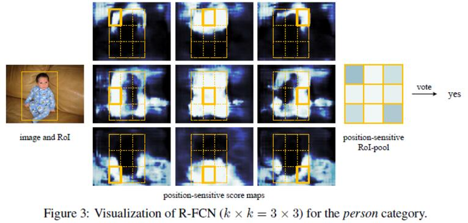
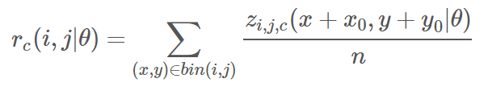
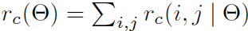
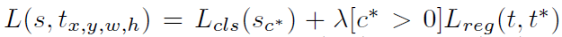
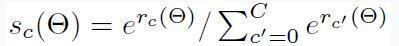
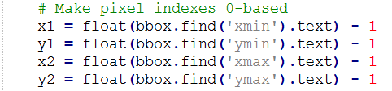

# RFCN
###### 20170411


<!-- toc orderedList:0 depthFrom:1 depthTo:6 -->

* [RFCN](#rfcn)
					* [20170411](#20170411)
	* [Results](#results)
	* [Others' Note](#others-note)
		* [介绍](#介绍)
		* [想法来源](#想法来源)
		* [网络结构](#网络结构)
	* [Reference](#reference)
	* [py-R-Fcn 阅读并训练underwater dataset](#py-r-fcn-阅读并训练underwater-dataset)
		* [train](#train)
			* [数据准备](#数据准备)
			* [tools/train_net.py](#toolstrain_netpy)
		* [lib/fast_rcnn/train.py](#libfast_rcnntrainpy)
			* [网络结构](#网络结构-1)
			* [配置文件](#配置文件)
		* [测试](#测试)
		* [小目标检测](#小目标检测)

<!-- tocstop -->


## Results
1. a position-sensitive score maps -- To incorporate translation variance into FCN
2. a position-sensitive RoI pooling layer -- shepherds information from these score maps
3. two-stage object detection stra -- (i) region proposal, and (ii) region classification
4. Region Proposal Network (RPN) [18] -- a fully convolutional architecture in itself

## Others' Note

### 介绍
1. 位置敏感度图”的方法，将FCN 网络引入到目标检测中来
2. 101层的ResNet, mAP: 83.6%, 170ms/f

### 想法来源
1. 检测思路
	2. 共享计算的全卷积子网络 (每个子网络与 RoI 无关)[“fully convolutional” subnetwork independent of RoIs]
	3. 不共享计算的作用于各自 RoI 的子网络[RoI-wise subnetwork]
2. 全连接卷积（fully convolutional）的设计网络: ResNets，GoogLeNets
3. 为给 FCN 引入平移变化, 作者在ResNet的检测流程中加入RoI pooling层到卷积之间, 使得其网络可以达到对于区域特定的目标，来完成作者认为的目标检测所需要不同于分类的translation-invariant
4. 出发点：能不找到一种方法可以最大限度的使用共享网络参数，也就是上层的，在RPN网络之后我是不是可以直接得到分类的结果。

### 网络结构
1. RPN+detection两个部分, RPN 给出感兴趣区域，R-FCN 对该感兴趣区域分类

2. 对于每一个类别，一共是有9（3×3）个feature map, 这是分别编号1-9。

每一个RoI对应一块的feature map 中的区域，根据前面的k=3，可以将这块区域平均分成9份，标记为上左，上中，上右……在形成后面的score map 的时候，分别取编号1的feature map的上左，编号2的feature map 的上中……分别进行pooling(**跨通道的池化**)，文中使用的是avgpooling，然后形成3×3=9的score map，然后对这9个数，进行投票，作者使用average为投票分值，来判断这个RoI的位置是不是恰到好处。

> rc：每一个分类的分数, C+1类；
z: 对应分类的得分；
x0，y0: Proposal的对应位置；
n: Proposal的像素点个数。
$r_c(i, j|\theta)$: 第C类第i, j个bin的池化响应; i, j -- bin的位置, $0<=i, j<=k-1$; $\theta$: 参数

3. 分类：对该 RoI 每类的所有相对空间位置的分数平均池化 (或投票)。

4. <font color=#FF0000 size=20>定位</font>

$k^2(C+1)$维的卷积层后，增加1个$4k^2$维的卷积层来回归边界框。每个 RoI 产生的$4k^2$维向量经平均投票后，用faster R-CNN 的参数化得到1个4维向量$(t_x,t_y,t_w,t_h)$。
5. 训练
每个 RoI 的损失函数为交叉熵损失与边界框回归损失的和。$c^*=0$说明 RoI 的真实标签为背景




## Reference
1. [6, 7] -- RCNN
2. [18] -- Faster RCNN, Region Proposal Network(RPN)
3. [9] -- ResNet
4. [24, 26] -- GoogLeNet
5. [15] -- FCN
6. [17, 14] -- no region method for detection

## py-R-Fcn 阅读并训练underwater dataset
```
./experiments/scripts/rfcn_end2end[_ohem].sh [GPU_ID] [NET] [DATASET] [--set ...]
```
### train
```python
time pythonc2 ./tools/train_net.py --gpu ${GPU_ID} \
  --solver models/${PT_DIR}/${NET}/rfcn_end2end/solver_ohem.prototxt \
  --weights data/imagenet_models/${NET}-model.caffemodel \
  --imdb ${TRAIN_IMDB} \
  --iters ${ITERS} \
  --cfg experiments/cfgs/rfcn_end2end_ohem.yml \
  ${EXTRA_ARGS}
```
#### 数据准备

1. 修改：增加数据的描述文件 `lib/datasets/underwater.py`

2. 修改： `lib/datasets/factory.py`
```
for year in ['20170522']:
    for split in ['train', 'val', 'trainval', 'test']:
        name = 'underwater_{}_{}'.format(year, split)
        __sets[name] = (lambda split=split, year=year: underwater(split, year))
```
3. 阅读：生成imdb
```python
# lib/datasets/factory.py
def get_imdb(name):
    """Get an imdb (image database) by name."""
    if not __sets.has_key(name):
        raise KeyError('Unknown dataset: {}'.format(name))
    return __sets[name]()
```
`_sets`是一个字典，字典的`key`是数据集的名称，字典的`value`是一个lambda表达式（即一个函数指针）,执行的实际上是`pascal_voc`函数，参数是`split` 和 `year`（ps：在train_vpn函数中，name是voc_2007_trainval，所以这里对应的split和year分别是trainval和2007）；pascal_voc是一个类，这是调用了该类的构造函数，返回的也是该类的一个实例，所以这下我们清楚了imdb实际上就是pascal_voc的一个实例；


#### tools/train_net.py
阅读：最关键的是获取数据imdb，roidb
```python
def get_roidb(imdb_name):
		imdb = get_imdb(imdb_name)
		print 'Loaded dataset `{:s}` for training'.format(imdb.name)
		imdb.set_proposal_method(cfg.TRAIN.PROPOSAL_METHOD)
		print 'Set proposal method: {:s}'.format(cfg.TRAIN.PROPOSAL_METHOD)
		roidb = get_training_roidb(imdb)
		return roidb
# 上面调用的函数，为imdb添加了roidb的数据，我们看看如何添加的，见下面这个函数：
def set_proposal_method(self, method):  
    method = eval('self.' + method + '_roidb')  
    self.roidb_handler = method  
# 这里method传入的是一个str：gt，所以method=eval('self.gt_roidb')
def get_training_roidb(imdb):  
    """Returns a roidb (Region of Interest database) for use in training."""  
    if cfg.TRAIN.USE_FLIPPED:  
        print 'Appending horizontally-flipped training examples...'  
        imdb.append_flipped_images()  
        print 'done'  

    print 'Preparing training data...'  
    rdl_roidb.prepare_roidb(imdb)  
    print 'done'  
# get_training_roidb(imdb)将roidb中的元素由5011个，通过水平对称变成10022个；将index这个list的元素相应的也翻一番
def append_flipped_images(self):  
    num_images = self.num_images  
    widths = self._get_widths()  
    for i in xrange(num_images):  
        boxes = self.roidb[i]['boxes'].copy()  
        oldx1 = boxes[:, 0].copy()  
        oldx2 = boxes[:, 2].copy()  
        boxes[:, 0] = widths[i] - oldx2 - 1  
        boxes[:, 2] = widths[i] - oldx1 - 1 # 新框的xmin和xmax都要更新  
        assert (boxes[:, 2] >= boxes[:, 0]).all()  
        entry = {'boxes' : boxes,  
                 'gt_overlaps' : self.roidb[i]['gt_overlaps'],  
                 'gt_classes' : self.roidb[i]['gt_classes'],  
                 'flipped' : True}  
        self.roidb.append(entry) # 把这个新的框添加到roidb中  
    self._image_index = self._image_index * 2　#将索引的list 复制拼接  
# 首先我们看看append_flipped_images函数：可以发现，roidb是imdb的一个成员变量，roidb是一个list（每个元素对应一张图片），list中的元素是一个字典，字典中存放了5个key，分别是boxes信息，每个box的class信息，是否是flipped的标志位，重叠信息gt_overlaps，以及seg_areas；分析该函数可知，将box的值按照水平对称，原先roidb中只有5011个元素，经过水平对称后通过append增加到5011*2=10022个；
def prepare_roidb(imdb):  
    """Enrich the imdb's roidb by adding some derived quantities that
    are useful for training. This function precomputes the maximum
    overlap, taken over ground-truth boxes, between each ROI and
    each ground-truth box. The class with maximum overlap is also
    recorded.
    """  
    sizes = [PIL.Image.open(imdb.image_path_at(i)).size  
             for i in xrange(imdb.num_images)]  
    roidb = imdb.roidb  
    for i in xrange(len(imdb.image_index)):  
        roidb[i]['image'] = imdb.image_path_at(i)  
        roidb[i]['width'] = sizes[i][0]  
        roidb[i]['height'] = sizes[i][1]  
        # need gt_overlaps as a dense array for argmax  
        gt_overlaps = roidb[i]['gt_overlaps'].toarray()  
        # max overlap with gt over classes (columns)  
        max_overlaps = gt_overlaps.max(axis=1)  
        # gt class that had the max overlap  
        max_classes = gt_overlaps.argmax(axis=1)  
        roidb[i]['max_classes'] = max_classes  
        roidb[i]['max_overlaps'] = max_overlaps  
        # sanity checks  
        # max overlap of 0 => class should be zero (background)  
        zero_inds = np.where(max_overlaps == 0)[0]  
        assert all(max_classes[zero_inds] == 0)  
        # max overlap > 0 => class should not be zero (must be a fg class)  
        nonzero_inds = np.where(max_overlaps > 0)[0]  
        assert all(max_classes[nonzero_inds] != 0)  
```
上面只是准备好了roidb的相关信息而已,真正的数据处理操作是在
`class RoIDataLayer(caffe.Layer)` 类的`def forward(self, bottom, top)`函数中开始的，这个类在`faster-rcnn-root/lib/roi_data_layer/layer.py`文件中
`blobs = self._get_next_minibatch()`这句话产生了我们需要的数据`blobs`；这个函数又调用了`minibatch.py`文件中的`def get_minibatch(roidb, num_classes)`函数；
然后又调用了`def _get_image_blob(roidb, scale_inds)`函数；在这个函数中，我们终于发现了cv2.imread函数，也就是最终的读取图片到内存的地方
```python
def _get_image_blob(roidb, scale_inds):  
    """Builds an input blob from the images in the roidb at the specified
    scales.
    """  
    num_images = len(roidb)  
    processed_ims = []  
    im_scales = []  
    for i in xrange(num_images):  
        im = cv2.imread(roidb[i]['image']) #终于在这里读取图片了  
        if roidb[i]['flipped']:  
            im = im[:, ::-1, :]  
        target_size = cfg.TRAIN.SCALES[scale_inds[i]]  
        im, im_scale = prep_im_for_blob(im, cfg.PIXEL_MEANS, target_size,  
                                        cfg.TRAIN.MAX_SIZE)  
        im_scales.append(im_scale)  
        processed_ims.append(im)  

    # Create a blob to hold the input images  
    blob = im_list_to_blob(processed_ims)  

    return blob, im_scales  
```

### lib/fast_rcnn/train.py
```python
def train_net(solver_prototxt, roidb, output_dir,
              pretrained_model=None, max_iters=40000):
    """Train a Fast R-CNN network."""

    roidb = filter_roidb(roidb) #过滤无效(无bbox)的roidb
    sw = SolverWrapper(solver_prototxt, roidb, output_dir,
                       pretrained_model=pretrained_model)
		# 创建solver
    print 'Solving...'
    model_paths = sw.train_model(max_iters) #开始训练
    print 'done solving'
    return model_paths
```
> 注意：
> 1. annotation文件中的difficult还是Diffcult
> 2. 训练时assert(boxes[:,2]>=boxes[:,0]).all()的问题
> (1). 问题分析: bbox坐标（x,y）可能为0，或标定区域溢出图片, 而faster rcnn会对Xmin,Ymin,Xmax,Ymax进行减一操作,如果Xmin为0，减一后变为65535

> (2). 问题解决
a. 修改`lib/datasets/imdb.py`，`append_flipped_images()`函数
数据整理，在一行代码为 `boxes[:, 2] = widths[i] - oldx1 - 1`下加入代码：
```python
for b in range(len(boxes)):
  if boxes[b][2]< boxes[b][0]:
    boxes[b][0] = 0
```
b. 修改`lib/datasets/pascal_voc.py`，`_load_pascal_annotation(,)`函数
将对`Xmin,Ymin,Xmax,Ymax`减一去掉，变为：

c. 可选，如果a和b可以解决问题，就没必要用c修改lib/fast_rcnn/config.py，不使图片实现翻转，如下改为：
```
# Use horizontally-flipped images during training?
__C.TRAIN.USE_FLIPPED = False
```

#### 网络结构
1. 修改：创建model/underwater/ResNet-50(拷贝pascal_voc)

2. 修改：ResNet-50/class-aware/train_ohem.prototxt

```
layer {
  name: 'input-data'
	...
	param_str: "'num_classes': 5"
layer {
  name: 'roi-data'
	...
	param_str: "'num_classes': 5"
layer {  
	bottom: "conv_new_1"
	top: "rfcn_cls"
	name: "rfcn_cls"
			num_output: 245 #5*(7^2) cls_num*(score_maps_size^2)
layer {
    bottom: "conv_new_1"
    top: "rfcn_bbox"
    name: "rfcn_bbox"
        num_output: 980 #4*5*(7^2) 4*cls_num*(score_maps_size^2)
layer {
    bottom: "rfcn_cls"
    bottom: "rois"
				output_dim: 5
layer {  
    bottom: "rfcn_bbox"  
    bottom: "rois"
				output_dim: 20 #4*cls_num  
```

2. 修改：ResNet-50/class-aware/test.prototxt

```
layer {  
	bottom: "conv_new_1"
	top: "rfcn_cls"
	name: "rfcn_cls"
			num_output: 245 #5*(7^2) cls_num*(score_maps_size^2)
layer {
    bottom: "conv_new_1"
    top: "rfcn_bbox"
    name: "rfcn_bbox"
        num_output: 980 #4*5*(7^2) 4*cls_num*(score_maps_size^2)
layer {
    bottom: "rfcn_cls"
    bottom: "rois"
				output_dim: 5
layer {  
    bottom: "rfcn_bbox"  
    bottom: "rois"
				output_dim: 20 #4*cls_num  
layer {
    name: "cls_prob_reshape"
				dim: 5  #cls_num  
layer {
    name: "bbox_pred_reshape"
        dim: 20
```

3. 修改 ResNet-50/train_agnostic.prototxt

```
layer {  
  name: 'input-data'  
    param_str: "'num_classes': 5"  #cls_num  
layer {  
    bottom: "conv_new_1"  
    top: "rfcn_cls"  
    name: "rfcn_cls"  
    type: "Convolution"  
    convolution_param {  
        num_output: 245 #cls_num*(score_maps_size^2)  
layer {  
    bottom: "rfcn_cls"  
    bottom: "rois"  
        output_dim: 5 #cls_num   
```

4. 修改 ResNet-50/train_agnostic_ohem.prototxt

同上

5. 修改 ResNet-50/test_agnostic.prototxt

```
layer {  
    bottom: "conv_new_1"  
    top: "rfcn_cls"  
        num_output: 245 #cls_num*(score_maps_size^2) ###  
layer {  
    bottom: "rfcn_cls"  
    bottom: "rois"  
        output_dim: 5 #cls_num  
layer {  
    name: "cls_prob_reshape"   
          dim: 5 #cls_num
```

6. 修改 ResNet-50/solver_ohem.prototxt && ResNet-50/solver.prototxt

```
train_net: "models/underwater/ResNet-50/rfcn_end2end/train_agnostic[_ohem].prototxt"
```
> 'rfcn_bbox'的'num_output: 392 #8*(7^2)'
in agonistic bbox regression it is actually a 2-class bbox regression, the first 4 dims are for background and the last 4 dims are for foreground. In fact the first 4 dims will never be used.

#### 配置文件

1. 修改：`lib/fast_rcnn/config.py`, 并修改

```python
# Model directory
__C.MODELS_DIR = osp.abspath(osp.join(__C.ROOT_DIR, 'models', 'underwater'))
```

### 测试

将训练得到的模型(RFCN_ROOT/output/rfcn_end2end_ohem/voc_0712_trainval里最后的caffemodel)拷贝到RFCN_ROOT/data/rfcn_models下，然后打开RFCN_ROOT/tools/demo_rfcn.py，将CLASSES修改成你的标签，NETS修改成你的model，im_names修改成你的测试图片(放在data/demo下),最后：

```
cd $RFCN_ROOT  
./tools/demo_rfcn.py --net ResNet-50  
```

### 小目标检测

1. 修改：`lib/fast_rcnn/config.py`

```python
# Proposal height and width both need to be greater than RPN_MIN_SIZE (at orig image scale)
__C.TRAIN.RPN_MIN_SIZE = 4
# Proposal height and width both need to be greater than RPN_MIN_SIZE (at orig image scale)
__C.TEST.RPN_MIN_SIZE = 4
```

2. 修改：`lib/rpn/generate_anchors.py`
decrease the default ratios and scales. You can also add new ratios and scales in addition to default ones but then you will need to make some more changes in prototxts to account for change in RPN outputs triggered by change in anchor boxes.

```python
def generate_anchors(base_size=16, ratios=[0.5, 1, 2],
                     scales=2**np.arange(3, 6)):
```
阅读这部分代码

```python
def generate_anchors(base_size=16, ratios=[0.5, 1, 2],
                     scales=2**np.arange(3, 6)):
    """
    Generate anchor (reference) windows by enumerating aspect ratios X
    scales wrt a reference (0, 0, 15, 15) window.
    """

    base_anchor = np.array([1, 1, base_size, base_size]) - 1 # array([ 0,  0, 15, 15])
    ratio_anchors = _ratio_enum(base_anchor, ratios)
    anchors = np.vstack([_scale_enum(ratio_anchors[i, :], scales)
                         for i in xrange(ratio_anchors.shape[0])])
    return anchors

def _ratio_enum(anchor, ratios):
    """
    Enumerate a set of anchors for each aspect ratio wrt an anchor.
    """
    w, h, x_ctr, y_ctr = _whctrs(anchor) # 得到宽、高、中心
    size = w * h
    size_ratios = size / ratios # 得到anchor的size大小
    ws = np.round(np.sqrt(size_ratios))
    hs = np.round(ws * ratios)
    anchors = _mkanchors(ws, hs, x_ctr, y_ctr)
    return anchors

def _whctrs(anchor):
    """
    Return width, height, x center, and y center for an anchor (window).
    """
    w = anchor[2] - anchor[0] + 1 # 15-0+1 = 16
    h = anchor[3] - anchor[1] + 1 # 15-0+1 = 16
    x_ctr = anchor[0] + 0.5 * (w - 1) # 0 + 0.5*15 = 7.5
    y_ctr = anchor[1] + 0.5 * (h - 1) # 0 + 0.5*15 = 7.5
    return w, h, x_ctr, y_ctr

def _mkanchors(ws, hs, x_ctr, y_ctr):
    """
    Given a vector of widths (ws) and heights (hs) around a center
    (x_ctr, y_ctr), output a set of anchors (windows).
    """
    ws = ws[:, np.newaxis]
    hs = hs[:, np.newaxis]
    anchors = np.hstack((x_ctr - 0.5 * (ws - 1),
                         y_ctr - 0.5 * (hs - 1),
                         x_ctr + 0.5 * (ws - 1),
                         y_ctr + 0.5 * (hs - 1)))
    return anchors
```
