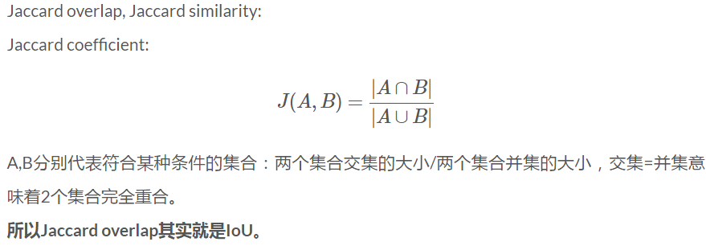
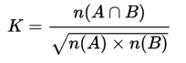
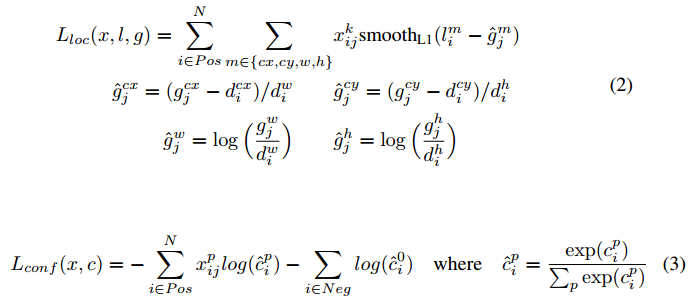
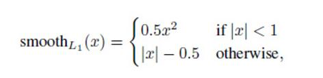
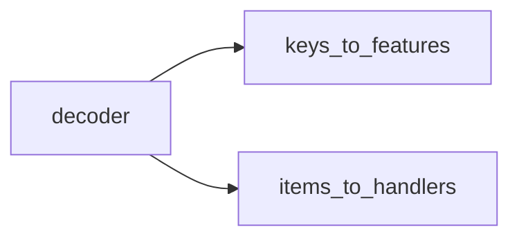

# SSD: Single Shot MultiBox Detector

<!-- toc orderedList:0 depthFrom:1 depthTo:6 -->

* [SSD: Single Shot MultiBox Detector](#ssd-single-shot-multibox-detector)
					* [20170419](#20170419)
	* [Results](#results)
	* [Contribution](#contribution)
	* [Others' Note](#others-note)
		* [介绍](#介绍)
		* [结构框架](#结构框架)
		* [训练](#训练)
		* [主要贡献](#主要贡献)
	* [SSD-TensorFlow](#ssd-tensorflow)
		* [Train](#train)
			* [从tfrecord中读取数据](#从tfrecord中读取数据)
			* [网络读取](#网络读取)
			* [图像处理器](#图像处理器)
			* [从dataset中读取数据](#从dataset中读取数据)
		* [Evalue](#evalue)
			* [从tfrecord中读取数测试据集](#从tfrecord中读取数测试据集)
	* [SSD Caffe](#ssd-caffe)
		* [运行流程](#运行流程)
		* [运行流程中的问题](#运行流程中的问题)
		* [数据准备](#数据准备)
			* [creat_list.sh](#creat_listsh)
		* [源码阅读](#源码阅读)
		* [ssd_pascal.py](#ssd_pascalpy)
		* [ssd_pascal.py 的修改](#ssd_pascalpy-的修改)
		* [Difference between train and score](#difference-between-train-and-score)
	* [SSD for external project](#ssd-for-external-project)
	* [Precision-Recall](#precision-recall)
		* [Precision](#precision)
		* [Recall](#recall)
		* [Effect from Confidence threshold](#effect-from-confidence-threshold)
		* [mAP](#map)
		* [Caffe implement](#caffe-implement)
	* [Plot curves](#plot-curves)
	* [Issues](#issues)
	* [SSD Pytorch](#ssd-pytorch)
		* [VGG](#vgg)
		* [Extra](#extra)
		* [Loc layers](#loc-layers)
		* [Conf layer](#conf-layer)
		* [Config](#config)
		* [PriorBox](#priorbox)
		* [Forward](#forward)
		* [Augmentation](#augmentation)
		* [Loss](#loss)
		* [Detection](#detection)
			* [NMS](#nms)

<!-- tocstop -->

## Results

1. Current state-of-the-art object detection systems are variants of the following approach:
**hypothesize bounding boxes**, **resample pixels** or **features for each box**, and apply a high quality **classifier**

## Contribution

1. This paper presents the first deep network based object detector that does not resample pixels or features for bounding box hypotheses and and is as accurate as approaches that do.

## Others' Note

### 介绍

1. 现今流行的 state-of-art 的检测系统大致都是如下步骤，先生成一些假设的 bounding boxes，然后在这些 bounding boxes 中提取特征，之后再经过一个分类器，来判断里面是不是物体，是什么物体。但这类方法对于嵌入式系统，所需要的计算时间太久了，不足以实时的进行检测。
2. 本文提出的实时检测方法，消除了中间的 bounding boxes、pixel or feature resampling 的过程。虽然本文不是第一篇这样做的文章（YOLO），但是本文做了一些提升性的工作，既保证了速度，也保证了检测精度。
3. 主要贡献：SSD比YOLO快，精度可与Faster媲美
4. SSD核心： predict object（物体），以及其 归属类别的 score（得分）；同时，在 feature map 上使用小的卷积核，去 predict 一系列 bounding boxes 的 box offsets。

### 结构框架

1. feature map cell和 default box：feature map cell 就是将 feature map 切分成 8×8 或者 4×4 之后的一个个 格子；
而 default box 就是每一个格子上，一系列固定大小的 box，即图中虚线所形成的一系列 boxes。

2. Model
SSD 是基于一个前向传播 CNN 网络，产生一系列 固定大小（fixed-size） 的 bounding boxes，以及每一个 box 中包含物体实例的可能性，即 score。之后，进行一个 非极大值抑制（Non-maximum suppression, NMS） 得到最终的 predictions。
	1. base network
	2. Multi-scale feature maps for detection：在基础网络结构后，添加了额外的卷积层，这些卷积层的大小是逐层递减的，可以在多尺度下进行 predictions。
	5. Convolutional predictors for detection
	每一个添加的特征层（或者在基础网络结构中的特征层），可以使用一系列 convolutional filters，去产生一系列固定大小的 predictions，具体见下图。对于一个大小为 m×n，具有 p 通道的特征层，使用的 convolutional filters 就是 3×3×p 的 kernels。产生的 predictions，那么就是归属类别的一个得分，要么就是相对于 default box coordinate 的 shape offsets。
	6. Default boxes and aspect ratios
	每一个 box 相对于与其对应的 feature map cell 的位置是固定的。 在每一个 feature map cell 中，我们要 predict 得到的 box 与 default box 之间的 offsets，以及每一个 box 中包含物体的 score（每一个类别概率都要计算出）。
因此，对于一个位置上的 k 个boxes 中的每一个 box，我们需要计算出 c 个类，每一个类的 score，还有这个 box 相对于 它的默认 box 的 4 个偏移值（offsets）。于是，在 feature map 中的每一个 feature map cell 上，就需要有 (c+4)×k 个 filters。对于一张 m×n 大小的 feature map，即会产生 (c+4)×k×m×n 个输出结果。
	5. 网络结构图解读

	从1~2有两层卷积层，输入$19*19*1024$, 输出$10*10*512$
* 第一层用1204*256$1\times 1$的卷积核，作用是改变通道数(feature map数)，减少网络参数。
* 第二层用256*512个$3\times 3$的卷积核，slide=2。输出尺寸计算公式为
$$n_{out} = (n_{in}+2*n_{padding}-n_{filter})/n_{slide}+1$$

### 训练

1. 正负样本
给定输入图像以及每个物体的 ground truth,首先找到每个ground true box对应的default box中IOU最大的作为（与该ground true box相关的匹配）正样本。然后，在剩下的default box中找到那些与任意一个ground truth box 的 IOU 大于 0.5的default box作为（与该ground true box相关的匹配）正样本。 一个 ground truth 可能对应多个 正样本default box 而不再像MultiBox那样只取一个IOU最大的default box。其他的作为负样本（每个default box要么是正样本box要么是负样本box）。图中的例子是：给定输入图像及 ground truth，分别在两种不同尺度(feature map 的大小为 8*8，4*4)下的匹配情况。有两个 default box 与猫匹配（8*8），一个 default box 与狗匹配（4*4）。

1. Matching strategy
将 default box 与任何的 groundtruth box 配对，只要两者之间的jaccard overlap (IoU, intersection over union)大于一个阈值，这里本文的阈值为 0.5。

> Ochiai coefficent: $n(A)$是 $A$ A的元素个数


2. Training objective(训练的目标函数)
源自于 MultiBox 的目标函数，但是本文将其拓展，使其可以处理多个目标类别。用 $x^p_{ij}$=1 表示 第 $i$ 个 default box 与 类别 $p$ 的 第 $j$ 个 ground truth box 相匹配，否则若不匹配的话，则 $x^p_{ij}=0$。根据上面的匹配策略，一定有 $\Sigma_ix^p_{ij}\geq1$，意味着对于 第 j 个 ground truth box，有可能有多个 default box与其相匹配。
总的目标损失函数（objective loss function）就由 localization loss（loc） 与 confidence loss（conf） 的加权求和：
$$L(x,c,l,g)=\frac{1}{N}(L_{conf}(x,c)+\alpha L_{loc}(x,l,g))$$
>N -- 与 ground truth box 相匹配的 default boxes 个数
localization loss（loc） -- Fast R-CNN 中 Smooth L1 Loss，用在 predict box($l$) 与 ground truth box($g$) 参数（即中心坐标位置，width、height）中，回归 bounding boxes 的中心位置，以及 width、height
confidence loss（conf） -- Softmax Loss，输入为每一类的置信度 $c$
$\alpha$ -- 权重项




3. Choosing scales and aspect ratios for default boxes
	大部分 CNN 网络在越深的层，feature map 的尺寸（size）会越来越小。这样做不仅仅是为了减少计算与内存的需求，还有个好处就是，最后提取的 feature map 就会有某种程度上的平移与尺度不变性。
	但是其实，如果使用同一个网络中的、不同层上的 feature maps，也可以达到相同的效果，同时**在所有物体尺度中共享参数**。因此，本文同时使用 lower feature maps、upper feature maps 来 predict detections。上图展示了本文中使用的两种不同尺度的 feature map，8×8 的feature map，以及 4×4 的 feature map。
	    一般来说，一个 CNN 网络中不同的 layers 有着不同尺寸的 [感受野](http://blog.csdn.net/kuaitoukid/article/details/46829355)（receptive fields）。这里的[感受野](http://blog.cvmarcher.com/posts/2015/05/17/cnn-trick/)，指的是输出的 feature map 上的一个节点，其对应输入图像上尺寸的大小。所幸的是，SSD 结构中，default boxes 不必要与每一层 layer 的 receptive fields 对应。本文的设计中，feature map 中特定的位置，来负责图像中特定的区域，以及物体特定的尺寸。假如我们用 $m$ 个 feature maps 来做 predictions，每一个 feature map 中 default box 的尺寸大小计算如下：
	    $$s_k=s_{min}+\frac{s_{max}-s_{min}}{m-1}(k-1), k\in (1,m)$$
 其中，$s_{min}$ 取值 0.2，$s_{max}$ 取值 0.95，意味着最低层的尺度是 0.2，最高层的尺度是 0.95，再用不同 aspect ratio 的 default boxes，用 $a_r$ 来表示：$a_r=(1,2,3,1/2,1/3)$，则每一个default boxes 的 width、height 就可以计算出来：
 $$w_k^a = s_k\sqrt{a_r}, h_k^a = s_k / \sqrt{a_r}$$
	  对于 aspect ratio 为 1 时，本文还增加了一个 default box，这个 box 的 scale 是 $s_k'=\sqrt{s_ks_{k+1}}$。所以最终，在每个 feature map location 上，有 6 个 default boxes。 每一个 default box 的中心，设置为：$(\frac{i+0.5}{|fk|},\frac{j+0.5}{|fk|})$，其中，$|fk|$ 是第 k 个 feature map 的大小，同时，$i,j\in[0,|fk|)$
	  在结合 feature maps 上，所有 不同尺度、不同 aspect ratios 的 default boxes，它们预测的 predictions 之后。可以想见，我们有许多个 predictions，包含了物体的不同尺寸、形状。如下图，狗狗的 ground truth box 与 4×4 feature map 中的红色 box 吻合，所以其余的 boxes 都看作负样本。

4. Hard negative mining 	  
	在生成一系列的 predictions 之后，会产生很多个符合 ground truth box 的 predictions boxes，但同时，不符合 ground truth boxes 也很多，而且这个 negative boxes，远多于 positive boxes。这会造成 negative boxes、positive boxes 之间的不均衡。训练时难以收敛。
    因此，本文采取，先将每一个物体位置上对应 predictions（default boxes）是 negative 的 boxes 进行排序，按照 default boxes 的 confidence 的大小。 选择最高的几个，保证最后 negatives、positives 的比例在 3:1。本文通过实验发现，这样的比例可以更快的优化，训练也更稳定。

5. Data augmentation (数据增广)
	本文同时对训练数据做了 data augmentation，数据增广。关于数据增广，推荐一篇文章：[Must Know Tips/Tricks in Deep Neural Networks](http://210.28.132.67/weixs/project/CNNTricks/CNNTricks.html)，其中的 section 1 就讲了 data augmentation 技术。
	每一张训练图像，随机的进行如下几种选择：
	* 使用原始的图像
	* 采样一个 patch，与物体之间最小的 jaccard overlap 为：0.1，0.3，0.5，0.7 与 0.9
	* 随机的采样一个 patch，采样的 patch 是原始图像大小比例是 [0.1，1]，aspect ratio 在 12 与 2 之间。当 groundtruth box 的中心（center）在采样的 patch 中时，我们保留重叠部分。在这些采样步骤之后，每一个采样的 patch 被 resize 到固定的大小，并且以 0.5 的概率随机的 水平翻转（horizontally flipped）

### 主要贡献

SSD的主要贡献是在不同输出层上使用不同尺度的默认框

## SSD-TensorFlow

[来源](https://zhuanlan.zhihu.com/p/25100992)
1. ssd_vgg_300.py： 模型建立


### Train

#### 从tfrecord中读取数据

1. 返回的数据 pascalvoc_2007.py

```
return pascalvoc_common.get_split(split_name, dataset_dir,
                                      file_pattern, reader,
                                      SPLITS_TO_SIZES,
                                      ITEMS_TO_DESCRIPTIONS,
                                      NUM_CLASSES)
```

2. 路径组合

```python
file_pattern = os.path.join(dataset_dir, file_pattern % split_name)
```

将两个字符串合并到一起形成新的路径。 `file_pattern='cifar10_%s.tfrecord',dataset_dir=./, split_name='train'`,则`file_pattern=./cifar10_train.tfrecord`

2. 数据文件阅读器

```
reader = tf.TFRecordReader
```

可从records文件中读取数据

2. 数据解码

```
decoder = slim.tfexample_decoder.TFExampleDecoder(
        keys_to_features, items_to_handlers)
```



3. 判断路劲下是否含有label map文件

```python
if dataset_utils.has_labels(dataset_dir):
        labels_to_names = dataset_utils.read_label_file(dataset_dir)
```

4. 返回值

```python
return slim.dataset.Dataset(
            data_sources=file_pattern, #tfrecord文件名格式（包含路径）
            reader=reader,
            decoder=decoder,
            num_samples=split_to_sizes[split_name],
            items_to_descriptions=items_to_descriptions,
            num_classes=num_classes,
            labels_to_names=labels_to_names)
```    

#### 网络读取

```
ssd_class = nets_factory.get_network(FLAGS.model_name) # 读取网络的种类
ssd_params = ssd_class.default_params._replace(num_classes=FLAGS.num_classes) # 更爱一些参数
ssd_net = ssd_class(ssd_params) # 构建网络
```

#### 图像处理器

1. 选择预处理器

```
preprocessing_name = FLAGS.preprocessing_name or FLAGS.model_name
image_preprocessing_fn = preprocessing_factory.get_preprocessing(preprocessing_name, is_training=True)
```

一般默认为网络名，用于图像处理

2. 图像转为float型

```
if image.dtype != tf.float32:
		image = tf.image.convert_image_dtype(image, dtype=tf.float32)
```

3. 用bbox crop图像

```python
dst_image, labels, bboxes, distort_bbox = \
            distorted_bounding_box_crop(image, labels, bboxes,
                                        min_object_covered=MIN_OBJECT_COVERED,
                                        aspect_ratio_range=CROP_RATIO_RANGE)
```

4. resize目标图（crop后的）
```
dst_image = tf_image.resize_image(dst_image, out_shape,
                                          method=tf.image.ResizeMethod.BILINEAR,
                                          align_corners=False)
```

5. 随机左右翻转

```
dst_image, bboxes = tf_image.random_flip_left_right(dst_image, bboxes)
```

6. 随机加入颜色干扰

```
dst_image = apply_with_random_selector(
                dst_image,
                lambda x, ordering: distort_color(x, ordering, fast_mode),
                num_cases=4)
```

7. Rescale to VGG input scale.

```python
image = dst_image * 255.
image = tf_image_whitened(image, [_R_MEAN, _G_MEAN, _B_MEAN]) # 每个通道减去其均值
```

8. 设置图像的类型

```python
if data_format == 'NCHW':
		image = tf.transpose(image, perm=(2, 0, 1)) #  转置，原来的第3维放到第一维，原来的第1维放到第2维，原来的第2维放到第3维
```

> NCHW -- [batch, in_channels, in_height, in_width]
NHWC -- [batch, in_height, in_width, in_channels]

#### 从dataset中读取数据

1. 创建provider

```python
provider = slim.dataset_data_provider.DatasetDataProvider(
                    dataset,
                    num_readers=FLAGS.num_readers,  # 默认为4
                    common_queue_capacity=20 * FLAGS.batch_size, # 默认为20*32
                    common_queue_min=10 * FLAGS.batch_size,
                    shuffle=True # 是否打乱)
```

2. 读取数据并预处理

```
# Get for SSD network: image, labels, bboxes.
[image, shape, glabels, gbboxes] = provider.get(['image', 'shape',
                                                  'object/label',
                                                  'object/bbox'])
# Pre-processing image, labels and bboxes.
image, glabels, gbboxes = \
                image_preprocessing_fn(image, glabels, gbboxes,
                                       out_shape=ssd_shape,
                                       data_format=DATA_FORMAT)
```

3. 编码groundtruth 的 labels and bboxes

```
gclasses, glocalisations, gscores = \
                ssd_net.bboxes_encode(glabels, gbboxes, ssd_anchors)
#  返回值是 target_labels, target_localizations, target_scores，这三个东西都是a list of target_Tensors
batch_shape = [1] + [len(ssd_anchors)] * 3
```

### Evalue

#### 从tfrecord中读取数测试据集

```
dataset = dataset_factory.get_dataset(
            FLAGS.dataset_name, FLAGS.dataset_split_name, FLAGS.dataset_dir)
```

## SSD Caffe

### 运行流程
修改Makefile.config
```
make -j8
make py
make test -j8
./data/underwater/create_list.sh
./data/underwater/create_data.sh
python examples/ssd/ssd_train_underwater.py
./ssd_detection.sh
```
>`make py`  "fatal error: numpy/arrayobject.h: No such file or directory"
> 可能numpy装在了~/.local/lib下

### 运行流程中的问题
1. make error for boost: install gcc 5

```
sudo add-apt-repository ppa:ubuntu-toolchain-r/test
sudo apt-get update
sudo apt-get install gcc-5 g++-5
```
在Makefile.config中`CUSTOM_CXX := /usr/bin/g++-5`

2. 找不到`libstdc++.so.6.20`
原因是更新了gcc，但是cpp的链接库没有更新
在`${anconda}/lib`中创建
`/usr/lib/x86_64-linux-gnu/libstdc++.so.6.0.22` 的连接

```
cd ${anconda}/lib
ln /usr/lib/x86_64-linux-gnu/libstdc++.so.6.0.22 -s ./libstdc++.so.6
ln ./libstdc++.so. -s ./libstdc++.so
```

3. No module named `caffe.proto`

```
make -j8
make pycaffe
```

在环境变量中

```
export PYTHONPATH=/home/sean/Documents/ssd_caffe/caffe/python:$PYTHONPATH
```

4. No module named google.protobuf.internal

```
pip install protobuf
```
5. 'module' object has no attribute 'LabelMap'
添加ssd目录的caffe/python到环境变量
```
export PYTHONPATH="/home/sean/Documents/ssd_caffe/caffe/python:$PYTHONPATH"
```

5. failed: error == cudaSuccess (10 vs. 0)  invalid device ordinal
```
gpus = '0'
```
6 `/usr/lib/gcc/aarch64-linux-gnu/5/include/arm_neon.h(38): error: identifier "__Int8x8_t" is undefined`
TX2 用g++4.8

7. `.build_release/lib/libcaffe.so: undefined reference to google::protobuf::io::CodedOutputStream::WriteVarint64ToArray(unsigned long long, unsigned char*)'`
可能是Makefile.config里定义的路径冲突

### 数据准备

#### creat_list.sh

1. 取得该脚本文件所在路径

```
bash_dir="$(cd "$(dirname "${BASH_SOURCE[0]}")" && pwd)"

```
> ${BASH_SOURCE[0]}  取得执行shell命令
dirname 取得前面的路径
cd 进到目录里
&& pwd 打印当前路径

2. sed 在线编辑器, [用法参考](http://man.linuxde.net/sed)

```
sed -i "s/^/$name\/JPEGImages\//g" $img_file

```
3. 统计xml的文件名
	 1. 打开目标txt，遍历xml文件下所有文件
	 ```
	 target_name = "./20170509/ImageSets/Main/trainval.txt"
	 file_object = open(target_name, 'a')
	 for root, dirs, files in os.walk("./20170509/Annotations/", topdown=False):
		 print(files)
	 ```
	 2. 打开xml并读取filename。 [xml.etree.cElementTree文档](http://pycoders-weekly-chinese.readthedocs.io/en/latest/issue6/processing-xml-in-python-with-element-tree.html)
	 ```python
	 import xml.etree.cElementTree as ET
    f = os.path.join(root, file)
    tree = ET.parse(f)  # 打开xml文档
    root_node = tree.getroot()  # 获得root节点
    filename = root_node.find('filename').text
    file_object.write(filename+"\n")
		```
4. 训练中查看测试效果
search "detection_eval = " in the `.log` file

### 源码阅读
[CSDN代码解读](http://blog.csdn.net/u011956147/article/details/73030116)
### ssd_pascal.py

1. `AddExtraLayers(net, use_batchnorm=True, lr_mult=1)`
> Add extra layers on top of a "base" network (e.g. VGGNet or Inception).

* Add ConvBNLayer

```
def ConvBNLayer(net, from_layer, out_layer, use_bn, use_relu, num_output,
    kernel_size, pad, stride, dilation=1, use_scale=True, lr_mult=1,
    conv_prefix='', conv_postfix='', bn_prefix='', bn_postfix='_bn',
    scale_prefix='', scale_postfix='_scale', bias_prefix='', bias_postfix='_bias',
    **bn_params):
```

* Get current work dirction

```python
os.getcwd() #方法用于返回当前工作目录。

```
* where to start

```
resume_training = True

```
> Set true if you want to load from most recently saved snapshot.
  Otherwise, we will load from the pretrain_model defined below.

* Resize shape

```python
resize_width = 300
resize_height = 300
resize = "{}x{}".format(resize_width, resize_height)
'resize_param': {
                'prob': 1,
                'resize_mode': P.Resize.WARP, # from caffe import params  as P
                'height': resize_height,
                'width': resize_width,
                'interp_mode': [
                        P.Resize.LINEAR,
                        P.Resize.AREA,
                        P.Resize.NEAREST,
                        P.Resize.CUBIC,
                        P.Resize.LANCZOS4,
                        ],
                },
```

> examples/ssd/ssd_pascal_orig.py should be able to handle images of any size during training.

* Learning rate

```python
lr_mult = 1
    #	Use different initial learning rate.
if use_batchnorm:
    base_lr = 0.0004
else:
    # A learning rate for batch_size = 1, num_gpus = 1.
    base_lr = 0.00004
```

> lr_mult是针对每个层而言，层的learning rate可以单独调节，lr_mult就是该层的learning rate是base_lr的多少倍。即该层的学习率=lr_mult*base_lr

* MultiBox Loss parameters <font color=#FF0000 size=7>Problem<font>

```python
num_classes = 3
share_location = True # all classes uses the same location regressor
background_label_id=0
train_on_diff_gt = True
normalization_mode = P.Loss.VALID
code_type = P.PriorBox.CENTER_SIZE
ignore_cross_boundary_bbox = False
mining_type = P.MultiBoxLoss.MAX_NEGATIVE
neg_pos_ratio = 3.
loc_weight = (neg_pos_ratio + 1.) / 4.
multibox_loss_param = {
    'loc_loss_type': P.MultiBoxLoss.SMOOTH_L1,
    'conf_loss_type': P.MultiBoxLoss.SOFTMAX,
    'loc_weight': loc_weight,
    'num_classes': num_classes,
    'share_location': share_location,
    'match_type': P.MultiBoxLoss.PER_PREDICTION,
    'overlap_threshold': 0.5,
    'use_prior_for_matching': True,
    'background_label_id': background_label_id,
    'use_difficult_gt': train_on_diff_gt,
    'mining_type': mining_type,
    'neg_pos_ratio': neg_pos_ratio,
    'neg_overlap': 0.5,
    'code_type': code_type,
    'ignore_cross_boundary_bbox': ignore_cross_boundary_bbox,
    }
loss_param = {
    'normalization': normalization_mode,
    }

# parameters for generating priors.
# minimum dimension of input image
min_dim = 300
# conv4_3 ==> 38 x 38
# fc7 ==> 19 x 19
# conv6_2 ==> 10 x 10
# conv7_2 ==> 5 x 5
# conv8_2 ==> 3 x 3
# conv9_2 ==> 1 x 1
mbox_source_layers = ['conv4_3', 'fc7', 'conv6_2', 'conv7_2', 'conv8_2', 'conv9_2']
# in percent %
min_ratio = 20
max_ratio = 90
step = int(math.floor((max_ratio - min_ratio) / (len(mbox_source_layers) - 2)))
min_sizes = []
max_sizes = []
for ratio in xrange(min_ratio, max_ratio + 1, step):
  min_sizes.append(min_dim * ratio / 100.) # s_k
  max_sizes.append(min_dim * (ratio + step) / 100.)
# min_sizes = [60, 112.5, 165, 217.5, 270]
# max_sizes = [112.5, 165, 217.5, 270, 300]
# max_size is used to store s_(k+1) so he can compute sqrt(s_k*s_(k+1)) later in PriorBoxLayer. The two scales in each layer: s_k and sqrt(s_k*s_(k+1))
min_sizes = [min_dim * 10 / 100.] + min_sizes
max_sizes = [min_dim * 20 / 100.] + max_sizes
# min_sizes = [30, 60, 112.5, 165, 217.5, 270]
# max_sizes = [60, 112.5, 165, 217.5, 270, 300]
steps = [8, 16, 32, 64, 100, 300]
aspect_ratios = [[2], [2, 3], [2, 3], [2, 3], [2], [2]]
#[2, 3] means using default box of aspect ratio of 2 and 3. And since we set flip=True at here, it will also use default box of aspect ratio of 1/2 and 1/3. Please refer to the paper for more details on it. The codes for default boxes locate at caffe/layers/prior_box_layer.cpp
# L2 normalize conv4_3.
normalizations = [20, -1, -1, -1, -1, -1]
# variance used to encode/decode prior bboxes. variance的作用是对预测box和真实box的误差进行放大，从而增加loss，增大梯度，加快收敛。
if code_type == P.PriorBox.CENTER_SIZE:
  prior_variance = [0.1, 0.1, 0.2, 0.2]
else:
  prior_variance = [0.1]
flip = True
clip = False
```

* Adjust base_lr <font color=FF0000 size=7>Problem<font>

```python
if normalization_mode == P.Loss.NONE:
  base_lr /= batch_size_per_device
elif cc == P.Loss.VALID:
  base_lr *= 25. / loc_weight
elif c == P.Loss.FULL:
  # Roughly there are 2000 prior bboxes per image.
  # TODO(weiliu89): Estimate the exact # of priors.
  base_lr *= 2000.
# Read the normalization mode parameter and compute the normalizer based on the blob size. If normalization_mode is VALID, the count of valid outputs will be read from valid_count, unless it is -1 in which case all outputs are assumed to be valid.
```

* Solver parameter

```python
solver_param = {
    # Train parameters
    'base_lr': base_lr, # 学习率
    'weight_decay': 0.0005, # 权衰量
    'lr_policy': "multistep", # 学习率衰减策略
    'stepvalue': [80000, 100000, 120000],  # 学习率衰减的参数
    'gamma': 0.1, # 学习率衰减的系数,防止过拟合的一个参数
    'momentum': 0.9, #冲量
    'iter_size': iter_size,
    'max_iter': 120000, # 最大迭代次数
    'snapshot': 1000, # 每迭代1000次保存一次模型
    'display': 10, # 迭代10次显示一次
    'average_loss': 10, # 不明白
    'type': "SGD",
    'solver_mode': solver_mode,
    'device_id': device_id,
    'debug_info': False,
    'snapshot_after_train': True, # 训练结束（中断）时保存模型
    # Test parameters
    'test_iter': [test_iter],  # 测试迭代次数，test_iter*batchsize=测试图片总数
    'test_interval': 1000, # 训练1000次测试一次
    'eval_type': "detection",
    'ap_version': "11point",
    'test_initialization': False,
    }
```

[solver详解博客](http://www.cnblogs.com/denny402/p/5074049.html)

* Create train net

```python
net = caffe.NetSpec()
# 定义DataLayer
net.data, net.label = CreateAnnotatedDataLayer(train_data, batch_size=batch_size_per_device,
        train=True, output_label=True, label_map_file=label_map_file,
        transform_param=train_transform_param, batch_sampler=batch_sampler)

VGGNetBody(net, from_layer='data', fully_conv=True, reduced=True, dilated=True,
    dropout=False)

AddExtraLayers(net, use_batchnorm, lr_mult=lr_mult)

mbox_layers = CreateMultiBoxHead(net, data_layer='data', from_layers=mbox_source_layers,
        use_batchnorm=use_batchnorm, min_sizes=min_sizes, max_sizes=max_sizes,
        aspect_ratios=aspect_ratios, steps=steps, normalizations=normalizations,
        num_classes=num_classes, share_location=share_location, flip=flip, clip=clip,
        prior_variance=prior_variance, kernel_size=3, pad=1, lr_mult=lr_mult)
# Create the MultiBoxLossLayer.
name = "mbox_loss"
mbox_layers.append(net.label)
net[name] = L.MultiBoxLoss(*mbox_layers, # from caffe import layers as L multibox_loss_param=multibox_loss_param,
        loss_param=loss_param, include=dict(phase=caffe_pb2.Phase.Value('TRAIN')),
        propagate_down=[True, True, False, False])
```

* Save net

```python
with open(train_net_file, 'w') as f:
    print('name: "{}_train"'.format(model_name), file=f)
    print(net.to_proto(), file=f)
shutil.copy(train_net_file, job_dir) # 复制文件
```

>[shutil用法参考](http://www.cnblogs.com/xiaowuyi/archive/2012/03/08/2385808.html)

* Create and save test net

```python
net = caffe.NetSpec()
net.data, net.label = CreateAnnotatedDataLayer(test_data, batch_size=test_batch_size,
        train=False, output_label=True, label_map_file=label_map_file,
        transform_param=test_transform_param)

VGGNetBody(net, from_layer='data', fully_conv=True, reduced=True, dilated=True,
    dropout=False)

AddExtraLayers(net, use_batchnorm, lr_mult=lr_mult)

mbox_layers = CreateMultiBoxHead(net, data_layer='data', from_layers=mbox_source_layers,
        use_batchnorm=use_batchnorm, min_sizes=min_sizes, max_sizes=max_sizes,
        aspect_ratios=aspect_ratios, steps=steps, normalizations=normalizations,
        num_classes=num_classes, share_location=share_location, flip=flip, clip=clip,
        prior_variance=prior_variance, kernel_size=3, pad=1, lr_mult=lr_mult)

conf_name = "mbox_conf"
if multibox_loss_param["conf_loss_type"] == P.MultiBoxLoss.SOFTMAX:
  reshape_name = "{}_reshape".format(conf_name)
  net[reshape_name] = L.Reshape(net[conf_name], shape=dict(dim=[0, -1, num_classes]))
  softmax_name = "{}_softmax".format(conf_name)
  net[softmax_name] = L.Softmax(net[reshape_name], axis=2)
  flatten_name = "{}_flatten".format(conf_name)
  net[flatten_name] = L.Flatten(net[softmax_name], axis=1)
  mbox_layers[1] = net[flatten_name]
elif multibox_loss_param["conf_loss_type"] == P.MultiBoxLoss.LOGISTIC:
  sigmoid_name = "{}_sigmoid".format(conf_name)
  net[sigmoid_name] = L.Sigmoid(net[conf_name])
  mbox_layers[1] = net[sigmoid_name]

net.detection_out = L.DetectionOutput(*mbox_layers,
    detection_output_param=det_out_param,
    include=dict(phase=caffe_pb2.Phase.Value('TEST')))
net.detection_eval = L.DetectionEvaluate(net.detection_out, net.label,
    detection_evaluate_param=det_eval_param,
    include=dict(phase=caffe_pb2.Phase.Value('TEST')))

with open(test_net_file, 'w') as f:
    print('name: "{}_test"'.format(model_name), file=f)
    print(net.to_proto(), file=f)
shutil.copy(test_net_file, job_dir)
```

* Create deploy net.

```python
# Remove the first and last layer from test net.
deploy_net = net
with open(deploy_net_file, 'w') as f:
    net_param = deploy_net.to_proto()
    # Remove the first (AnnotatedData) and last (DetectionEvaluate) layer from test net.
    del net_param.layer[0]
    del net_param.layer[-1]
    net_param.name = '{}_deploy'.format(model_name)
    net_param.input.extend(['data'])
    net_param.input_shape.extend([
        caffe_pb2.BlobShape(dim=[1, 3, resize_height, resize_width])])
    print(net_param, file=f)
shutil.copy(deploy_net_file, job_dir)
```

* Create solver.

```
solver = caffe_pb2.SolverParameter(
        train_net=train_net_file,
        test_net=[test_net_file],
        snapshot_prefix=snapshot_prefix,
        **solver_param)

with open(solver_file, 'w') as f:
    print(solver, file=f)
shutil.copy(solver_file, job_dir)
```

* Find most recent snapshot.

```
for file in os.listdir(snapshot_dir):
  if file.endswith(".solverstate"): # 判断后缀名
    basename = os.path.splitext(file)[0]  # 去掉后缀名
    iter = int(basename.split("{}_iter_".format(model_name))[1])
    if iter > max_iter:
      max_iter = iter
```
> [os.listdir用法参考](http://www.runoob.com/python/os-listdir.html)
.endswitch(".solverstate") 判断后缀名

* Create job file.

```
with open(job_file, 'w') as f:
  f.write('cd {}\n'.format(caffe_root))
  f.write('./build/tools/caffe train \\\n')
  f.write('--solver="{}" \\\n'.format(solver_file))
  f.write(train_src_param)
  if solver_param['solver_mode'] == P.Solver.GPU:
    f.write('--gpu {} 2>&1 | tee {}/{}.log\n'.format(gpus, job_dir, model_name))
  else:
    f.write('2>&1 | tee {}/{}.log\n'.format(job_dir, model_name))
```

* Copy the python script to job_dir and Run the job

```python
py_file = os.path.abspath(__file__) #得到绝对路径
shutil.copy(py_file, job_dir)
os.chmod(job_file, stat.S_IRWXU)
if run_soon:
  subprocess.call(job_file, shell=True)
```
### ssd_pascal.py 的修改
```python
# The database file for training data. Created by data/VOC0712/create_data.sh
train_data = "examples/underwater/underwater_trainval_lmdb"
# The database file for testing data. Created by data/VOC0712/create_data.sh
test_data = "examples/underwater/underwater_test_lmdb"
# The name of the model. Modify it if you want.
model_name = "VGG_underwater_{}".format(job_name)

# Directory which stores the model .prototxt file.
save_dir = "models/VGGNet/underwater_20170607/{}".format(job_name)
# Directory which stores the snapshot of models.
snapshot_dir = "models/VGGNet/underwater_20170607/{}".format(job_name)
# Directory which stores the job script and log file.
job_dir = "jobs/VGGNet/underwater_20170607/{}".format(job_name)
# Directory which stores the detection results.
output_result_dir = "{}/data/underwater/results/20170607/{}/Main".format(os.environ['HOME'], job_name)
# Stores the test image names and sizes. Created by data/VOC0712/create_list.sh
name_size_file = "data/underwater/test_name_size.txt"
# Stores LabelMapItem.
label_map_file = "data/underwater/labelmap_underwater.prototxt"
# MultiBoxLoss parameters.
num_classes = 5
# Evaluate on whole test set.
num_test_image = 103
```
### Difference between train and score
1. resume **(only needed by train)**
```python
# train
resume_training = True
remove_old_models = False
```
2. save directory
```
#train
save_dir = "models/VGGNet/VOC0712/{}".format(job_name)
# score
save_dir = "models/VGGNet/VOC0712/{}_score".format(job_name)
```
3. job directory
```python
# train
job_dir = "jobs/VGGNet/VOC0712/{}".format(job_name)
# socre
job_dir = "jobs/VGGNet/VOC0712/{}_score".format(job_name)
```
4. Find most recent snapshot and test images. **(only needed by score, add before Multibox Parameters)**
```python
# score
max_iter = 0
for file in os.listdir(snapshot_dir):
  if file.endswith(".caffemodel"):
    basename = os.path.splitext(file)[0]
    iter = int(basename.split("{}_iter_".format(model_name))[1])
    if iter > max_iter:
      max_iter = iter

if max_iter == 0:
  print("Cannot find snapshot in {}".format(snapshot_dir))
  sys.exit()

# Stores the test image names and sizes. Created by data/VOC0712/create_list.sh
name_size_file = "data/VOC0712/test_name_size.txt"
# The resume model.
pretrain_model = "{}_iter_{}.caffemodel".format(snapshot_prefix, max_iter)
# Stores LabelMapItem.
label_map_file = "data/VOC0712/labelmap_voc.prototxt"
```
5. batch size
```python
# train
batch_size = 32
accum_batch_size = 32
# score
batch_size = 1
accum_batch_size = 1
```
6.Find most recent snapshot. **(only train)**
```python
# train
max_iter = 0
# Find most recent snapshot.
for file in os.listdir(snapshot_dir):
  if file.endswith(".solverstate"):
    basename = os.path.splitext(file)[0]
    iter = int(basename.split("{}_iter_".format(model_name))[1])
    if iter > max_iter:
      max_iter = iter

train_src_param = '--weights="{}" \\\n'.format(pretrain_model)
if resume_training:
  if max_iter > 0:
    train_src_param = '--snapshot="{}_iter_{}.solverstate" \\\n'.format(snapshot_prefix, max_iter)

if remove_old_models:
  # Remove any snapshots smaller than max_iter.
  for file in os.listdir(snapshot_dir):
    if file.endswith(".solverstate"):
      basename = os.path.splitext(file)[0]
      iter = int(basename.split("{}_iter_".format(model_name))[1])
      if max_iter > iter:
        os.remove("{}/{}".format(snapshot_dir, file))
    if file.endswith(".caffemodel"):
      basename = os.path.splitext(file)[0]
      iter = int(basename.split("{}_iter_".format(model_name))[1])
      if max_iter > iter:
        os.remove("{}/{}".format(snapshot_dir, file))

```
7. solver_param
```python
#train
'max_iter': 200000,
'snapshot': 1000,
'snapshot_after_train': True,
'test_initialization': False,
#score
'max_iter': 0,
'snapshot': 0,
'snapshot_after_train': False,
'test_initialization': True,
```
8. creat job file
```python
# train
with open(job_file, 'w') as f:
  f.write('cd {}\n'.format(caffe_root))
  f.write('./build/tools/caffe train \\\n')
  f.write('--solver="{}" \\\n'.format(solver_file))
  f.write(train_src_param)
  if solver_param['solver_mode'] == P.Solver.GPU:
    f.write('--gpu {} 2>&1 | tee {}/{}.log\n'.format(gpus, job_dir, model_name))
  else:
    f.write('2>&1 | tee {}/{}.log\n'.format(job_dir, model_name))
# score
with open(job_file, 'w') as f:
  f.write('cd {}\n'.format(caffe_root))
  f.write('./build/tools/caffe train \\\n')
  f.write('--solver="{}" \\\n'.format(solver_file))
  f.write('--weights="{}" \\\n'.format(pretrain_model))
  if solver_param['solver_mode'] == P.Solver.GPU:
    f.write('--gpu {} 2>&1 | tee {}/{}_test{}.log\n'.format(gpus, job_dir, model_name, max_iter))
  else:
    f.write('2>&1 | tee {}/{}.log\n'.format(job_dir, model_name))

```
9. job file (No need to be modified)
```python
# train
cd /home/sean/Documents/ssd_caffe/caffe
./build/tools/caffe train \
--solver="models/VGGNet/VOC0712/SSD_300x300/solver.prototxt" \
--snapshot="models/VGGNet/VOC0712/SSD_300x300/VGG_VOC0712_SSD_300x300_iter_84.solverstate" \
--gpu 0,1,2,3 2>&1 | tee jobs/VGGNet/VOC0712/SSD_300x300/VGG_VOC0712_SSD_300x300.log
# score
cd /home/sean/Documents/ssd_caffe/caffe
./build/tools/caffe train \
--solver="models/VGGNet/VOC0712/SSD_300x300_score/solver.prototxt" \
--weights="models/VGGNet/VOC0712/SSD_300x300/VGG_VOC0712_SSD_300x300_iter_120000.caffemodel" \
--gpu 0 2>&1 | tee jobs/VGGNet/VOC0712/SSD_300x300_score/VGG_VOC0712_SSD_300x300_test120000.log
```


## SSD for external project
```
vim cmake/Dependencies.cmake
set(BLAS "Open" ...) # line 84
mkdir cmake_build && cd cmake_build
cmake .. -DBUILD_SHARED_LIB=ON
cmake . -DCMAKE_BUILD_TYPE=Debug     # switch to debugll
make -j 12 && make install           # installs by default to build_dir/install
cmake . -DCMAKE_BUILD_TYPE=Release   # switch to release
make -j 12 && make install           # doesn’t overwrite debug install
make symlink
```
> 1. `‘type name’ declared as function returning an array` 升级gcc到5.3以上
> 2. 找不到openblas：将$HOME/local/OpenBlAS/lib中的.a和.so拷贝到$HOME/local/lib下（或做软链接）；拷贝$HOME/local/OpenBlAS/include下的所有到$HOME/local/include下

## Precision-Recall
### Precision
Precision $P$ is defined as the number of true positives $T_p$ over the number of true positives plus the number of false positives $F_p$.
$$ P = \frac{T_p}{T_p+F_p} $$
### Recall
Recall $R$ is defined as the number of true positives $T_p$ over the number of true positives plus the number of false negatives $F_n$.
$$ R = \frac{T_p}{T_p+F_n} $$
### Effect from Confidence threshold
* lowering the threshold of a classifier may increase the denominator, by increasing the number of results returned. If the threshold was previously set too high, the new results may all be true positives, which will increase precision. If the previous threshold was about right or too low, further lowering the threshold will introduce false positives, decreasing precision.
* $T_p+F_n$ does not depend on the classifier threshold. This means that lowering the classifier threshold may increase recall, by increasing the number of true positive results. It is also possible that lowering the threshold may leave recall unchanged, while the precision fluctuates.

### mAP
Area under P-R curve [多标签图像分类任务的评价方法-mAP](http://blog.sina.com.cn/s/blog_9db078090102whzw.html)
$$mAP = \int_0^1P(R)dR$$
### Caffe implement
```cpp
void CumSum(const vector<pair<float, int> >& pairs, vector<int>* cumsum) {
  // Sort the pairs based on first item of the pair.
  vector<pair<float, int> > sort_pairs = pairs;
  std::stable_sort(sort_pairs.begin(), sort_pairs.end(),
                   SortScorePairDescend<int>);

  cumsum->clear();
  for (int i = 0; i < sort_pairs.size(); ++i) {
    if (i == 0) {
      cumsum->push_back(sort_pairs[i].second);
    } else {
      cumsum->push_back(cumsum->back() + sort_pairs[i].second);
    }
  }
}

void ComputeAP(const vector<pair<float, int> >& tp, const int num_pos,
               const vector<pair<float, int> >& fp, const string ap_version,
               vector<float>* prec, vector<float>* rec, float* ap) {
  const float eps = 1e-6;
  CHECK_EQ(tp.size(), fp.size()) << "tp must have same size as fp.";
  const int num = tp.size();
  // Make sure that tp and fp have complement value.
  for (int i = 0; i < num; ++i) {
    CHECK_LE(fabs(tp[i].first - fp[i].first), eps);
    CHECK_EQ(tp[i].second, 1 - fp[i].second);
  }
  prec->clear();
  rec->clear();
  *ap = 0;
  if (tp.size() == 0 || num_pos == 0) {
    return;
  }

  // Compute cumsum of tp.
  vector<int> tp_cumsum;
  CumSum(tp, &tp_cumsum);
  CHECK_EQ(tp_cumsum.size(), num);

  // Compute cumsum of fp.
  vector<int> fp_cumsum;
  CumSum(fp, &fp_cumsum);
  CHECK_EQ(fp_cumsum.size(), num);

  // Compute precision.
  for (int i = 0; i < num; ++i) {
    prec->push_back(static_cast<float>(tp_cumsum[i]) /
                    (tp_cumsum[i] + fp_cumsum[i]));  // Top1 ~ TopN 的precision
  }

  // Compute recall.
  for (int i = 0; i < num; ++i) {
    CHECK_LE(tp_cumsum[i], num_pos);
    rec->push_back(static_cast<float>(tp_cumsum[i]) / num_pos); //Top1 ~ TopN 的recall
  }

  if (ap_version == "11point") {
    // VOC2007 style for computing AP.
    vector<float> max_precs(11, 0.);
    int start_idx = num - 1;
    for (int j = 10; j >= 0; --j) {
      for (int i = start_idx; i >= 0 ; --i) {
        if ((*rec)[i] < j / 10.) {
          start_idx = i;
          if (j > 0) {
            max_precs[j-1] = max_precs[j];
          }
          break;
        } else {
          if (max_precs[j] < (*prec)[i]) {
            max_precs[j] = (*prec)[i];
          }
        }
      }
    }
    for (int j = 10; j >= 0; --j) {
      *ap += max_precs[j] / 11;
    }
  } else if (ap_version == "MaxIntegral") {
    // VOC2012 or ILSVRC style for computing AP.
    float cur_rec = rec->back();
    float cur_prec = prec->back();
    for (int i = num - 2; i >= 0; --i) {
      cur_prec = std::max<float>((*prec)[i], cur_prec);
      if (fabs(cur_rec - (*rec)[i]) > eps) {
        *ap += cur_prec * fabs(cur_rec - (*rec)[i]);
      }
      cur_rec = (*rec)[i];
    }
    *ap += cur_rec * cur_prec;
  } else if (ap_version == "Integral") {
    // Natural integral.
    float prev_rec = 0.;
    for (int i = 0; i < num; ++i) {
      if (fabs((*rec)[i] - prev_rec) > eps) {
        *ap += (*prec)[i] * fabs((*rec)[i] - prev_rec);
      }
      prev_rec = (*rec)[i];
    }
  } else {
    LOG(FATAL) << "Unknown ap_version: " << ap_version;
  }
}
```
## Plot curves
1. 复制以下文件到log目录下
```
caffe-master/tools/extra/parse_log.sh  caffe-master/tools/extra/extract_seconds.py和 caffe-master/tools/extra/plot_training_log.py.example
```
2. `./parse_log.sh *.log `
生成 `*.log.train`和 `*.log.test` 文件
3.  画图
`./plot_training_log.py.example 0  save.png caffe.wujiyang-ubuntu.wujiyang.log  `
```
Notes:  
    1. Supporting multiple logs.  
    2. Log file name must end with the lower-cased ".log".  
Supported chart types:  
    0: Test accuracy  vs. Iters  
    1: Test accuracy  vs. Seconds  
    2: Test loss  vs. Iters  
    3: Test loss  vs. Seconds  
    4: Train learning rate  vs. Iters  
    5: Train learning rate  vs. Seconds  
    6: Train loss  vs. Iters  
    7: Train loss  vs. Seconds  
```
## Issues
1. Data layer prefetch queue empty
means that your data loading is slower than net forward, so net has to wait for data IO to prepare next batch. This message is OK and you can ignore it

2. locale::facet::_S_create_c_locale name not valid
```
export LC_ALL=C
export LC_ALL="en_US.UTF-8"
```
3. 'google.protobuf.pyext._message.RepeatedScalarConta' object has no attribute '_values' Can't import name symbol_database
`pip install protobuf=2.6.0`

4. CHECK(std::equal(top_shape.begin() + 1, top_shape.begin() + 4, shape.begin() + 1)
Assertion failed ((scn == 3 || scn == 4) && (depth == CV_8U || depth == CV_32F)) in cvtColor
	1. 图片中混有灰度图，检查方法：在Anotations下 `grep \<depth\>1 *`
	2. 有比标准尺寸更小的图
		 * 移除这些xml
		 * 或
		 `test_batch_size = 1`, `batch_size = 1`, `'resize_mode': P.Resize.FIT_SMALL_SIZE`
		 >

## SSD Pytorch
### VGG
0.  Conv2d(3, 64, kernel_size=(3, 3), stride=(1, 1), padding=(1, 1)),
1.  ReLU (inplace),
2.  Conv2d(64, 64, kernel_size=(3, 3), stride=(1, 1), padding=(1, 1)),
3.  ReLU (inplace),
4.  MaxPool2d (size=(2, 2), stride=(2, 2), dilation=(1, 1)),
5.  Conv2d(64, 128, kernel_size=(3, 3), stride=(1, 1), padding=(1, 1)),
6.  ReLU (inplace),
7.  Conv2d(128, 128, kernel_size=(3, 3), stride=(1, 1), padding=(1, 1)),
8.  ReLU (inplace),
9. MaxPool2d (size=(2, 2), stride=(2, 2), dilation=(1, 1)),
10. Conv2d(128, 256, kernel_size=(3, 3), stride=(1, 1), padding=(1, 1)),
11. ReLU (inplace),
12. Conv2d(256, 256, kernel_size=(3, 3), stride=(1, 1), padding=(1, 1)),
13. ReLU (inplace),
14. Conv2d(256, 256, kernel_size=(3, 3), stride=(1, 1), padding=(1, 1)),
15. ReLU (inplace),
16. MaxPool2d (size=(2, 2), stride=(2, 2), dilation=(1, 1)),
17. Conv2d(256, 512, kernel_size=(3, 3), stride=(1, 1), padding=(1, 1)),
18. ReLU (inplace),
19. Conv2d(512, 512, kernel_size=(3, 3), stride=(1, 1), padding=(1, 1)),
20. ReLU (inplace),
21. Conv2d(512, 512, kernel_size=(3, 3), stride=(1, 1), padding=(1, 1)),
22. ReLU (inplace),
23. MaxPool2d (size=(2, 2), stride=(2, 2), dilation=(1, 1)),
24. Conv2d(512, 512, kernel_size=(3, 3), stride=(1, 1), padding=(1, 1)), ## for multibox 38
25. ReLU (inplace),
26. Conv2d(512, 512, kernel_size=(3, 3), stride=(1, 1), padding=(1, 1)),
27. ReLU (inplace),
28. Conv2d(512, 512, kernel_size=(3, 3), stride=(1, 1), padding=(1, 1)),
29. ReLU (inplace),
30. MaxPool2d (size=(3, 3), stride=(1, 1), padding=(1, 1), dilation=(1, 1)),
31. Conv2d(512, 1024, kernel_size=(3, 3), stride=(1, 1), padding=(6, 6), dilation=(6, 6)),
32. ReLU (inplace),
33. Conv2d(1024, 1024, kernel_size=(1, 1), stride=(1, 1)), ## for multibox 19
34. ReLU (inplace)

### Extra
0. Conv2d(1024, 256, kernel_size=(1, 1), stride=(1, 1)),
1. Conv2d(256, 512, kernel_size=(3, 3), stride=(2, 2), padding=(1, 1)), ## for multibox 10
2. Conv2d(512, 128, kernel_size=(1, 1), stride=(1, 1)),
3. Conv2d(128, 256, kernel_size=(3, 3), stride=(2, 2), padding=(1, 1)),## for multibox 5
4. Conv2d(256, 128, kernel_size=(1, 1), stride=(1, 1)),
5. Conv2d(128, 256, kernel_size=(3, 3), stride=(1, 1)),## for multibox 3
6. Conv2d(256, 128, kernel_size=(1, 1), stride=(1, 1)),
7. Conv2d(128, 256, kernel_size=(3, 3), stride=(1, 1))## for multibox 1

### Loc layers
vgg24->Conv2d(512, 16, kernel_size=(3, 3), stride=(1, 1), padding=(1, 1)),
> featuremap的每个像素点预测4 anchors(aspect ratio:1,1,2,0.5)，所以out_channel=4*4

vgg33->Conv2d(1024, 24, kernel_size=(3, 3), stride=(1, 1), padding=(1, 1)),
extra1->Conv2d(512, 24, kernel_size=(3, 3), stride=(1, 1), padding=(1, 1)),
extra3->Conv2d(256, 24, kernel_size=(3, 3), stride=(1, 1), padding=(1, 1)),
extra5->Conv2d(256, 16, kernel_size=(3, 3), stride=(1, 1), padding=(1, 1)),
extra7->Conv2d(256, 16, kernel_size=(3, 3), stride=(1, 1), padding=(1, 1))

### Conf layer
vgg24->Conv2d(512, 124, kernel_size=(3, 3), stride=(1, 1), padding=(1, 1)),
vgg33->Conv2d(1024, 186, kernel_size=(3, 3), stride=(1, 1), padding=(1, 1)),
> featuremap的每个像素点预测6 anchors(aspect ratio:1,1,2,3,0.5,0.33)，所以out_channel=6*num_class

extra1->Conv2d(512, 186, kernel_size=(3, 3), stride=(1, 1), padding=(1, 1)),
extra3->Conv2d(256, 186, kernel_size=(3, 3), stride=(1, 1), padding=(1, 1)),
extra5->Conv2d(256, 124, kernel_size=(3, 3), stride=(1, 1), padding=(1, 1)),
extra7->Conv2d(256, 124, kernel_size=(3, 3), stride=(1, 1), padding=(1, 1))

### Config
```python
# comment针对第一个feature map描述
'feature_maps' : [38, 19, 10, 5, 3, 1], # 第一个feature map大小为38*38，总共38*38个中心
'min_dim' : 300,
'steps' : [8, 16, 32, 64, 100, 300], # 每次移动8，需要移动300/8=37.5次
'min_sizes' : [30, 60, 111, 162, 213, 264], # 针对每个feature map
'max_sizes' : [60, 111, 162, 213, 264, 315],
'aspect_ratios' : [[2], [2, 3], [2, 3], [2, 3], [2], [2]],
'variance' : [0.1, 0.2],
'clip' : True, # 是否做值越界限制，这里把所有的值限制在0--1
'name' : 'v2',
```

### PriorBox
```python
# 计算中心
f_k = self.image_size / self.steps[k]
cx = (j + 0.5) / f_k # 某一行的第j个中心，从原点移动j次到达，f_k是总共移动的次数，除以f_k是归一化
cy = (i + 0.5) / f_k
# for aspect ratio =1
s_k = self.min_sizes[k]/self.image_size
mean += [cx, cy, s_k, s_k]
s_k_prime = sqrt(s_k * (self.max_sizes[k]/self.image_size))
mean += [cx, cy, s_k_prime, s_k_prime]
# for other aspect ratio
for ar in self.aspect_ratios[k]:
		mean += [cx, cy, s_k*sqrt(ar), s_k/sqrt(ar)]
		mean += [cx, cy, s_k/sqrt(ar), s_k*sqrt(ar)]

# clamp
output.clamp_(max=1, min=0) # output中的>1元素全=1，<0元素全=0
```

### Forward
```python
# apply vgg up to conv4_3 relu
for k in range(23):
    x = self.vgg[k](x)

s = self.L2Norm(x)
sources.append(s)

# apply vgg up to fc7
for k in range(23, len(self.vgg)):
    x = self.vgg[k](x)
sources.append(x)

# apply extra layers and cache source layer outputs
for k, v in enumerate(self.extras):
    x = F.relu(v(x), inplace=True)
    if k % 2 == 1:
        sources.append(x)
# apply multibox head to source layers
for (x, l, c) in zip(sources, self.loc, self.conf):
    loc.append(l(x).permute(0, 2, 3, 1).contiguous())
		# [ith_multi_layer, batch, height, width, out_channel]
    conf.append(c(x).permute(0, 2, 3, 1).contiguous())
print(loc)
loc = torch.cat([o.view(o.size(0), -1) for o in loc], 1)
# [batch, -1]
conf = torch.cat([o.view(o.size(0), -1) for o in conf], 1)
```

### Augmentation
1. ConvertFromInts(): image 转换到 np.float32
2. ToAbsoluteCoords(): 0-1归一化的box乘以图像的长宽
3. PhotometricDistort():
	 1. RandomBrightness(): 像素点随机加-32~32 或不加
	 2. RandomContrast(): 像素点随机乘 0.5~1.5 或不乘
      ConvertColor(transform='HSV'),
      RandomSaturation(): S通道随机乘 0.5~1.5 或不乘
      RandomHue(): H通道随机加-18~18 或不加，但不能越出 0~360，>360 的-360， <0的+360
      ConvertColor(current='HSV', transform='BGR'),
      RandomContrast()
			上面操作随机取[1:]或[:-1]
	 3. RandomLightingNoise: 随机交换通道顺序 或不交换
4. Expand():
		+ 产生随机数ratio=[1,4)，left=[0,width*(ratio-1)), top=[0,height*(ratio-1))
		+ 产生新的图像尺寸为height*ratio，width*ratio
		+ [top:top+height, left:left+width]=image, 其余等于mean
		+ box的x坐标加上left，y加上top
5. RandomSampleCrop():
	  + 随机选择一组模式 None,(0.1, None),(0.3, None),(0.7, None),(0.9, None),(None, None)。None不操作，后面的tuple为(min_iou, max_iou),
		+ 随机生成w,h确保h/w在0.5和2之间
		+ 随机生成左上角left,top=[0,width-w),[0,height-h)
		+ 生成矩形[left,top,left+w,height+h]
		+ 计算box和矩形的overlap，确保overlap在(min_iou, max_iou)之间
		+ 用矩形crop图像
		+ 相应地计算box坐标
6. RandomMirror(): 左右镜像(`image = image[:, ::-1],boxes[:, 0::2] = width - boxes[:, 2::-2]`)或不操作
7. ToPercentCoords(): box的坐标归一化到 0~1
8. Resize(): 图像resize
9. SubtractMeans: 像素点减去mean

### Loss
```python
criterion = MultiBoxLoss(num_classes, 0.5, True, 0, True, 3, 0.5, False, args.cuda)
#num_classes, overlap_thresh, prior_for_matching, bkg_label, neg_mining, neg_pos, neg_overlap, encode_target, use_gpu=True

num # batch
num_priors # 8732
loc_t = torch.Tensor(num, num_priors, 4) # 存放local的匹配，每个box相对最匹配gt的offset
conf_t = torch.LongTensor(num, num_priors) # 存放conf的匹配，每个box最匹配的类别

# 取出一个真值放在truths, labels
truths = targets[idx][:, :-1].data # 每个图片所有gt box的坐标
labels = targets[idx][:, -1].data # 每个图片所有gt box的类别

# 所有的prior都去匹配这个真值，结果放在loc_t和conf_t
defaults #[8732, 4]
match(self.threshold, truths, defaults, self.variance, labels, loc_t, conf_t, idx)

# 选出非背景
pos = conf_t > 0 # conf的索引, size同conf_t，>0的位置为1，<=0的位置为0
pos_idx = pos.unsqueeze(pos.dim()).expand_as(loc_data) # 把pos张成loc_data的尺寸，bath_8732-> bath_8732_1-> bath_8732_4，最后一维复制。也就产生pos坐标的索引

# 得到位置预测和loss
loc_p = loc_data[pos_idx].view(-1, 4) # 预测，size为pos个数x4
loc_t = loc_t[pos_idx].view(-1, 4) # 真值
loss_l = F.smooth_l1_loss(loc_p, loc_t, size_average=False)
# 计算conf loss
batch_conf = conf_data.view(-1, self.num_classes) # 统一看整个batch对每一类的conf
loss_c = log_sum_exp(batch_conf) - batch_conf.gather(1, conf_t.view(-1, 1))# torch.log(torch.sum(torch.exp(x-x_max), 1, keepdim=True)) + x_max 计算所有的conf loss

# hard negative mining:从负样本中选取出一些有代表性的负样本，使得分类器的训练结果更好。把其中得分较高的这些false positive当做所谓的Hard negative
loss_c[pos] = 0  # pos box的loss=0
loss_c = loss_c.view(num, -1) #[batch, 8732]
_, loss_idx = loss_c.sort(1, descending=True) #降序排列得到索引
_, idx_rank = loss_idx.sort(1) # 索引升序排列
num_pos = pos.long().sum(1, keepdim=True) # 每个batch有几个pos box
num_neg = torch.clamp(self.negpos_ratio*num_pos, max=pos.size(1)-1) # 每个batch的neg box数量
neg = idx_rank < num_neg.expand_as(idx_rank)

# Confidence Loss Including Positive and Negative Examples
pos_idx = pos.unsqueeze(2).expand_as(conf_data)
neg_idx = neg.unsqueeze(2).expand_as(conf_data)
conf_p = conf_data[(pos_idx+neg_idx).gt(0)].view(-1, self.num_classes)
targets_weighted = conf_t[(pos+neg).gt(0)]
loss_c = F.cross_entropy(conf_p, targets_weighted, size_average=False)
# Sum of losses: L(x,c,l,g) = (Lconf(x, c) + αLloc(x,l,g)) / N

N = num_pos.data.sum()
seq_loss_l += loss_l / N
seq_loss_c += loss_c / N

```

### Detection
对每个batch做如下操作
```python
decoded_boxes = decode(loc_data[i], prior_data, self.variance) # 解码box为[x_min,y_min,x_max,y_max]
# For each class, perform nms
conf_scores = conf_preds[i].clone()
num_det = 0
for cl in range(1, self.num_classes):
  c_mask = conf_scores[cl].gt(self.conf_thresh) # 找到>conf_thresh的索引
  scores = conf_scores[cl][c_mask] # 找到>conf_thresh的得分
  if scores.dim() == 0:
      continue
  l_mask = c_mask.unsqueeze(1).expand_as(decoded_boxes)
  boxes = decoded_boxes[l_mask].view(-1, 4) # 找到>conf_thresh的bbox
  # idx of highest scoring and non-overlapping boxes per class
  ids, count = nms(boxes, scores, self.nms_thresh, self.top_k)
  self.output[i, cl, :count] = \
      torch.cat((scores[ids[:count]].unsqueeze(1),
                 boxes[ids[:count]]), 1)
```
#### NMS
```python
keep = scores.new(scores.size(0)).zero_().long() # 保持score的形状，全0
if boxes.numel() == 0:
    return keep
x1 = boxes[:, 0]
y1 = boxes[:, 1]
x2 = boxes[:, 2]
y2 = boxes[:, 3]
area = torch.mul(x2 - x1, y2 - y1)
v, idx = scores.sort(0)  # sort in ascending order v为得分的升序，idx为索引
# I = I[v >= 0.01]
idx = idx[-top_k:]  # indices of the top-k largest vals 只保留最后top_k个索引
xx1 = boxes.new() #保持类型不变新建
yy1 = boxes.new()
xx2 = boxes.new()
yy2 = boxes.new()
w = boxes.new()
h = boxes.new()

# keep = torch.Tensor()
count = 0
while idx.numel() > 0:
    i = idx[-1]  # index of current largest val 取出目前最大得分的索引
    # keep.append(i)
    keep[count] = i
    count += 1
    if idx.size(0) == 1:
        break
    idx = idx[:-1]  # remove kept element from view 去掉已选择的索引
    # load bboxes of next highest vals
    torch.index_select(x1, 0, idx, out=xx1) # xx1存放idx中索引的x1, 也就是剩下的x1
    torch.index_select(y1, 0, idx, out=yy1)
    torch.index_select(x2, 0, idx, out=xx2)
    torch.index_select(y2, 0, idx, out=yy2)
    # store element-wise max with next highest score
    xx1 = torch.clamp(xx1, min=x1[i]) # 用所选box钳制剩下待选的boxes
    yy1 = torch.clamp(yy1, min=y1[i])
    xx2 = torch.clamp(xx2, max=x2[i])
    yy2 = torch.clamp(yy2, max=y2[i])
    w.resize_as_(xx2)
    h.resize_as_(yy2)
    w = xx2 - xx1
    h = yy2 - yy1 # 计算宽和高
    # check sizes of xx1 and xx2.. after each iteration
    w = torch.clamp(w, min=0.0)
    h = torch.clamp(h, min=0.0)
    inter = w*h # 计算交集面积
    # IoU = i / (area(a) + area(b) - i)
    rem_areas = torch.index_select(area, 0, idx)  # load remaining areas 载入剩余box本来的面积
    union = (rem_areas - inter) + area[i] # 计算并集面积
    IoU = inter/union  # store result in iou
    # keep only elements with an IoU <= overlap
    idx = idx[IoU.le(overlap)] # 保留 IoU<=overlap_thresh 的索引
return keep, count
```
