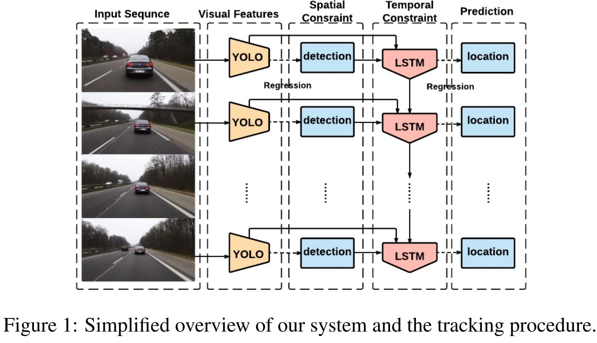
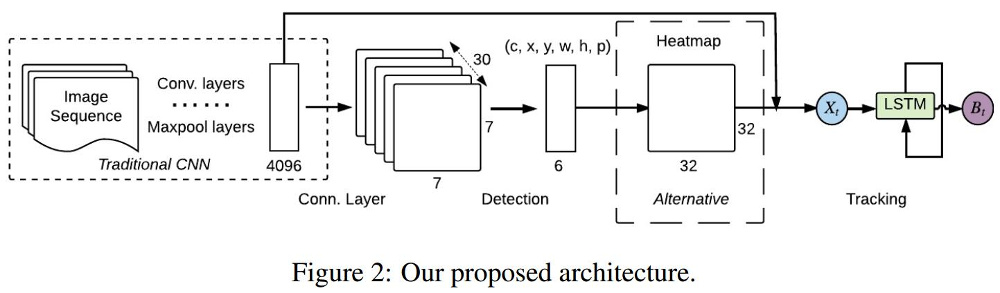

# Spatially Supervised Recurrent Convolutional Neural Networks for Visual Object Tracking
[arXiv](https://arxiv.org/abs/1607.05781)
[TOC]

## Introduction

## Method
### Overview

1. The major innovation of LSTM is its memory cell ct which essentially acts as an accumulator of the state information. The cell is accessed, written and cleared by several self-parameterized controlling gates.
   * Every time a new input comes, its information will be accumulated to the cell if the input gate it is activated.
   * Also, the past cell status ct−1 could be “forgotten” in this process if the forget gate ft is on.
   * Whether the latest cell output ct will be propagated to the final state ht is further controlled by the output gate ot.
> 对LSTM的描述

2. YOLO检测，然后选择assign the correct detection to the tracking target，用一个assignment cost matrix计算IOU distance between 当前的检测和历史记忆的正确检测。如果IOU过小，reject assignments

### system

1. architecture
    1. use YOLO to collect rich and robust visual features, as well as preliminary location inferences
    2. use LSTM in the next stage as it is spatially deep and appropriate for sequence processing
    > YOLO 用来提取目标的视觉特征和位置参考， LSTM 用来

2. Alternative Heatmap
   1. alternatively convert the ROLO prediction location into a feature vector of length 1024, which can be translated into a 32-by-32 heatmap
   2. concatenate it with the 4096 visual features before feeding into the LSTM
   3. The advantage of the heatmap is that it allows to have confidence at multiple spatial locations and we can visualize the intermediate results

## Referecne
### tracking-by-detection
[23] Lijun Wang, Wanli Ouyang, Xiaogang Wang, and Huchuan Lu. Stct: Sequentially training convolutional networks for visual tracking. CVPR, 2016.
[13] Seunghoon Hong, Tackgeun You, Suha Kwak, and Bohyung Han. Online tracking by learning discriminative saliency map with convolutional neural network. In ICML, 2015.

## learned
heat map是很好的思想，还需进一步加深理解。heat map其实就是LSTM预测的结果，本来1024-d，直接个4096-d的特征concat就可以送入LSTM。作者又把它resize到32x32，训练时，正确的位置为1，错误的为0
