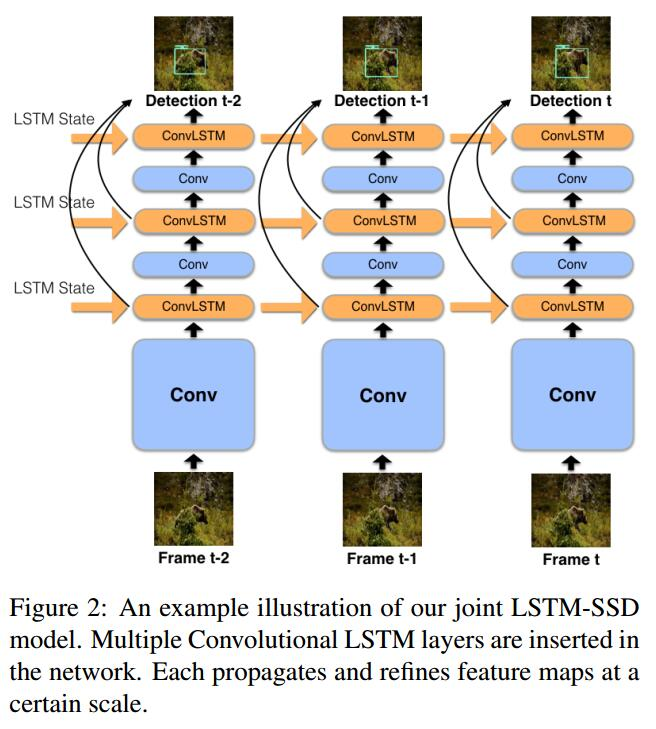
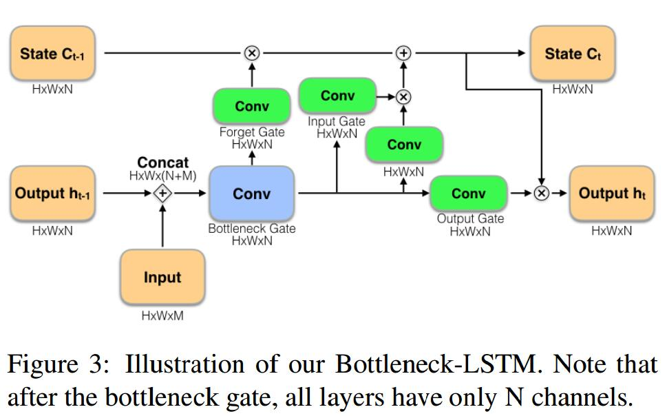

# Mobile Video Object Detection with Temporally-Aware Feature Maps
[arXiv](https://arxiv.org/abs/1711.06368)
## Architecture

* 在feature map后插入LSTM
* 引入block gate来减小通道数，文章中$4N=M$
* LSTM门用sigmoid，c和h用relu
> 与TSSD插入LSTM的方式不同
