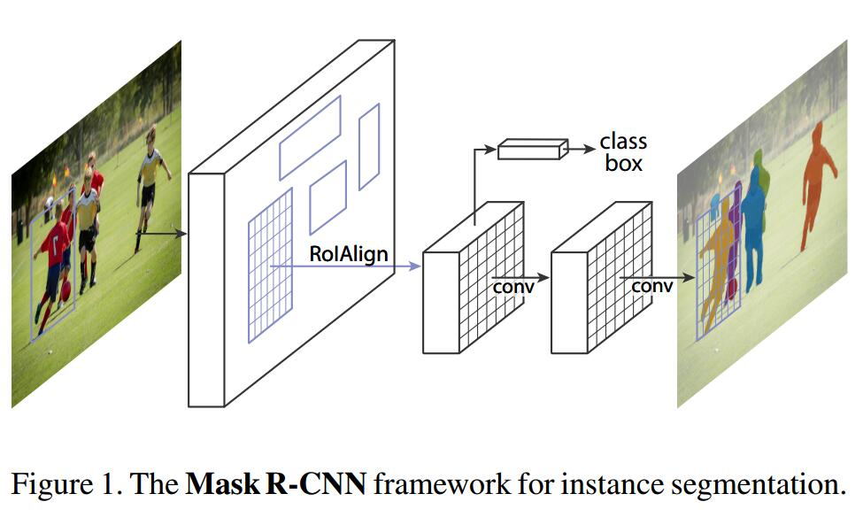

# Mask R-CNN

1. 三个分支：cls, box, mask
   mask branch: $Km^2$-dimensional output  encodes $K$ binary masks of resolution $m\times m$
   > $K$位类别数

2. Loss: $L=L_{cls}+L_{box}+L_{mask}$
   $L_{mask}$仅对gt class计算, inference时用cls分支的结果选择mask

3. RoIAlign
   RoIPooling需要量化/离散RoI的边界，而RoIAlign用双线性插值在RoI的四个边界上计算准确的feature
