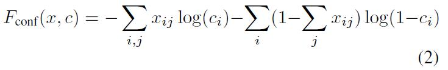
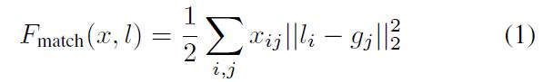

# Scalable Object Detection using Deep Neural Networks

## Referance
[11] -- branch-and-bound strategy to avoid evaluating all potential
object locations.

## Goal
    将基于DNN 的物体检测方法扩展到大规模数据集上。

## Contribution
1. 将物体检测问题定义为输出为多个bounding box 的回归问题。每个bounding box 同时输出坐标和置信度，使得模型更加紧凑和高效。
2. 利用DNN 同时学习数据的表示和bounding box 检测器。
3. 在无类别监督的条件下训练box 检测器，使得该方法的计算复杂度几乎不受物体类别的影响，因此适合于大规模物体检测问题。该方法还可以推广到未知的类别。

##　DPM 的问题：
1. Sliding windows 需要在多个尺度上进行穷尽搜索，时间代价高。Branch-and-bound [1]策略避免了这个问题。
2. 检测时间和类别数目成线性关系，不利于大规模检测问题。使用低维共享的基[2] 和哈希方法[3] 可以解决这个问题。
3. 另一个解决将检测扩展到大规模类别的思路是借助分割来解决。首先进行自下而上的类别无关的分割[4]，然后利用由上至下的推理来对分割得到的区域进行打分[5,6,7]。在对分割块进行判断之前，还可以先判断每个区块是否包含一个物体，然后再判断类别 [8] 。

## Method
作者采用“定位+识别”两步的方法。即先用DNN 回归模型定位出若干可能的bounding box（此时并不知道每个box 的label，置信度只表明该box 包含物体的可能性大小），然后利用DNN 分类器对每个box 进行识别。

1. DNN 回归模型：
* Model：将DNN 输出层改为回归。输出为包含K个bounding box 的坐标$l_k \in R^4$（左上和右下坐标）和这K个box 对应的置信度$c_k \in R$（表明该box 包含物体的可能性大小）。
* Loss: min{预bbox和真实bbox的匹配误差（平方误差） - 预测bbox 的置信度（条件熵）}

* Optimization：BP
* 训练细节
提出Prior Matching 的概念，即将先验知识整合到匹配过程中。具体来说，就是对训练样本的真实bbox 进行聚类，得到物体的几个典型位置，利用他们来辅助匹配。
