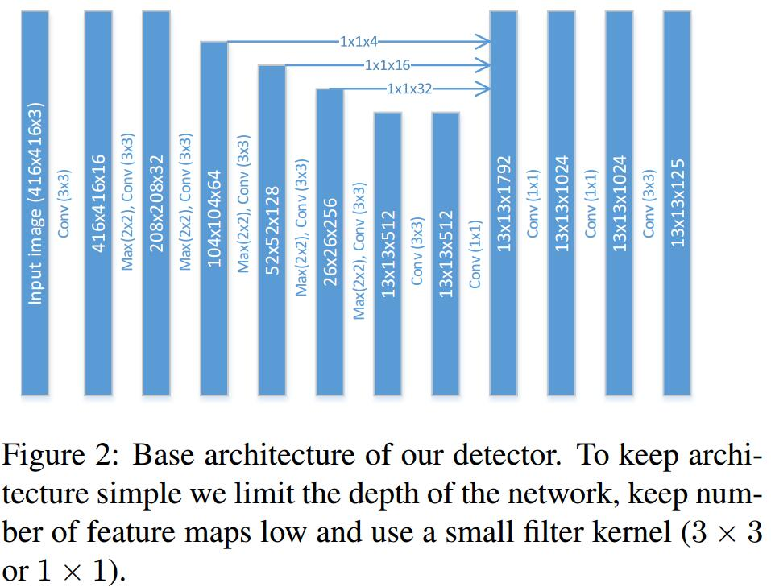
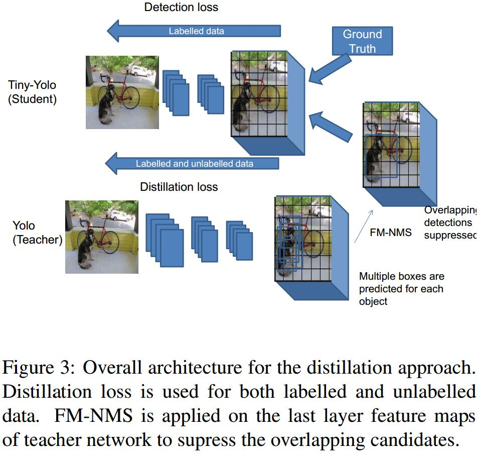
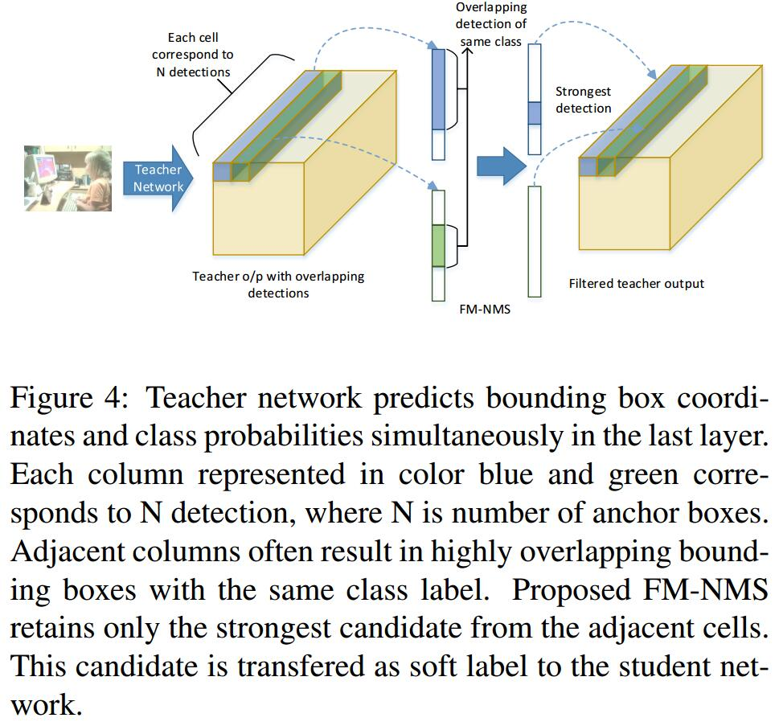

# Object detection at 200 Frames Per Second
[arXiv](https://arxiv.org/abs/1805.06361)

## Architecture

## Distillation

1. YOLO loss
每个cell预测$N(k+5)$个值，$N$为anchor，$k$为类别数，5=bbox + objectness(IOU between prediction and ground truth)
$$ L_{YOLO}=f_{obj}(o_i^{gt},\hat{o}_i) + f_{cl}(p_i^{gt},\hat{p}_i) + f_{bb}(b_i^{gt},\hat{b}_i)$$

2. distillation
   1. teacher network: 精度更高，更复杂
   2. student network：速度更快，更简单
   3. take the output of the last layer of the teacher network and replace it with the ground truth $o_i^{gt}, p_i^{gt}, b_i^{gt}$
   > student network 学习 teacher network的操作，但是在single stage detector里这种dense sampling可能导致distillation失效, 因为传播了背景 (two stage detector可以，因为不dense)

3. Objectness scaled Distillation
The idea is to learn the bounding box coordinates and class probabilities only when objectness value of the teacher prediction is high. 只学习objectness高的
$$ f_{obj}^{Comb}(o^{gt}_i,\hat o_i, o^T_i)=f_{obj}(o_i^{gt},\hat{o}_i)+\lambda_D f_{obj}(o_i^{T},\hat{o}_i) $$
> 第一项是Detection loss，第二项是Detection loss

$$
\begin{array}l
f_{cl}^{Comb}(p^{gt}_i,\hat p_i, p^T_i, \hat{o_i^T})=f_{cl}(p_i^{gt},\hat{p}_i)+\hat{o_i^T}\lambda_D f_{cl}(p_i^{T},\hat{p}_i) \\
f_{bb}^{Comb}(b^{gt}_i,\hat b_i, b^T_i, \hat{o_i^T})=f_{bb}(b_i^{gt},\hat{b}_i)+\hat{o_i^T}\lambda_D f_{bb}(b_i^{T},\hat{b}_i)
\end{array}
$$
> 第二项是objectness scaled distillation part

## Feature Map-NMS

1. 一些cell和anchor预测同一个object，所以需要NMS
2. 但NMS在end-to-end network architecture之外，网络最后的预测结果仍然有很多overlapping prediction
3. 如果teacher network传播这些overlapping prediction给student network可能导致over-fitting
4. FM-NMS: if multiple candidates in neighbourhood of KxK cells correspond to the same class, then they are highly likely to correspond to the same object in an image. Thereby, we choose only one candidate with the highest objectness value. 其实就是做一次NMS，这里所谓的FM其实已经是预测结果了，只不过没有解码出来

## Effectiveness of data
distillation loss 可以由Unlabeled data 来做

## Learned
1. 提出了一个light-weight的主干网络
2. Objectness scaled Distillation: 用较弱的网络去学习较强的网络，这里可以用到Unlabeled data
