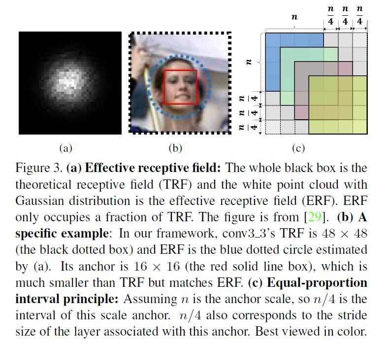

# S3FD: Single Shot Scale-invariant Face Detector


<!-- toc orderedList:0 depthFrom:1 depthTo:6 -->

* [S3FD: Single Shot Scale-invariant Face Detector](#s3fd-single-shot-scale-invariant-face-detector)
  * [Anchor matching strategy](#anchor-matching-strategy)
    * [`multibox_loss_layer.cpp`的`Forward_cpu`](#multibox_loss_layercpp的forward_cpu)
    * [`FindMatches` in `bbox_util.cpp`](#findmatches-in-bbox_utilcpp)
    * [`MatchBBox` in `bbox_util.cpp`](#matchbbox-in-bbox_utilcpp)
    * [Implementation](#implementation)
  * [Max-out](#max-out)
  * [关于anchor](#关于anchor)
  * [感受野(receptive field)](#感受野receptive-field)
  * [Mining type](#mining-type)
    * [`MineHardExamples` in `bbox_util.cpp`](#minehardexamples-in-bbox_utilcpp)
  * [对本次比赛的启发](#对本次比赛的启发)

<!-- tocstop -->


## Anchor matching strategy
   1. We follow current anchor matching method but decrease threshold from 0:5 to 0:35 in order to increase the average number of matched anchors.
   2. We deal with each of these faces as follow: firstly picking out anchors whose jaccard overlap with this face are higher than 0:1, then sorting them to select top-N as matched anchors of this face. We set N as the average number from stage one.
   

### `multibox_loss_layer.cpp`的`Forward_cpu`
1. 获得所有的ground truth bbox `all_gt_bboxes`; 所有的prior bboxes `prior bboxes`; prior variances `prior_variances`; 所有的位置预测 `all_loc_preds`，就是`bottom[0]`，`loc_data`
2. Find match.
函数`FindMatches`在`bbox_util.cpp`中
3. 基于`mining type`, 筛选hard negative (and positive)样本
函数`MineHardExamples`在`bbox_util.cpp`中
4. 前向计算loc和conf的loss

### `FindMatches` in `bbox_util.cpp`
> 只在训练过程中匹配prior_bbox和gt_bbox
不仅是给每个groudtruth box找到了最匹配的prior box，而是给每个prior box都找到了匹配的groundtruth box（如果有的话），这样显然大大增大了正样本的数量

1. 函数原型和调用
```cpp
void FindMatches(const vector<LabelBBox>& all_loc_preds,
      const map<int, vector<NormalizedBBox> >& all_gt_bboxes,
      const vector<NormalizedBBox>& prior_bboxes,
      const vector<vector<float> >& prior_variances,
      const MultiBoxLossParameter& multibox_loss_param,
      vector<map<int, vector<float> > >* all_match_overlaps,
      vector<map<int, vector<int> > >* all_match_indices)

FindMatches(all_loc_preds, all_gt_bboxes, prior_bboxes, prior_variances,
              multibox_loss_param_, &all_match_overlaps, &all_match_indices_);
```
2. 参数
```cpp
// in
const vector<LabelBBox>& all_loc_preds, //所有的位置预测
const map<int, vector<NormalizedBBox> >& all_gt_bboxes, //所有的gt bbox
const vector<NormalizedBBox>& prior_bboxes,
const vector<vector<float> >& prior_variances,
const MultiBoxLossParameter& multibox_loss_param,
//out
vector<map<int, vector<float> > >* all_match_overlaps, //所有匹配的overlap
vector<map<int, vector<int> > >* all_match_indices //所有匹配的索引
```
3. multibox_loss_param 参数解析, 重要的有
```cpp
const float overlap_threshold = multibox_loss_param.overlap_threshold();
const bool use_prior_for_matching =
      multibox_loss_param.use_prior_for_matching(); // true
const CodeType code_type = multibox_loss_param.code_type(); // CENTER_SIZE
const bool encode_variance_in_target =
      multibox_loss_param.encode_variance_in_target();  //false
const bool ignore_cross_boundary_bbox =
      multibox_loss_param.ignore_cross_boundary_bbox(); //false
```
4. Find matches
```cpp
int num = all_loc_preds.size();   //
  for (int i = 0; i < num; ++i) { // 对每一个预测bbox操作
    map<int, vector<int> > match_indices;
    map<int, vector<float> > match_overlaps;
    // Check if there is ground truth for current image.
    if (all_gt_bboxes.find(i) == all_gt_bboxes.end()) { // 当前image上没有gt
      // There is no gt for current image. All predictions are negative.
      all_match_indices->push_back(match_indices);
      all_match_overlaps->push_back(match_overlaps);
      continue;
    }
    // Find match between predictions and ground truth.
    const vector<NormalizedBBox>& gt_bboxes = all_gt_bboxes.find(i)->second;  // 取gt box
    if (!use_prior_for_matching) {            // use_prior_for_matching = true
      for (int c = 0; c < loc_classes; ++c) {
        int label = share_location ? -1 : c;
        if (!share_location && label == background_label_id) {
          // Ignore background loc predictions.
          continue;
        }
        // Decode the prediction into bbox first.
        vector<NormalizedBBox> loc_bboxes;
        bool clip_bbox = false;
        DecodeBBoxes(prior_bboxes, prior_variances,
                     code_type, encode_variance_in_target, clip_bbox,
                     all_loc_preds[i].find(label)->second, &loc_bboxes);
        MatchBBox(gt_bboxes, loc_bboxes, label, match_type,
                  overlap_threshold, ignore_cross_boundary_bbox,
                  &match_indices[label], &match_overlaps[label]);
      }
    } else {  // 使用先验
      // Use prior bboxes to match against all ground truth.
      vector<int> temp_match_indices;    // 存放的规则是第i个prior与temp_match_indices[i]grounding truth 匹配，要是为-1表示不匹配。
      vector<float> temp_match_overlaps; // 存放上面说的overlap
      const int label = -1;
      MatchBBox(gt_bboxes, prior_bboxes, label, match_type, overlap_threshold,
                ignore_cross_boundary_bbox, &temp_match_indices,  
                &temp_match_overlaps);
      if (share_location) {   // share_location=true,一般都是share_location
        match_indices[label] = temp_match_indices;
        match_overlaps[label] = temp_match_overlaps;
      } else {// 不share_location
          ...
      }
    }  // 使用先验，结束
    all_match_indices->push_back(match_indices);
    all_match_overlaps->push_back(match_overlaps);
  }   // end for all_loc_preds.size()
```
### `MatchBBox` in `bbox_util.cpp`
1. 原型和调用
```cpp
void MatchBBox(const vector<NormalizedBBox>& gt_bboxes,
    const vector<NormalizedBBox>& pred_bboxes, const int label,
    const MatchType match_type, const float overlap_threshold,
    const bool ignore_cross_boundary_bbox,
    vector<int>* match_indices, vector<float>* match_overlaps)
MatchBBox(gt_bboxes, prior_bboxes, label, match_type, overlap_threshold,
          ignore_cross_boundary_bbox, &temp_match_indices,  
          &temp_match_overlaps);
```
2. 参数
```cpp
// in
const vector<NormalizedBBox>& gt_bboxes,
const vector<NormalizedBBox>& pred_bboxes,
const int label,  // -1
const MatchType match_type, // P.MultiBoxLoss.PER_PREDICTION
const float overlap_threshold,  // 0.5
const bool ignore_cross_boundary_bbox, // false
// out
vector<int>* match_indices,
vector<float>* match_overlaps
```
3. vector::resize
```cpp
void resize(
   size_type _Newsize, //The new size of the vector.
   Type _Val //The value of new elements added to the vector if the new size is larger that the original size. If the value is omitted, the new objects are assigned the default value.
);
```
4. 函数本体
> 先为每个gt_bbox找出一个overlap最高的prior_bbox，这里不需要overlap_treshold。
再为未匹配的prior_bbox找到对应的gt_bbox, overlap>overlap_treshold

[Bipartite matching.](http://www.csie.ntnu.edu.tw/~u91029/Matching.html)
```cpp
void MatchBBox(const vector<NormalizedBBox>& gt_bboxes,
    const vector<NormalizedBBox>& pred_bboxes, const int label,
    const MatchType match_type, const float overlap_threshold,
    const bool ignore_cross_boundary_bbox,
    vector<int>* match_indices, vector<float>* match_overlaps) {
  int num_pred = pred_bboxes.size();           // 初始化 10196
  match_indices->clear();
  match_indices->resize(num_pred, -1); // -1表示还没有进行匹配
  match_overlaps->clear();
  match_overlaps->resize(num_pred, 0.);

  int num_gt = 0;
  vector<int> gt_indices;
  if (label == -1) {         // label = -1 取所有的gt box
    // label -1 means comparing against all ground truth.
    // label是-1表示对比所有的ground truth，label不是-1表示只比较label类型的ground truth
    num_gt = gt_bboxes.size();
    for (int i = 0; i < num_gt; ++i) {
      gt_indices.push_back(i);
    }
  } else {
    // Count number of ground truth boxes which has the desired label.
    for (int i = 0; i < gt_bboxes.size(); ++i) {
      if (gt_bboxes[i].label() == label) {
        num_gt++;
        gt_indices.push_back(i);
      }
    }
  }
  if (num_gt == 0) {
    return;
  }

  // Store the positive overlap between predictions and ground truth.
  map<int, map<int, float> > overlaps; //初始值全为0
  for (int i = 0; i < num_pred; ++i) {
    if (ignore_cross_boundary_bbox && IsCrossBoundaryBBox(pred_bboxes[i])) {  // ignore_cross_boundary_bbox = false
      (*match_indices)[i] = -2;
      continue;
    }
    for (int j = 0; j < num_gt; ++j) {
      float overlap = JaccardOverlap(pred_bboxes[i], gt_bboxes[gt_indices[j]]);   // 计算overlap并保存
      if (overlap > 1e-6) {                                                       
        (*match_overlaps)[i] = std::max((*match_overlaps)[i], overlap);
        overlaps[i][j] = overlap; //保存第i个pred_bbox和gt_bbox的overlap
      }
    }
  }

  // Bipartite matching.  
  vector<int> gt_pool;
  for (int i = 0; i < num_gt; ++i) {
    gt_pool.push_back(i);
  }
  while (gt_pool.size() > 0) {
    // Find the most overlapped gt and cooresponding predictions.
    int max_idx = -1;
    int max_gt_idx = -1;
    float max_overlap = -1;
    for (map<int, map<int, float> >::iterator it = overlaps.begin();
         it != overlaps.end(); ++it) {
      int i = it->first; // pred_bbox的索引
      if ((*match_indices)[i] != -1) {
        // The prediction already has matched ground truth or is ignored.
        continue;
      }
      for (int p = 0; p < gt_pool.size(); ++p) {
        int j = gt_pool[p]; //gt_bbox的索引
        if (it->second.find(j) == it->second.end()) { // 第i个pred 与第j个grounding truth没有overlap
          // No overlap between the i-th prediction and j-th ground truth.
          continue;
        }
        // Find the maximum overlapped pair.
        if (it->second[j] > max_overlap) {
          // If the prediction has not been matched to any ground truth,
          // and the overlap is larger than maximum overlap, update.
          max_idx = i;  // i是map索引值
          max_gt_idx = j;   // j是gt的索引
          max_overlap = it->second[j];
        }
      } // edn for p
    } // end for iterator
    if (max_idx == -1) {
      // Cannot find good match.
      break;
    } else {
      CHECK_EQ((*match_indices)[max_idx], -1);
      (*match_indices)[max_idx] = gt_indices[max_gt_idx];
      (*match_overlaps)[max_idx] = max_overlap;
      // Erase the ground truth.
      gt_pool.erase(std::find(gt_pool.begin(), gt_pool.end(), max_gt_idx));
    }
  }  // 目前为止每个gt_bbox都有一个匹配的pred_bbox，且这个overlap是最高的

  switch (match_type) {
    case MultiBoxLossParameter_MatchType_BIPARTITE:
      // Already done.
      break;
    case MultiBoxLossParameter_MatchType_PER_PREDICTION:
      // Get most overlaped for the rest prediction bboxes. 为未匹配的pred_bbox找gt_bbox
      for (map<int, map<int, float> >::iterator it = overlaps.begin();
           it != overlaps.end(); ++it) {
        int i = it->first;  
        if ((*match_indices)[i] != -1) {
          // The prediction already has matched ground truth or is ignored.
          continue;
        }
        int max_gt_idx = -1;
        float max_overlap = -1;
        for (int j = 0; j < num_gt; ++j) {
          if (it->second.find(j) == it->second.end()) {
            // No overlap between the i-th prediction and j-th ground truth.
            continue;
          }
          // Find the maximum overlapped pair.
          float overlap = it->second[j];
          if (overlap >= overlap_threshold && overlap > max_overlap) {
            // If the prediction has not been matched to any ground truth,
            // and the overlap is larger than maximum overlap, update.
            max_gt_idx = j;
            max_overlap = overlap;
          }
        } // end for j
        if (max_gt_idx != -1) {
          // Found a matched ground truth.
          CHECK_EQ((*match_indices)[i], -1);
          (*match_indices)[i] = gt_indices[max_gt_idx];
          (*match_overlaps)[i] = max_overlap;
        }
      }  // end for iterator
      break;
    default:
      LOG(FATAL) << "Unknown matching type.";
      break;
  }

  return;
}
```
### Implementation
```cpp
// Store the positive overlap between predictions and ground truth.
  map<int, map<int, float> > overlaps;
  map<int, std::multimap<float, int, std::greater<float> > > overlaps2; 			 //new
  vector<int> max_match_index(num_pred, -1);										 //new
  for (int i = 0; i < num_pred; ++i) {
    if (ignore_cross_boundary_bbox && IsCrossBoundaryBBox(pred_bboxes[i])) {
      (*match_indices)[i] = -2;
      continue;
    }
    for (int j = 0; j < num_gt; ++j) {
      float overlap = JaccardOverlap(pred_bboxes[i], gt_bboxes[gt_indices[j]]);
      if (overlap > 1e-6) {
//        (*match_overlaps)[i] = std::max((*match_overlaps)[i], overlap);
        overlaps[i][j] = overlap;
        overlaps2[j].insert(pair<float, int>(overlap, i));							 //new
        if (overlap > (*match_overlaps)[i]){										 //new
          max_match_index[i] = gt_indices[j];										 //new
          (*match_overlaps)[i] = overlap;
        }
      }
    }

//keep some gt  at least have 6 matched-anchors
     vector<int> gt_num_matched_anchor(num_gt, 0);
     for(int p=0;p<num_pred;p++){
       if ((*match_indices)[p] !=-1){
     	  gt_num_matched_anchor[(*match_indices)[p]]++;
     	}
     }
     for (int g = 0; g < num_gt; g++) {
       float gt_width = (gt_bboxes[gt_indices[g]].xmax() - gt_bboxes[gt_indices[g]].xmin()) * 640 + 1;
   	float gt_height = (gt_bboxes[gt_indices[g]].ymax() - gt_bboxes[gt_indices[g]].ymin()) * 640 + 1;
   	float gt_radius = sqrtf(gt_width*gt_height);
   	//if (gt_radius <= 16 && gt_num_matched_anchor[g]<6) {
   	if (gt_num_matched_anchor[g]<6) {
   	  for (map<float, int>::iterator it = overlaps2[g].begin(); it != overlaps2[g].end(); ++it){
   	    if (max_match_index[it->second] == gt_indices[g] && (*match_indices)[it->second]==-1 && it->first >=0.14){
   		  (*match_indices)[it->second] = gt_indices[g];
   		  (*match_overlaps)[it->second] = it->first;
   		  gt_num_matched_anchor[g]++;
   		  if (gt_num_matched_anchor[g]>=6) {
   			float th = it->first;
   			it++;
   			while (it->first == th && max_match_index[it->second] == gt_indices[g] && (*match_indices)[it->second]==-1){
   		      (*match_indices)[it->second] = gt_indices[g];
   			  (*match_overlaps)[it->second] = it->first;
   			  gt_num_matched_anchor[g]++;
   			  it++;
   			}
   		    break;
   		  }
   		 }
   	  }
   	 }
    }
```
[std:multimap是允许重复键的map](http://blog.csdn.net/tianmohust/article/details/10114691)

## Max-out
对于负样本，多分类几次，取最大的得分作为负样本的得分

## 关于anchor
所有的anchor都在原图上，detection layer上的每个卷积区域对其所对应的anchor进行分类和回归，回归得到的一个4维向量:偏移量和长宽调整比例

## 感受野(receptive field)
   1. feature map某个点的响应对应的输入图像的区域就是感受野
   2. [计算详解1](https://zhuanlan.zhihu.com/p/22627224)
      [计算详解2](https://zhuanlan.zhihu.com/p/26663577)
      [位置计算](https://zhuanlan.zhihu.com/p/26663577)
      从$k-1$层到$k$层的运算经过了一个核大小为$kenel_{size}$,步长为$stride$的conv or pooling
      $$ rf^{k-1}_{size}=(rf^{k}_{size}-1)*stride+kenel_{size} $$
   3. Effective receptive field: 感受野中心区域对该点影响较大，边缘区域影响较小
   

## Mining type

### `MineHardExamples` in `bbox_util.cpp`
> 使用在`FindMatches`之后
1. 函数申明与调用
```cpp
void MineHardExamples(const Blob<Dtype>& conf_blob,
    const vector<LabelBBox>& all_loc_preds,
    const map<int, vector<NormalizedBBox> >& all_gt_bboxes,
    const vector<NormalizedBBox>& prior_bboxes,
    const vector<vector<float> >& prior_variances,
    const vector<map<int, vector<float> > >& all_match_overlaps,
    const MultiBoxLossParameter& multibox_loss_param,
    int* num_matches, int* num_negs,
    vector<map<int, vector<int> > >* all_match_indices,
    vector<vector<int> >* all_neg_indices)

MineHardExamples(*bottom[1], all_loc_preds, all_gt_bboxes, prior_bboxes,
                 prior_variances, all_match_overlaps, multibox_loss_param_,
                 &num_matches_, &num_negs, &all_match_indices_,
                 &all_neg_indices_);
```
2. 参数
```cpp
// in
const Blob<Dtype>& conf_blob, // bottom输入mbox_conf
const vector<LabelBBox>& all_loc_preds, //预测box
const map<int, vector<NormalizedBBox> >& all_gt_bboxes, //gt box
const vector<NormalizedBBox>& prior_bboxes, // 先验box
const vector<vector<float> >& prior_variances,
const vector<map<int, vector<float> > >& all_match_overlaps, // 匹配的box
const MultiBoxLossParameter& multibox_loss_param,
// out
int* num_matches, int* num_negs,
vector<map<int, vector<int> > >* all_match_indices,
vector<vector<int> >* all_neg_indices
```
3. 参数解析
```cpp
const int background_label_id = multibox_loss_param.background_label_id();  // 0
const bool use_prior_for_nms = multibox_loss_param.use_prior_for_nms();     // default = false
const ConfLossType conf_loss_type = multibox_loss_param.conf_loss_type();   // SOFTMAX
const MiningType mining_type = multibox_loss_param.mining_type();   // default = MAX_NEGATIVE
const LocLossType loc_loss_type = multibox_loss_param.loc_loss_type();   // SMOOTH_L1
const float neg_pos_ratio = multibox_loss_param.neg_pos_ratio();   // 3.0
const float neg_overlap = multibox_loss_param.neg_overlap();    // 0.5
const CodeType code_type = multibox_loss_param.code_type();   // CENTER_SIZE
const bool encode_variance_in_target = multibox_loss_param.encode_variance_in_target();        // default = false
const bool has_nms_param = multibox_loss_param.has_nms_param();  // false
```
4. 计算conf loss 存放在 `vector<vector<float> > all_conf_loss`中
```cpp
ComputeConfLossGPU(conf_blob, num, num_priors, num_classes,
      background_label_id, conf_loss_type, *all_match_indices, all_gt_bboxes,
      &all_conf_loss);
```
5. 如果 `mining_type == MultiBoxLossParameter_MiningType_HARD_EXAMPLE`，计算loc loss 存放在`vector<vector<float> > all_loc_loss`, 否则`all_loc_loss`全为0
```cpp
ComputeLocLoss(loc_pred, loc_gt, *all_match_indices, num,
                   num_priors, loc_loss_type, &all_loc_loss);
```
6. 对batch中的每个图像进行处理
7. 把conf_loss 放到`vector<float> loss;`里
8. 未完待续...

## 对本次比赛的启发
1. anchor的大小需根据实际物体大小来设置
2. 对于不太好的数据集，`mining_type` 需要认真考虑
3. 学习率的变化：采取multi-step，第一次变化前尽量训练充分
