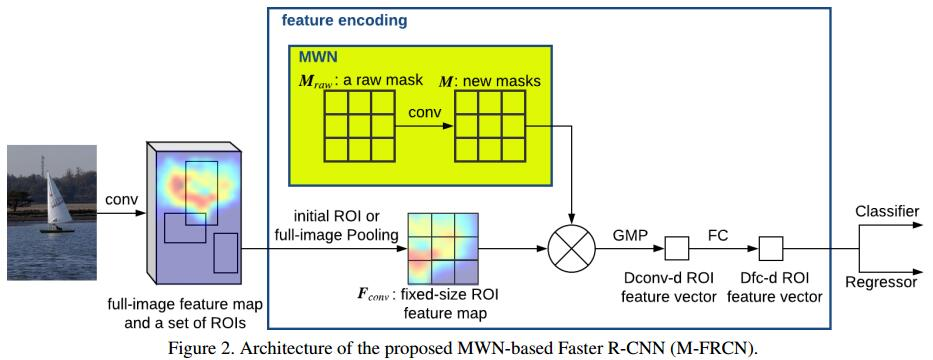

# Object Detection with Mask-based Feature Encoding
[arXiv](https://arxiv.org/abs/1802.03934)

## Approach

1. Overview
    1. ROI pooling $F$
    2. Mask Weight Network (MWN)
       1. 输入: a raw Mask $M_raw$
       2. 操作: a set of Conv
       3. 输出: new Masks $M^k$, $k$对应每个channel
    3. $M$与$F$逐通道、逐元素相乘得到$F'$
    4. global max pooling (GMP) 作用于每个channel
    5. FC layer
