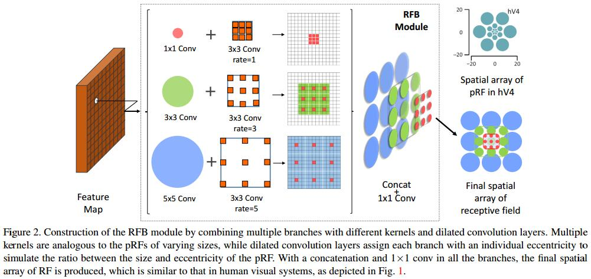
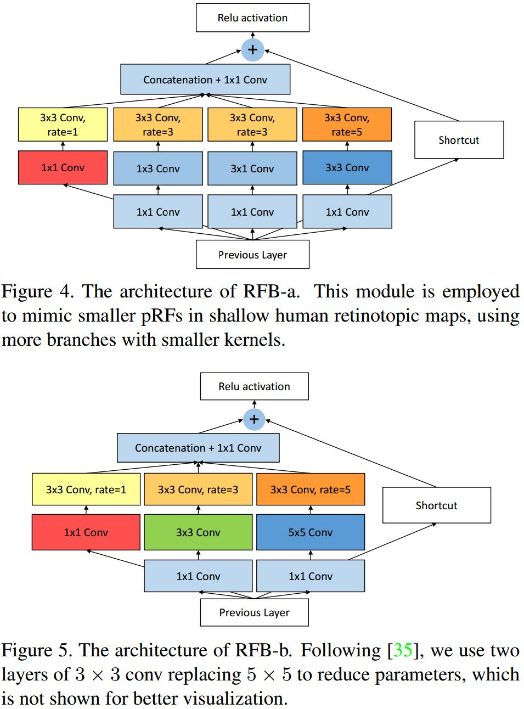
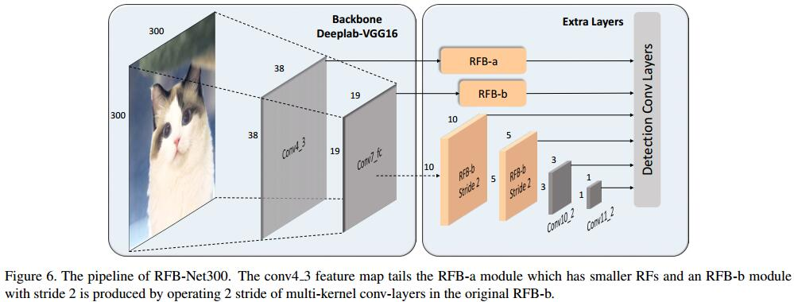

# Receptive Field Block Net for Accurate and Fast Object Detection
[arXiv](https://arxiv.org/abs/1711.07767)
[github](https://github.com/ruinmessi/RFBNet)

## Introduction
1. 大多情况，一个feature map上的RF是一致的
2. GoogleNet [34] considers RFs of multiple sizes, and it implements this concept by launching multi branch CNNs with different convolution kernels.
> 多分支结构实现RF的多样化

3. Deformable CNN [4] attempts to adaptively adjust the spatial distribution of RFs according to the scale and shape of the object.
> 自适应调整RF

## Receptive Field Block

1. Multi-branch convolution layer
2. Dilated pooling or convolution layer

## RFB Net Detection Architecture

## Reference
1. Dilated Convolution
[3] L.-C. Chen, G. Papandreou, F. Schroff, and H. Adam. Rethinking atrous convolution for semantic image segmentation. arXiv preprint arXiv:1706.05587, 2017.

## Learned
主要针对感受野进行改进，利用多分支结构和空洞卷积
