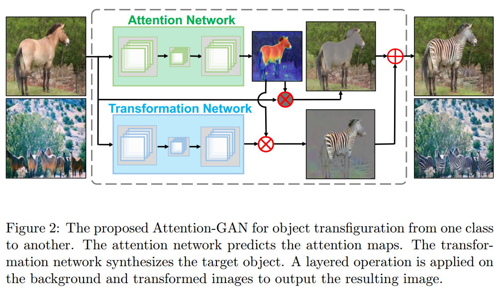

# Attention-GAN for Object Transfiguration in Wild Images
[arXiv](https://arxiv.org/abs/1803.06798)

## Model

1. an attention network, $ A_X(x) $
2. transformation network, $ T_X(x) $
$$
\begin{array}l
G(x) = A_X(x)\odot T_X(x)+(1-A_X(x))\odot x \\
F(G(x)) \approx x
\end{array}
$$
3. discriminative network
4. loss
    1. adversarial loss
    2. cycle consistency loss
    > only work for region in attention mask

    3. attention loss: the regions of interest in the original image and the transformed image should be the same
    $$
    \begin{array}l
    \mathcal L_{A_{cyc}}=\mathbb E_{x\in X}[||A_X(x)-A_Y(G(x))||_ 1]+E_{y\in Y}[||A_Y(y)-A_X(F(y))||_ 1] \\
    \mathcal L_{A_{sparse}}(A_X,A_Y)=E_{x\in X}[||A_X(x)||_ 1]+E_{y\in Y}[||A_Y(y)||_ 1]
    \end{array}
    $$
    > 1. Attention 一致性：$A_X(x)\approx A_Y(G(x)), A_Y(y)\approx A_Y(F(y))$
    > 2. Attention稀疏性：尽量关注small region而不是the whole image
    > 3. 当有分割label时，不用$\mathcal L_{A_{cyc}},\mathcal L_{A_{sparse}}$，只用分割label,$\{(x_1,m_1),...,(x_N,m_N))\}$, $m=0\quad or\quad 1$
    $$ \mathcal L_{A_{sup}}=\sum_{i=1}^{N_X}||m_i-A_X(x_i)||_ 1+\sum_{i=1}^{N_Y}||m_j-A_Y(y_j)||_ 1 $$

## Learned
1. 为无监督image2image加了attention
2. transform时，仍操作原图，最后加权生成结果
