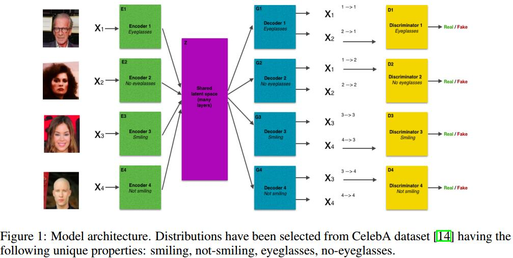

# Composable Unpaired Image to Image Translation
[arXiv](https://arxiv.org/abs/1804.05470)
[github](https://github.com/lgraesser/im2im2im)

## Introduction
1. [6] introduces the requirement that translations be cycle-consistent; mapping image $x\in X$ to domain $Y$ and back again to $X$ must yield an image that is close to the original.
2. [7] enforces weight sharing between the early layers of the generators and later layers of the discriminators.
3. [8] combines these two ideas and models each image domain using a VAE-GAN.
4. [9] utilizes reconstruction loss and teacher loss instead of VAE using a pretrained teacher network to ensure the encoder output lies in a meaningful subregion.
5. [10] has presented results in generating translations between multiple distribution samples. However, their generator is conditioned on supervised labels.

## Method
1. symbols
    1. distributions $N=\{X_1,...,X_N\}$
    2. existing and unknown joint distribution $P(X_1,...,X_N)$
    3. $x_j = G_j\circ E_i(x_i), \{i,j\}\in N$
2. architecture

Assumption: there exists a single latent code $z$ from which images in any of the four domains can be recovered

## Reference
[6] J. Zhu, T. Park, P. Isola, and A. A. Efros, “Unpaired image-to-image translation using cycleconsistent adversarial networks,” CoRR, vol. abs/1703.10593, 2017.

[7] M.-Y. Liu and O. Tuzel, “Coupled generative adversarial networks,” in Advances in Neural Information Processing Systems 29 (D. D. Lee, M. Sugiyama, U. V. Luxburg, I. Guyon, and R. Garnett, eds.), pp. 469–477, Curran Associates, Inc., 2016.

[8] M. Liu, T. Breuel, and J. Kautz, “Unsupervised image-to-image translation networks,” CoRR, vol. abs/1703.00848, 2017.

[9] A. Royer, K. Bousmalis, S. Gouws, F. Bertsch, I. Moressi, F. Cole, and K. Murphy, “Xgan: Unsupervised image-to-image translation for many-to-many mappings,” arXiv preprint arXiv:1711.05139, 2017.

[10] Y. Choi, M. Choi, M. Kim, J.-W. Ha, S. Kim, and J. Choo, “Stargan: Unified generative adversarial networks for multi-domain image-to-image translation,” arXiv preprint arXiv:1711.09020, 2017.

## Learned
扩展[UNIT](./[UNIT]_Unsupervised_Image-to-Image_Translation_Networks.md)到多分布表达
