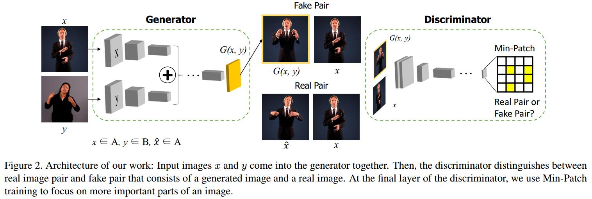
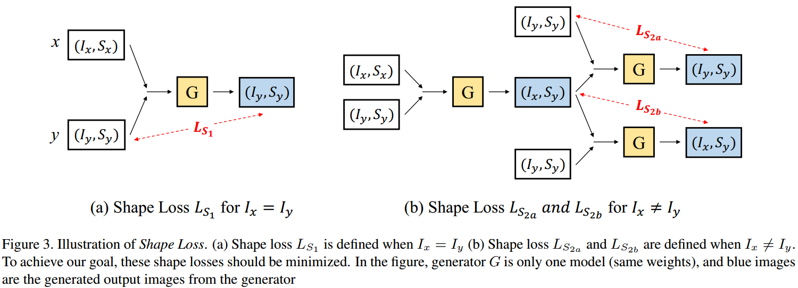
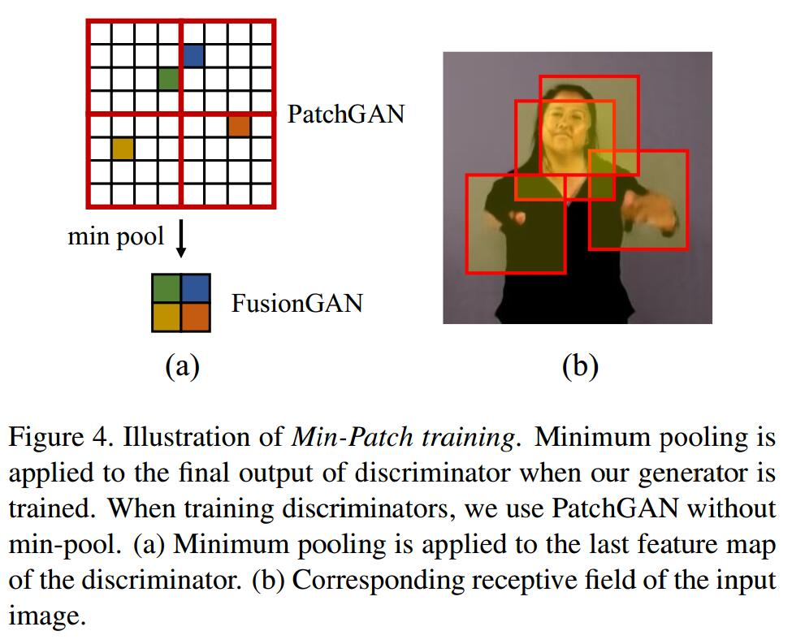

# Generating a Fusion Image: One’s Identity and Another’s Shape
[arXiv](https://arxiv.org/abs/1804.07455)

## Method

1. Goal: $x=(I_x,S_x), y=(I_y,S_y), G(x,y)=(I_x,S_y)$
> identity: can be seen as a set-level characteristic
  shape: can be seen as an instance-level characteristic

2. Loss
   1. Identity loss
   $$
   \begin{array}l
   L_I(G,D)=\mathbb E_{x,\hat x\sim p_{data}(x)}[\log D(x,\hat x)]+ \mathbb E_{x\sim p_{data}(x),y\sim p_{data}(y)}[\log( 1-D(x,G(x,y)))] \\
   L_I(G,D)=\mathbb E_{x,\hat x\sim p_{data}(x)}[||1-D(x,\hat x)||_ 2]+ \mathbb E_{x\sim p_{data}(x),y\sim p_{data}(y)}[||D(x,G(x,y))||_ 2]
   \end{array}
   $$
   > $x, y$是两个输入，$\hat x$是和$x$同identity的另一个图像。实际上用下面的loss

   2. Shape Loss
   
   $$
   \begin{array}l
   L_{S_1}(G)=\mathbb E_{x\sim p_{data}(x),y\sim p_{data}(y)}[||y-G(x,y)||_ 1] \\
   L_{S_{2a}}=\mathbb E_{x\sim p_{data}(x),y\sim p_{data}}(||y-G(y,G(x,y))||_ 1) \\
   L_{S_{2b}}=\mathbb E_{x\sim p_{data}(x),y\sim p_{data}}(||G(x,y)-G(G(x,y),y)||_ 1)
   \end{array}
   $$
   > $s_1: I_x=I_y$
   $s_{2a}: (I_x,S_x)\to (I_x,S_y)\to (I_y,S_y)$
   $s_{2b}: (I_x,S_x)\to (I_x,S_y)\to (I_x,S_y)$

3. Min-Patch Training

patch-GAN 的最后一层再加层Minimum pooling，找到最困难的区域

## Learned
1. condition GAN，这里有两个condition
