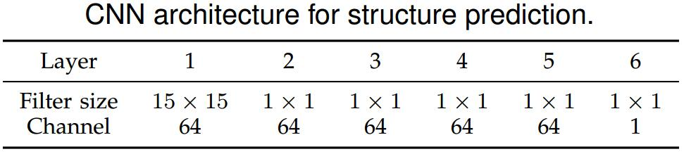

# Learning to Deblur Images with Exemplars
[arXiv](https://arxiv.org/pdf/1805.05503.pdf)

## Introduction
1. blurred image formation
$$ B=I*k+\varepsilon $$
> $B$: blurred input image; $I$: blurred input image; $k$: blur kernel: $* $: convolutio; $\varepsilon $: noise

## Learned
2. 针对人脸进行deblur，提出了exemplar-based method和CNN-based method
3. CNN-method用于reduce the computational cost，并predict **sharp edges** more effectively than the exemplar-based method
  
   1. 采用了$15\times 15$的卷积核来capture large spatial information
   2. 后面的层都不考虑空间信息
   3. 从实验看出CNN对edge很关键
4. 这两个方法都是用于估计blur kernel，之后再用去卷积的方法恢复图像[42]

## Reference
[42] A. Levin, R. Fergus, F. Durand, and W. T. Freeman, “Image and depth from a conventional camera with a coded aperture,” ACM Trans. Graph., vol. 26, no. 3, p. 70, 2007.
