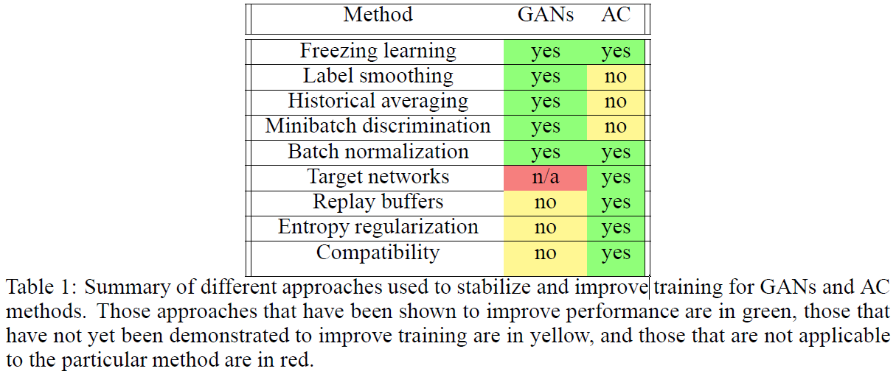

# Connecting Generative Adversarial Networks and Actor-Critic Methods
[arXiv](https://arxiv.org/abs/1610.01945)

<!-- toc orderedList:0 depthFrom:1 depthTo:6 -->

* [Connecting Generative Adversarial Networks and Actor-CriticMethods](#connecting-generative-adversarial-networks-and-actor-criticmethods)
  * [Introduction](#introduction)
  * [Algorithms](#algorithms)
  * [Reference](#reference)

<!-- tocstop -->

## Introduction
1. AC
   1. takes an action
   2. reward information
2. GAN
   1. generates a sample
   2. real samples from the distribution in question
3. Common
   1. a second model which evaluates the output of the first model
   2. first model must learn based on error signals from the second model alone.

## Algorithms
1. similar

2. difference

3. Stabilizing Strategies
   1. Freezing learning
   2. Label smoothing

## Reference
1. DDPG
[7] David Silver, Guy Lever, Nicholas Heess, Thomas Degris, Daan Wierstra, and Martin Riedmiller. Deterministic policy gradient algorithms. In Proceedings of the 31st International Conference on Machine Learning, 2014.
2. policy gradient
[2] Richard S Sutton, David A McAllester, Satinder P Singh, Yishay Mansour, et al. Policy gradient methods for reinforcement learning with function approximation. In Advances in Neural Information Processing Systems, volume 99, pages 1057–1063, 1999.
