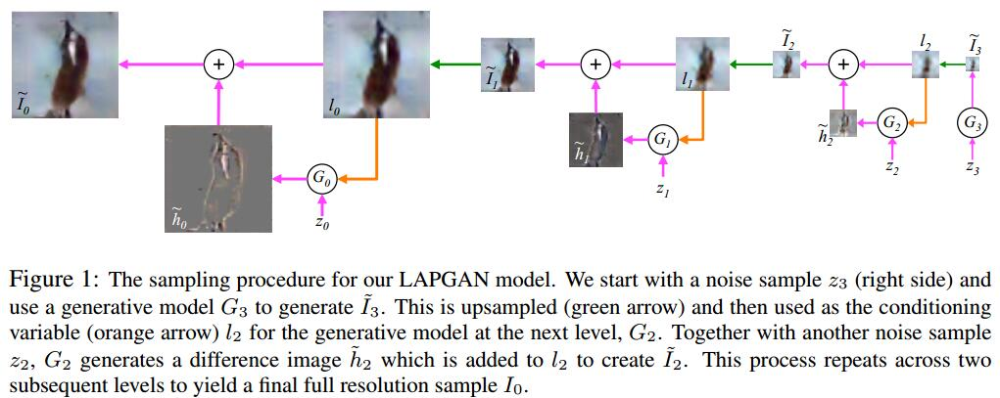
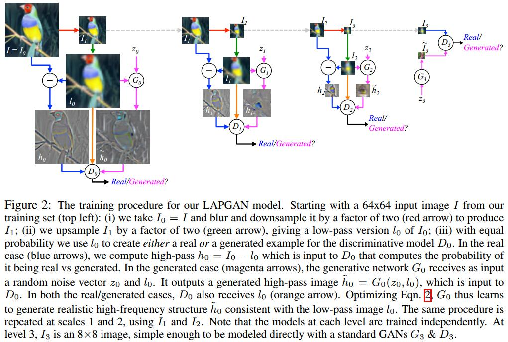

# Deep Generative Image Models using a Laplacian Pyramid of Adversarial Networks
[arXiv](https://arxiv.org/abs/1506.05751)

## Laplacian Pyramid
1. a linear invertible image representation consisting of a set of band-pass images, spaced an octave apart, plus a low-frequency residual.
2. starting at the coarsest level $I_K=h_K$, we repeatedly upsample and add the difference image h at the next finer level until we get back to the full resolution image.
$$
\begin{array}l
 h_k=L_k(I)=G_k-u(G_{k+1}(I))=I_k-u(I_{k+1}) \\
 I_k=u(I_{k+1}+h_k)
\end{array}
$$
> $G(I)=[I_0,...,I_K]$ -- Gaussian pyramid
$I_k$ -- $I$经过$k$次下采样
$L(I)$ --  Laplacian pyramid
$u$ -- upsampling

## Laplacian Generative Adversarial Networks (LAPGAN)

1. a set of generative convnet models $\{G_0,...,G_K\}$,  each of which captures the distribution of coefficients $h_k$ for natural images at a different level of the Laplacian pyramid.
> $G_k$ 生成 $h_k$

2.
$$ \widetilde I_k=u(\widetilde I_{k+1})+\widetilde h_k = u(\widetilde I_{k+1})+ G_k(z_k, u(\widetilde I_{k+1})) $$
> $\widetilde I_{K+1}=0$

## learned
1. 把生成问题打破为层级的优化 (Breaking the generation into successive refinements)
2. 每个层级由一个G负责
3. 由于Laplacian pyramid可由原图生成，所以可无监督训练
