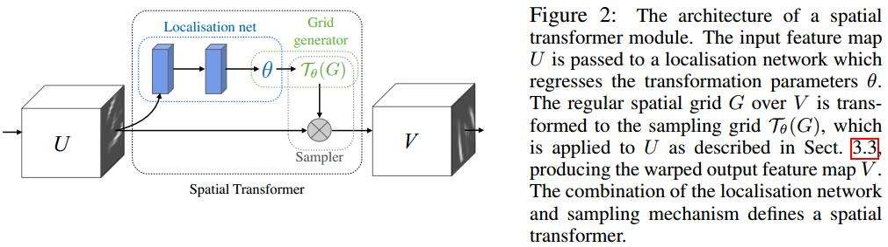

# Spatial Transformer Networks
[arXiv](https://arxiv.org/abs/1506.02025)
[pytorch](http://pytorch.org/tutorials/intermediate/spatial_transformer_tutorial.html)

## Introduction
1. max-pooling (e.g. 2 × 2 pixels): this spatial invariance is only realised over a deep hierarchy of max-pooling and convolutions, and the intermediate feature maps (convolutional layer activations) in a CNN are not actually invariant to large transformations of the input data

## Spatial Transformers

### localisation network
1. $U\in \mathbb R^{H\times W\times C}\to \theta, \theta=f_{loc}(U)$
2. 变换参数 $\mathcal T_\theta$ 会被用于feature map
3. $f_{loc}$ 可以任意形式，e.g.,  a fully-connected network or a convolutional network. 但最后需回归出$\theta$
### Parameterised Sampling Grid
1. 假设$\mathcal T_\theta$ 是一个2D放射变换$A_\theta$
$$
\left(\begin{array}lx_i^s \\ y_i^s\end{array}\right)=\mathcal T_\theta(G_i)=A_\theta\left(\begin{array}lx_i^t \\ y_i^t \\1\end{array}\right)= \left[\begin{array}l\theta_{11} & \theta_{12}& \theta_{13} \\ \theta_{11} & \theta_{22}& \theta_{23}\end{array}\right]\left(\begin{array}lx_i^t \\ y_i^t \\1\end{array}\right)
$$
> $(x_i^t, y_i^t)$ are the target coordinates of the regular grid in the output feature map, $-1\lt x_i^t,y_i^t\lt 1$.
$(x_i^s, y_i^s)$ are the source coordinates in the input feature map that define the sample points, $-1\lt x_i^s,y_i^s\lt 1$.

2. 线性变换, allowing cropping, translation, and isotropic scaling
$$ A_\theta =  \left[\begin{array}l s & 0 & t_x \\ 0 & s & t_y \end{array}\right]$$

### Differentiable Image Sampling
1. General spatial transformation
$$
V_i^c=\sum_N^H\sum_m^WU_{nm}^ck(x_i^s-m;\Phi_x)k(y_i^s-n;\Phi_y) \quad \forall i\in[1...H'W']\quad \forall i\in[1...C]
$$
> $\Phi_x,\Phi_y$ are the parameters of a generic sampling kernel $k()$ which defines the image interpolation (e.g. bilinear)
$U_{nm}^c$ is the value at location $(n, m)$ in channel $c$ of the input
$V_i^c$ is the output value for pixel i at location $(x_i^t, y_i^t)$ in channel $c$

2. Using a integer sampling kernel: copying the value at the nearest pixel to $(x_i^s ; y_i^s)$ to the output location $(x_i^t; y_i^t)$.
$$
V_i^c=\sum_N^H\sum_m^WU_{nm}^c\delta(\lfloor x_i^s+0.5\rfloor-m)\delta(\lfloor y_i^s+0.5\rfloor-n)
$$
> $\lfloor x_i^s+0.5\rfloor$ rounds $x$ to the nearest integer and $\delta()$ is the [Kronecker delta function](https://zh.wikipedia.org/wiki/%E5%85%8B%E7%BD%97%E5%86%85%E5%85%8B%E5%87%BD%E6%95%B0)

3. Using a bilinear sampling kernel
   1. Sampling
  $$
  V_i^c=\sum_N^H\sum_m^WU_{nm}^c\max(0,1-|x_i^s-m|)\max(0,1-|y_i^s-n|)
  $$
   2. Gradient
  $$
  \frac{\partial V_i^c}{\partial U_{nm}^c}=\sum_N^H\sum_m^W\max(0,1-|x_i^s-m|)\max(0,1-|y_i^s-n|)
  $$
  $$
  \frac{\partial V_i^c}{\partial x_i^s}=\sum_N^H\sum_m^WU_{nm}^c\max(0,1-|y_i^s-n|)\left\{\begin{array}l0\quad \text{if}\quad|m-x_i^s|\ge 1 \\ 1\quad \text{if}\quad m\ge x_i^s \\ -1\quad \text{if}\quad m\lt x_i^s \end{array}\right.
  $$
  > allowing loss gradients to flow back not only to the input feature map, but also to the sampling grid coordinates, and therefore back to the transformation parameters $\theta$ and localisation network

## Spatial Transformer Networks
1. The combination of the localisation network, grid generator, and sampler form a spatial transformer
2. does not impair the training speed
3. It is also possible to use spatial transformers to downsample or oversample a feature map
4. it is possible to have multiple spatial transformers in a CNN
