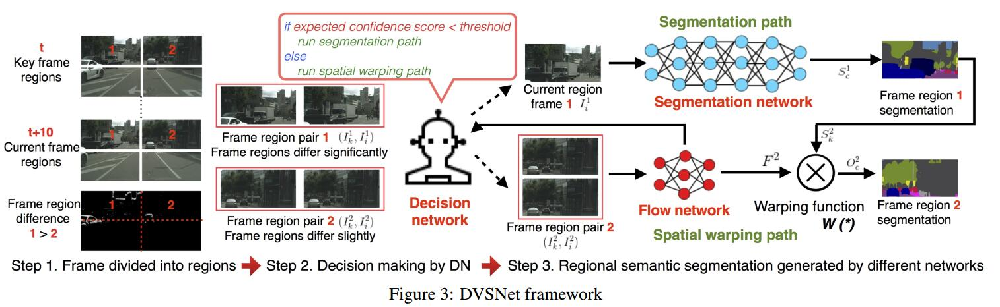
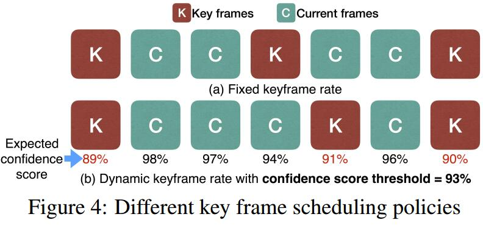

# Dynamic Video Segmentation Network
[arXiv](https://arxiv.org/abs/1804.00931)

## Introduction
1. Goal: to adaptively apply two different neural networks to different regions of the frames, exploiting spatial and temporal redundancies in feature maps as much as possible to accelerate the processing speed
> 对视频的不同区域用不同的网络，减小空间和时间的冗余

2. segmentation network (deeper and slower) + flow network (FlowNet 2.0 [35]) (shallower and faster )

3. expected confidence score
> 得分高区域的用flow net处理

## DVSNet

### Dynamic Video Segmentation Network
1.  dividing the input frames into frame regions
2. DN analyzes the frame region pairs between $I_k$ and $I_i$, and evaluates the $expected~confidence~scores$ for the four regions separately. DN compares the expected confidence score of each region against a predetermined threshold.
> $I_k$ represents the key frame(用分割), $I_i$ represents the current frame(用光流). DN分析两帧的区域对以及$expected~confidence~scores$,并于阈值比较
> DN的作用: 评估一个空间区域是否会产生(与key frame)相似的分割结果

3. frame regions are forwarded to different paths to generate their regional semantic segmentations. flow network can not generate a regional image segmentation by itself. It simply predicts the displacement of objects by optical flow
> 前向传播，flow net不会产生分割，只是预测位移

## Adaptive Key Frame Scheduling

1. Goal: updates the key frames after a certain period of time
2. $confidence~score$: ground truth difference in pixels between $O_r$(光流的结果) and $S_r$(分割的结果)
$$ confidence~score=\frac{\sum_{p\in P}C(O^r(p), S^r(p))}{P} $$
> $P$是$r$区域内像素总和，$p$是像素点，$C$是0,1函数(相等时为1)

3. DN compares its $expected~confidence~score$ against $t$($confidence~score$的阈值), If it is higher than $t$, $F_r$ is considered satisfactory. Otherwise, $I_r$ is forwarded to the
segmentation path
