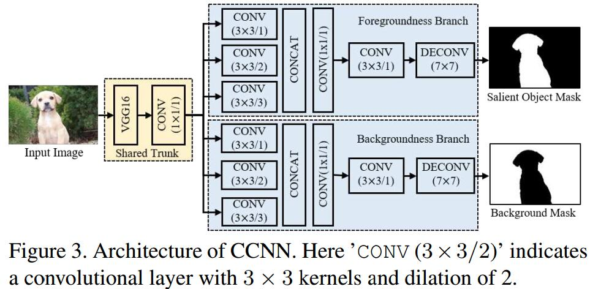

# Primary Video Object Segmentation via Complementary CNNs and Neighborhood Reversible Flow
[cv](http://openaccess.thecvf.com/content_ICCV_2017/papers/Li_Primary_Video_Object_ICCV_2017_paper.pdf)

## Introduction
1. image-based salient object detection: segmentation of primary image objects
2. primary video objects: the objects that consistently pop-out throughout a whole video
> 在视频里始终出现的object

## Complementary Convolutional Neural Networks (CCNN) 互补的CNN

1. Shared trunk
    1. remove all the pooling layers after $Conv4\_1$
    2. conduct dilated convolution in all subsequent $Conv$ layers to extend the receptive fields without loss of resolution
    3. the last two fully connected layers are converted into convolutional layers with $7\times 7$ and $1\times 1$ kernels, respectively
    > 修改$Conv4\_1$后的卷积，保持feature的size不变，全连接变为两个卷积

    4. Input size: $280\times 280\times 3$
    5. output size: $35\times 35\times 128$
2. foregroundness and backgroundness estimation
    1. parallel CONV layers; dilation = 1, 2, 3 ensures the measurement of foregroundness and backgroundness at three consecutive scales
    > 在3个连续的尺度上测量

    2. $1\times 1 Conv$ for compressed
    3. output foregroundness $X_u$ and backgroundness $Y_u$ maps via $DeConv$ layers and sigmoid activation functions

## Neighborhood Reversible Flow for Efficient Temporal Propagation
   1. Goal: propagate foregroundness and backgroundness along the temporal axis
   2. 临近帧存在大量冗余，所以想要从far-away frames寻找primary objects的线索 for, 同时抑制 distractors。但是光流处理far-away frames不准，所以建立了neighborhood reversible flow based on superpixels(超像素)
   3. superpixels: average RGB, Lab and HSV colors as well as the horizontal and vertical positions
   4. frame $\mathcal I_u$分为$N_u$个superpixels，记为$\mathcal O_{ui}$
   4. $I_u$和$I_v$的superpixels计算$l1$ distance
   5. 找到$\mathcal O_{ui}$的$k$近邻$\mathcal N_k(O_{ui}|I_v)$
   6. 如果两个superpixels互为k近邻，则他们是k-neighborhood reversible的
   7. 形成flow $F_{uv}\in \mathbb R^{N_u\times N_v}$
   8. Temporal Propagation
   propagation process is actually calculating the average foregroundness and backgroundness scores within a local temporal slice under the guidance of neighborhood reversible flow
   > 在局部时间片中，在neighborhood reversible flow的引导下，计算foregroundness and backgroundness scores的平均值

## Learned
1. parallel CONV layers 可提取多尺度信息，增加感受野 [zhihu](https://www.zhihu.com/question/54149221)
2. 提出了一种跨帧计算association的方法
3. 超像素的构建：采用多颜色空间
