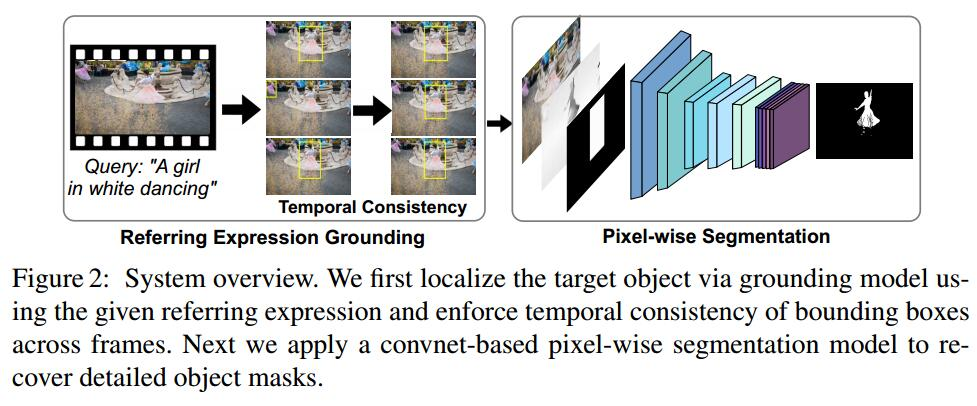

# Video Object Segmentation with Language Referring Expressions
[arXiv](https://arxiv.org/abs/1803.08006)

[TOC]

## Method

1. Grounding objects in video by referring expressions
   1. 两个基本元素
      1. box proposal $O=\{o_i\}_{i=1}^M$
      2. textual query $Q$
   2. grounding model 输出一组匹配得分$S=\{s_i\}_{i=1}^M$
   3. 最高得分的proposal被选择为predicted region
   4. 为解决predicted region在时序上的不稳定性(主要是false negative)，对得分$S$进行重排序
      1. 目的：减少false negative；忽略短时出现的目标
      2. 根据overlap
      $$ \hat s_i = s_i\times(\sum_{j=1,j\neq i}^Mr_{i,j}\times d_j\times s_j/t_{i,j})$$
      > $r_{i,j}$是第$i,j$个box的IoU
      $t_{i,j}=|f_i-f_j|$ 是temporal distance, $f$是frame
      $d_j$ 是原始的score

2. Pixel-level video object segmentation (box refinement task)
   1. 产生二值图, concatenate RGB 通道和 optical flow magnitude。形成5通道的输入 (Fusing appearance and motion cues)
   2. Training
      1. 在静态图上训练，采用密集分割标注的数据集
      2. bbox由分割gt产生，训练时随机抖动
      3. 综合光流信息 [63]，减去中值做平均
      > subtracting the median motion for each frame and averaging the magnitude of the forward and backward flow.

      4. 放射变换：模拟相机或目标的运动

## Reference
[63]. Ilg, E., Mayer, N., Saikia, T., Keuper, M., Dosovitskiy, A., Brox, T.: Flownet 2.0: Evolution of optical flow estimation with deep networks. In: Proceedings of the IEEE Conference on Computer Vision and Pattern Recognition (CVPR). (2017)
[66]. Chen, L.C., Papandreou, G., Kokkinos, I., Murphy, K., Yuille, A.L.: Deeplab: Semantic image segmentation with deep convolutional nets, atrous convolution, and fully connected crfs. arXiv:1606.00915 (2016)
> spatial pyramid pooling

## Learned
用query找到bbox，再对bbox进行分割，其中对bbox proposal做了时序一致性处理，处理过程存在疑问
