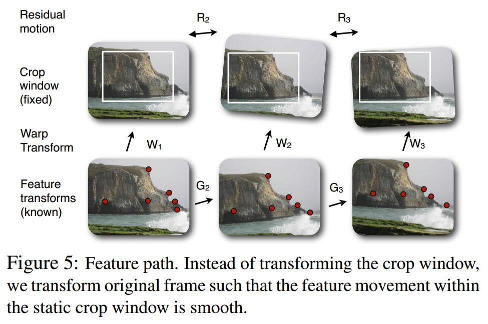

#	Auto-Directed Video Stabilization with Robust L1 Optimal Camera Paths
[project](https://www.cc.gatech.edu/cpl/projects/videostabilization/)

1. Estimating the original (potentially shaky) camera path.
2. Estimating a new smooth camera path
3. Synthesizing the stabilized video using the estimated smooth camera path.

