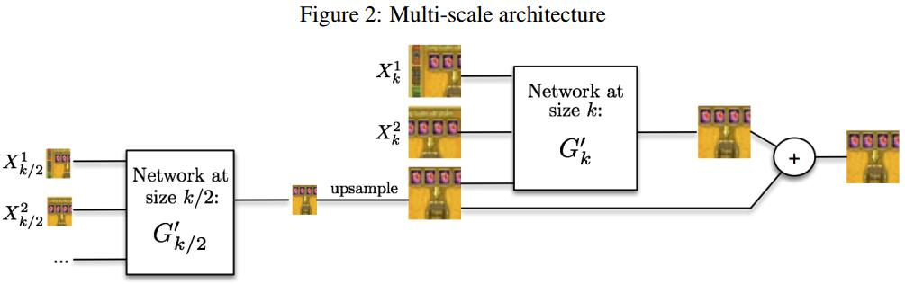

# Deep multi-scale video prediction beyond mean square error
[arXiv](https://arxiv.org/abs/1511.05440)

## Introduction
1. $l_2$ loss function inherently produces blurry results. Indeed, using the $l_2$ loss comes from the assumption that the data
is drawn from a Gaussian distribution, and works poorly with multimodal distributions.
> 用$l_2$ loss 做视频预测往往产生模糊，因为它只能处理高斯分布，对多峰分布不起作用

## Models
1. $Y=\{Y^1,...,Y^n\}$是对$Y=\{X^1,...,X^m\}$的预测
2. 问题1：卷积不能处理long-range dependencies，所以引入Multi-scale Network
3. 问题2：$l_2$ loss 会产生模糊的预测，因为它不能处理多峰分布。例如，某个输出像素等概率地可能是$v_1$ 或 $v_2$, $l_2$ loss的结果是$(v1+v_2)/2$。所以引入了对抗loss
### Multi-scale Network

1. $N$个尺度的子网络，input size 为 $s_1,...,s_N$
2. $G'_ k$ 预测 $Y_k-u_k(Y_{k-1})$，预测的结果是
$$ \hat Y_k=G_k(X)=u_k(\hat Y_{k-1})+G'_ k(X_k,u_k(\hat Y_{k-1})) $$
> $G'_ k$预测的是尺度间的差异
> $Y^i_k$为$Y^i$下采样的结果，尺度为$s_k$; $Y^i_k$同样; $u_k$ is the upscaling operator toward size $s_k$ (向$s_k$的上采样)

### Adversarial training
1. Multi-scale Network 作为 G
2. D 处理一个视频序列，预测最后一帧的real or fake
3. 序列中最后一帧是真实的或者生成的，前面的帧都是真实的
4. 实际上是一个condition GAN，是否加入噪声对结果影响不大
5. D也是针对N个尺度的，loss
$$
\begin{array}l
\mathcal L^D_{adv}=\sum_{k=1}^N L_{bce}(D_k(X_k,Y_k),1)+L_{bce}(D_k(X_k,G_K(X_k),0) \\
\mathcal L^G_{adv} = \sum_{k=1}^N L_{bce}(D_k(X_k,G_K(X),1) \\
\end{array}
$$
> $L_{bce}$ is the binary cross-entropy loss

### Image gradient difference loss (GDL)
$$
\begin{array}l
\mathcal L_{gdl}(X,Y)=L_{gdl}=\sum_{i,j}||Y_{i,j}-Y_{i-1,j}|-|\hat Y_{i,j}-\hat Y_{i-1,j}||^\alpha+
||Y_{i,j-1}-Y_{i,j}|-|\hat Y_{i,j-1}-\hat Y_{i,j}||^\alpha \\
\mathcal L^G(X,Y) = \lambda_{adv}\mathcal L^G_{adv}(X,Y)+\lambda_p\mathcal L_p(X,Y) + \mathcal L_{gdl}(X,Y)
\end{array}
$$
> real和fake样本中，梯度应该保持相似; $\alpha\ge 1$; $\mathcal L_p$是$l_p$ loss

## Learned
1. $l_2$ loss 的缺点：对多峰分布只能权衡处理。相反，这正是对抗loss的优势所在
1. 多尺度G net
2. G loss 由对抗loss，$l_p$ loss, 和GDL loss组成，保证生成图像不模糊
