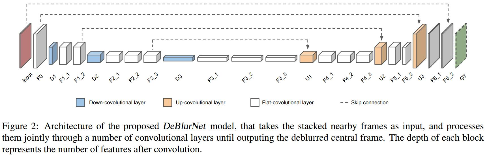

# Deep video deblurring
[arXiv](https://arxiv.org/abs/1611.08387)

## introducion
1. Deblur using deconvolution
strongly rely on the accuracy of the assumed image degradation model (blur, motion, noise) and its estimation.
2. Multi-image aggregation
   1. combine multiple images in either spatial or frequency domain without solving any inverse problem.
   2. aggregation approaches rely on the observation that in general not all video frames are equally blurred.
   > 视频里的各帧不是同等blur的，Sharp pixels能在邻近帧中传递，方法有homography alignment[30]、patch-based alignment[4]、3D reconstruction[20]、Fourier[5,6]

3. Data-driven approaches

## Method

1. three types of convolutional layers
   1. down-convolutional layers
   2. flat-convolutional layers
   3. up-convolutional layers
2. three versions of our dataset with varying degrees of alignment
   1. no alignment at all (significantly faster)
   2. use optical flow to align stacks (be slow to compute and prone to errors)
   3. single global homography to align frames (compromise in terms of computational complexity and alignment quality)
3. training input size: $15\times 128\times 128$, 15是5帧的堆叠
  test input size: $960\times 540$

4. processing time for a frame
   1. this paper: within 1s (without alignment)
   2. [6]:15s, [4]:30s, [2]:more than 1 hour, [17]:several minutes

5. Synthetical data
   1. 采集240fps的视频
   2. 隔8帧抽取，得到30fps的视频，作为gt
   3. 以每帧gt为中心，用7帧图像合成运动模糊
   4. 71 videos, each with 3-5s average running time.
   5. 6708 synthetic blurry frames with corresponding ground truth

6. data augmention
   1. flipping
   2. rotating (0°, 90°, 180°, 270°)
   3. scaling (1/4; 1/3; 1/2) the images
   4. random 128×128 crops

## Reference
### Survy
[47] R. Wang and D. Tao. Recent progress in image deblurring. arXiv preprint arXiv:1409.6838, 2014.

### Multi-image aggregation
[4] S. Cho, J. Wang, and S. Lee. Video deblurring for hand-held cameras using patch-based synthesis. ACM Trans. Graph., 31(4):64, 2012.

[5] M. Delbracio and G. Sapiro. Burst deblurring: Removing camera shake through fourier burst accumulation. In Proc. IEEE Conf. Comput. Vis. Pattern Recognit. (CVPR), 2015. 2, 8

[6] M. Delbracio and G. Sapiro. Hand-held video deblurring via efficient fourier aggregation. IEEE Trans. Comp. Imag., 1(4):270–283, 2015.

[20] F. Klose, O. Wang, J.-C. Bazin, M. Magnor, and A. SorkineHornung. Sampling based scene-space video processing. ACMTrans. Graph., 34(4):67, 2015.

 [30] Y. Matsushita, E. Ofek, W. Ge, X. Tang, and H.-Y. Shum. Full-frame video stabilization with motion inpainting. IEEE Trans. Pattern Anal. Mach. Intell., 28(7):1150–1163, July 2006.

## Learned
1. 采用encoder-decoder的传统方式
2. 考虑时序信息：输入时用5帧堆叠
