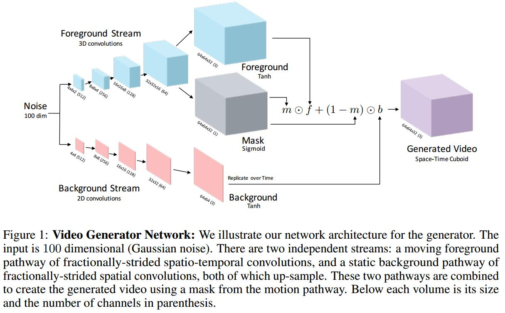

# Generating Videos with Scene Dynamics
[arXiv](https://arxiv.org/abs/1609.02612)

## Generative Models for Video
1. G
    
    1. $0\le m(z)\le 1$ 是时空mask，选择背景$b$和前景$f$
    2. $\odot$是 element-wise multiplication
    3. 训练时，加入$\lambda||m(z)||_ 1$来使$m$稀疏，也就是尽量用$b$少用$f$
2. D
   1. solve two problems
      1. classify realistic scenes from synthetically generated scenes
      2. recognize realistic motion between frames
