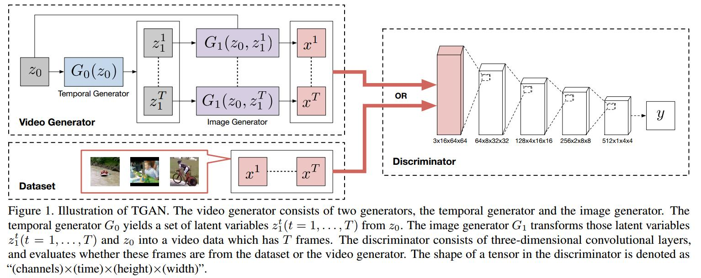
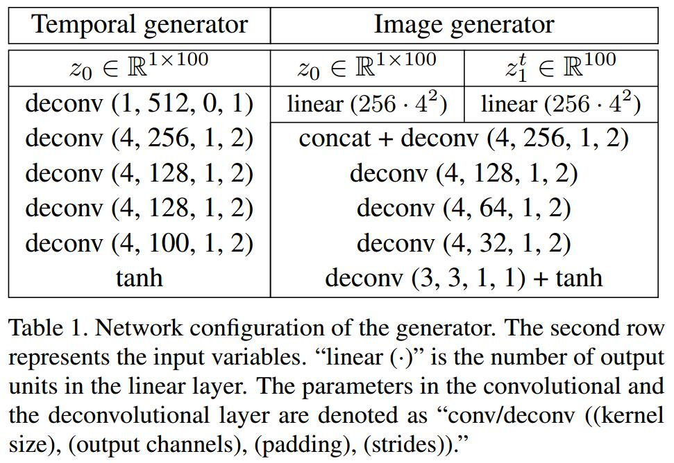

# Temporal generative adversarial nets with singular value clipping
[arXiv](https://arxiv.org/abs/1611.06624)

## Temporal Generative Adversarial Nets

1. Wasserstein GAN
   1. the GAN training can also be interpreted as the minimization of the [Jensen-Shannon (JS) divergence](https://en.wikipedia.org/wiki/Jensen%E2%80%93Shannon_divergence)
   2. K-Lipschitz constraint
   $$ |D(x_1)-D(x_2)|\le K|x_1-x_2| $$
   3. if D satisfies K-Lipschitz constraint, minimax game of WGAN can be represented as
   $$ \min_{\theta_G}\max_{\theta_D}\mathbb E_x[D(x)]-E_z[D(G(z))] $$
   4. To make the discriminator be the K-Lipschitz: clamps all the weights in the discriminator to a fixed box denoted as $w\in [-c, c]$
   > 为了K-Lipschitz，D中的参数被clamp

2. Temporal GAN
   1. $G_0: z_0\in \mathbb R^{k_0}\to [z_1^1,...,z_1^T]\in\mathbb R^{T\times K_1}$
   > $T$为时间，$[z_1^1,...,z_1^T]$ 为latent variables

   2. Generated video: $[G_1(z_0,z_1^1),...,G_1(z_0,z_1^T)]$

   3. objective
   $$ \min_{\theta_{G_0},\theta_{G_1}}\max_{\theta_{D}}\mathbb E_{[x^1,...,x^T]}[D([x^1,...,x^T])]-\mathbb E_{z_0}[D([G_1(z_0,z_1^1),...,G_1(z_0,z_1^T)])$$

   4. Network configuration
      1. 
      1. D: use four convolutional layers with 4 × 4 × 4 kernel and a stride of 2

## Learned
G:Temporal generator + image generator
D: 3D conv
Training: Wasserstein GAN
