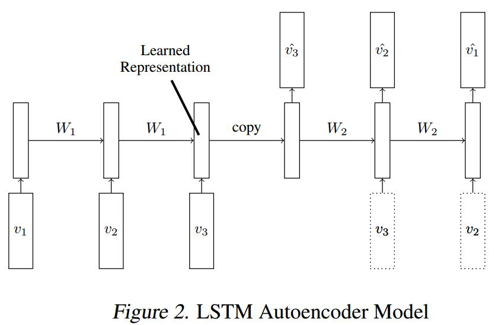
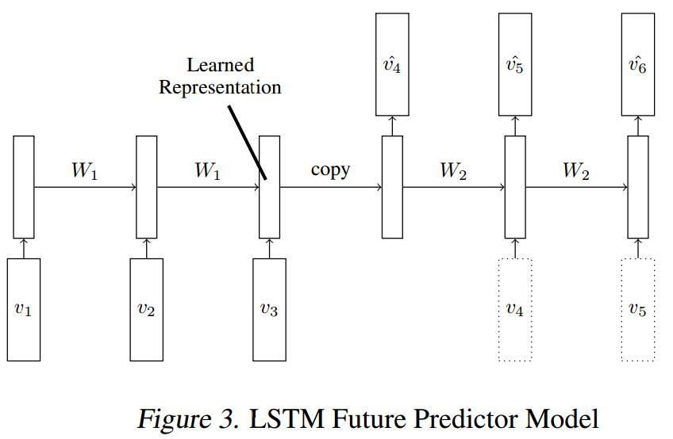
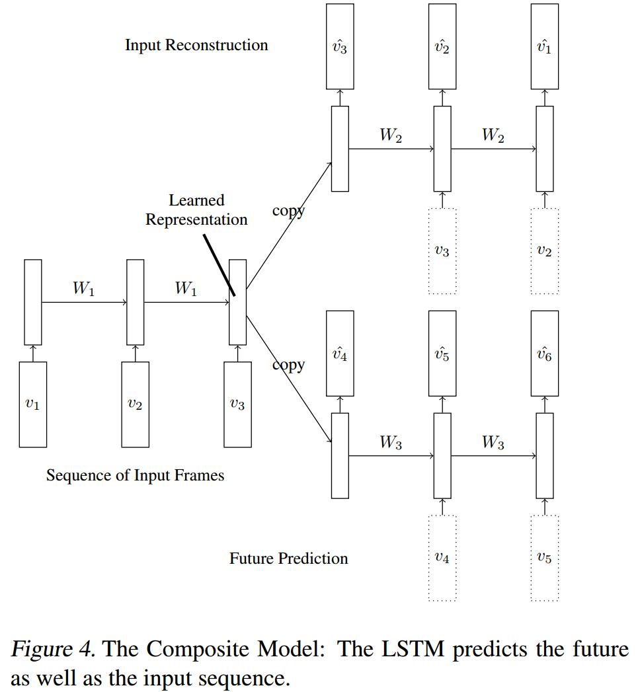

# Unsupervised Learning of Video Representations using LSTMs
[arXiv](https://arxiv.org/abs/1502.04681)
[github](https://github.com/emansim/unsupervised-videos)

## LSTM Autoencoder Model

1. Encoder Input: a sequence of vectors
2. Decoder Output: target sequence is same as the input sequence, but in reverse order
3. conditional decoder: receives the last generated output frame as input, i.e., the dotted input in Fig. 2
> 1. allows the decoder to model multiple modes in the target sequence distribution
可产生多峰分布的target
> 2. There are strong short-range correlations in video data
优化时decoder容易采取这种correlations，不利于长时信息的传播

4. 如何保证autoencoder-style model不学出一个单位映射
   1. there are only a fixed number of hidden units makes it unlikely that the model can learn trivial mappings for arbitrary length input sequences.
   > 有限个hidden units v.s. 任意长度的输入
   2. the same LSTM operation is used to decode the representation recursively This means that the same dynamics must be applied on the representation at any stage of decoding.
   > Decoder 也是动态的

## LSTM Future Predictor Model

## A Composite Model

1. A high-capacity autoencoder would suffer from the tendency to learn trivial
representations that just memorize the inputs.
> autoencoder:学习到一些不重要的表达

2. the future predictor suffers form the tendency to store information only about the last few frames since those are most important for predicting the future
> predictor: 只关注近的information

## Learned
1. LSTM Autoencoder Model 的结构和缺点
2. LSTM Future Predictor Model 的结构和缺点
3. conditional decoder 的优缺点
4. A Composite Model
