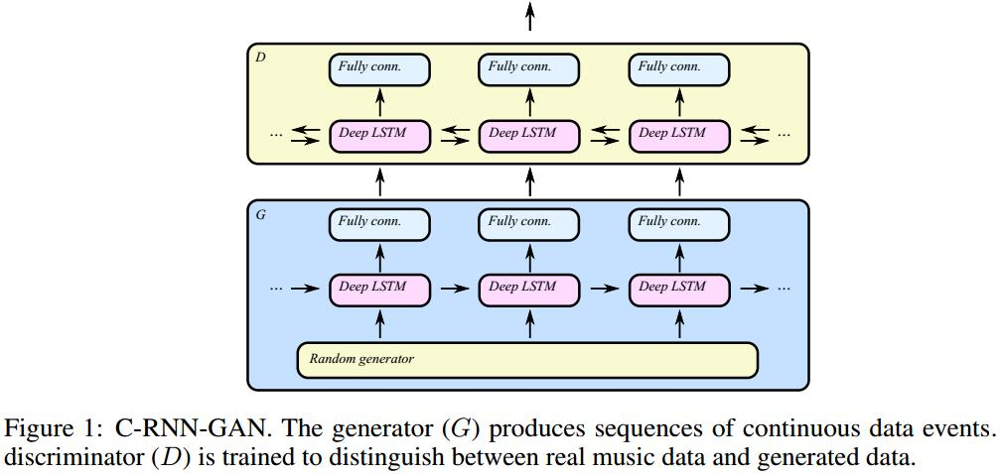

# C-RNN-GAN: Continuous recurrent neural networks with adversarial training
[arXiv](https://arxiv.org/abs/1611.09904)
[github](https://github.com/olofmogren/c-rnn-gan)
[project](http://mogren.one/publications/2016/c-rnn-gan/)

## Network

1. D由双向LSTM组成(a bidirectional layout)
2. G is unidirectional

## Training
1. freezing: stopping the updates of D whenever its training loss is less than 70% of the training loss of G [1]
> 以免D训得过好

2. feature matching: objective of G is to produce an internal representation at some level in the discriminator that matches that of real data.
$$ \hat L_G=\frac{1}{m}\sum_{i=1}^m(R(x^{(i)})-R(G(x^{(i)}))^2 $$
> $R$是D分类层前的最后一层，有点像pix2pix的D

## Reference
[1]. Tim Salimans, Ian Goodfellow, Wojciech Zaremba, Vicki Cheung, Alec Radford, and Xi Chen. Improved techniques for training gans. In Advances in Neural Information Processing Systems, pages 2226–2234, 2016.

## Learned
1. G单向LSTM保证online，而D可以采用bi-LSTM
2. 两个训练trick很重要
