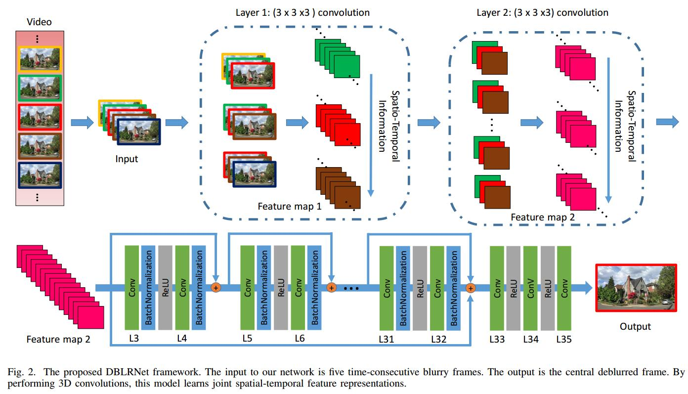
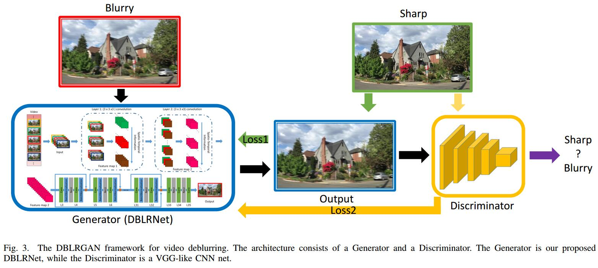

# Adversarial Spatio-Temporal Learning for Video Deblurring
[arXiv](https://arxiv.org/pdf/1804.00533.pdf)

## Introduction

1. image/video deblurring
    1. Geometry-based methods
       1. single-image deblurring: it is difficult for single image based methods to estimate blur kernel because blur is spatially varying in real world
       > 单图估计blur kernel很困难

       2. multi-image based methods
          1. flash/no-flash image pairs [23]
          2. blurred/noise image pairs [22]
          3. gyroscope information [24]
          4. optical flow [28]
          5. temporal information [29]
          6. patchbased synthesis [31]
          7. Fourier aggregation method [32]
          8. stereo videos [33]
    2. Deep learning methods
       1. deconvolution [42]
       2. motion kernel estimation [2]
       3. multi-scale [43]
       4. DBN [44] **(not online)**

## Model

### DBLRNet

1. input: five consecutive frames
2. RGB $\to$ YCbCr, 其中Y作为输入
3. layer1: kernel $3\times 3\times 3$, 5帧分为3组输入，得到3组输出(每组16个2Dmap)，又reshuffle为16组(每组3个2Dmap)
4. layer2: kernel $3\times 3\times 3$, 16组输入，16组输出
5. reslayers: kernel $3\times 3\times 1$, stride and padding
are set to 1 in every layer
6. 输出为中间帧的结果， 结合original Cb and Cr变为彩色图

### DBLRGAN

1. G: DBLRNet, restores sharp images
2. D: a binary classification network, which tells a restored image apart from a real-world sharp image [48]
3. content loss: respect the pixel-wise measurement
$$ \mathcal L_{content}=\frac{1}{WH}\sum_{x=1}^W\sum_{y=1}^H(I^{sharp}_{x,y}-G(I^{blurry}_{x,y}))^2 $$
> $I^{sharp}_{x,y}$为gt, 这里就是一个MSE

4. adversial loss: promotes a more realistically looking (hence sharper) image
$\mathcal L_{adversarial}=\log(1-D(G(I^{blurry}))) $
> $D(G(I^{blurry}))$为是真实图像的概率

## Dataset
1.  VideoDeblurring Dataset [44]
    1. quantitative subset:  6708 blurry frames and their corresponding ground-truth sharp frames from 71 videos
    > [44]中有split方法

    2. qualitative subset: 22 scenes, most of which contain more than 100 images. Note that there is not ground truth for the qualitative subset
2. Blurred KITTI Dataset [49] [33]
   1.  contains 199 scenes. Each of the scenes includes 3 images captured by a left camera and 3 images captured by a right camera. (utilized only for testing.)

## Reference
### Geometry-based methods
[22] L. Yuan, J. Sun, L. Quan, and H.-Y. Shum, “Image deblurring with blurred/noisy image pairs,” in ACM Transactions on Graphics (TOG), vol. 26, p. 1, ACM, 2007.

[23] G. Petschnigg, R. Szeliski, M. Agrawala, M. Cohen, H. Hoppe, and K. Toyama, “Digital photography with flash and no-flash image pairs,” in ACM Transactions on Graphics (TOG), vol. 23, pp. 664–672, ACM, 2004.

[24] S. Hee Park and M. Levoy, “Gyro-based multi-image deconvolution for removing handshake blur,” in The IEEE Conference on Computer Vision and Pattern Recognition (CVPR), 2014.

[29] Y. Li, S. B. Kang, N. Joshi, S. M. Seitz, and D. P. Huttenlocher, “Generating sharp panoramas from motion-blurred videos,” in The IEEE Conference on Computer Vision and Pattern Recognition (CVPR), 2010.

[31] S. Cho, J. Wang, and S. Lee, “Video deblurring for hand-held cameras using patch-based synthesis,” ACM Transactions on Graphics (TOG), vol. 31, no. 4, p. 64, 2012.

[32] M. Delbracio and G. Sapiro, “Burst deblurring: Removing camera shake through fourier burst accumulation,” in The IEEE Conference on Computer Vision and Pattern Recognition (CVPR), 2015.

[33] L. Pan, Y. Dai, M. Liu, and F. Porikli, “Simultaneous stereo video deblurring and scene flow estimation,” The IEEE Conference on Computer Vision and Pattern Recognition (CVPR), 2017.

### Deep learning methods
[2] J. Sun, W. Cao, Z. Xu, and J. Ponce, “Learning a convolutional neural network for non-uniform motion blur removal,” in The IEEE Conference on Computer Vision and Pattern Recognition (CVPR).

[42] L. Xu, J. S. Ren, C. Liu, and J. Jia, “Deep convolutional neural network for image deconvolution,” in Advances in Neural Information Processing Systems (NIPS), 2014.

[43] S. Nah, T. H. Kim, and K. M. Lee, “Deep multi-scale convolutional neural network for dynamic scene deblurring,” The IEEE Conference on Computer Vision and Pattern Recognition (CVPR), 2017.

[44] S. Su, M. Delbracio, J. Wang, G. Sapiro, W. Heidrich, and O. Wang, “Deep video deblurring,” The IEEE Conference on Computer Vision and Pattern Recognition (CVPR), 2017.

[45] T. M. Nimisha, A. Kumar Singh, and A. N. Rajagopalan, “Blurinvariant deep learning for blind-deblurring,” in The IEEE International Conference on Computer Vision (ICCV), 2017.

### 3D Conv
[39] S. Ji, W. Xu, M. Yang, and K. Yu, “3d convolutional neural networks for human action recognition,” IEEE Transactions on Pattern Analysis and Machine Intelligence, vol. 35, no. 1, pp. 221–231, 2013.

### Blurred KITTI Dataset
[49] A. Geiger, P. Lenz, C. Stiller, and R. Urtasun, “Vision meets robotics: The kitti dataset,” The International Journal of Robotics Research, vol. 32, no. 11, pp. 1231–1237, 2013.

## Learned
1. 本文的方法也不online
2. 3D Conv只在前两层用，用于整合多帧信息，后续分析还是用2D Conv
3. 虽然考虑时空信息，但文章还是针对图像来说的，并未考虑整个视频的恢复情况
