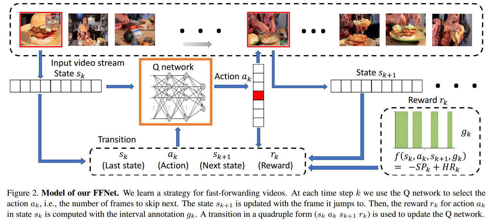

# FFNet: Video Fast-Forwarding via Reinforcement Learning
[arXiv](https://arxiv.org/abs/1805.02792)

## Introduction
1. Goal: Our goal is to fast-forward a long video sequence by skipping unimportant frames in an online and real-time fashion
> 加速视频、跳过非关键帧

1. Key advantage: it automatically selects the most important frames without processing or even obtaining the entire video.
> 自动选择重要的帧

## Method

### MDP Formulation for FFNe
1. State $s_k$: we consider a single frame as a state, defined in terms of the extracted feature vector of the current frame
> 关键帧，用特征向量描述

2. Action $a_k$: action state $A=\{a^1,a^2,...,a^M\}$, which represents
the possible numbers of frames to skip
> 跳过的帧数

3. Reward:
   1. immediate reward:  $r_k=r(s_k,a_k,s_{k+1})$ when it transits from one state $s_k$ to another state $s_{k+1}$ after taking action $a_k$
   2. accumulated reward:
   $$R=\sum_k\gamma^{k-1} r_k$$
> $\gamma\in[0,1]$ -- discount factor for the rewards in the future 衰减因子

4. Policy $\pi$: determines the action to be chosen in every state visited by the system. it selects the action that maximizes the expected accumulated reward for current and future actions.
$$ \pi(s_k)=arg\max_aE[R|s_k,a,\pi] $$

### Design of the Immediate Reward
1. binary label: $l(i)=1$ indicates that frame $i$ is an important frame, and $l(i)=0$ means it is an unimportant one
2. immediate reward:
$$ r_k=-SP_k+HR_k $$
   1. "skip" penalty (SP)
    $$ SP_k=\frac{\sum_{i\in t_k}1(l(i)=1)}{T}-\beta\frac{\sum_{i\in t_k}1(l(i)=0)}{T} $$
    > $t_k$: skipping interval at step $k$
      $1(\cdot)$: indicator function that equals to 1 if the condition holds.
      T: the largest number of frames we may skip
      第一项表示跳过的关键帧，第二项表示跳过的非关键帧

    2. "hit" reward (HR): defines the reward for jumping to an important frame or a position near an important frame.    
       1. transfer the one-frame label to a Gaussian distribution in a time window.
       $$ f_i(t)=\frac{1}{\sqrt{2\pi\sigma^2}}\exp(-\frac{(t-i)^2}{2\sigma^2}),t\in[i-w,i+w] $$
       > 上式表示 frame $i$ 对周围窗口$w$的影响，实验中$\sigma=1,w=4$。如果跳到关键帧附近也应该得到奖励

       $HR_k=\sum_{i=z-w}^{z+w}1(l(i)=1)\cdot f_i(z)$
       > 在第$k$步, 跳到第$z$th fream。reward为(z,w)窗口的在$z$处的贡献

### Learning the Fast-Forwarding Policy
1. Q-learning
$$ Q_{k+1}(s_k,a_k)=(1-\alpha)Q_k(s_k,a_k)+\alpha(r_k+\gamma\max_{a_{k+1}}Q_k(s_{k+1},a_{k+1})) $$
2. Q-Net
   1. Input: current state vector
   2. Output: a vector of the estimated Q-value for each action given the state
3. $$ Q^* (s_k,a_k)= r_k+\gamma\max_{a_{k+1}}Q^* (s_{k+1},a_{k+1})$$

## Reference
The use of Reinforcement Learning:
object detection [21], visual tracking [48], pose estimation [17] and image captioning [35]

[17] A. Krull, E. Brachmann, S. Nowozin, F. Michel, J. Shotton, and C. Rother. Poseagent: Budget-constrained 6d object pose estimation via reinforcement learning. In Proceedings of the IEEE Conference on Computer Vision and Pattern Recognition (CVPR), 2017.

[21] S. Mathe, A. Pirinen, and C. Sminchisescu. Reinforcement learning for visual object detection. In Proceedings of the IEEE Conference on Computer Vision and Pattern Recognition (CVPR), 2016.

[35] Z. Ren, X. Wang, N. Zhang, X. Lv, and L.-J. Li. Deep reinforcement learning-based image captioning with embedding reward. In Proceedings of the IEEE Conference on Computer Vision and Pattern Recognition (CVPR), 2017.

[48] S. Yun, J. Choi, Y. Yoo, K. Yun, and J. Young Choi. Actiondecision networks for visual tracking with deep reinforcement learning. In Proceedings of the IEEE Conference on Computer Vision and Pattern Recognition (CVPR), 2017.
