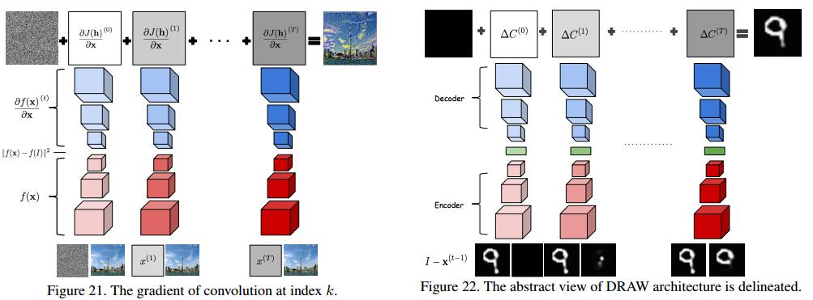
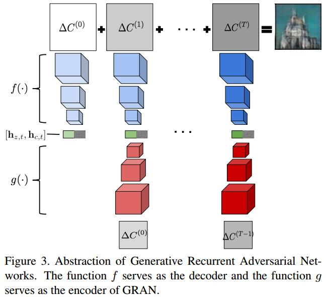
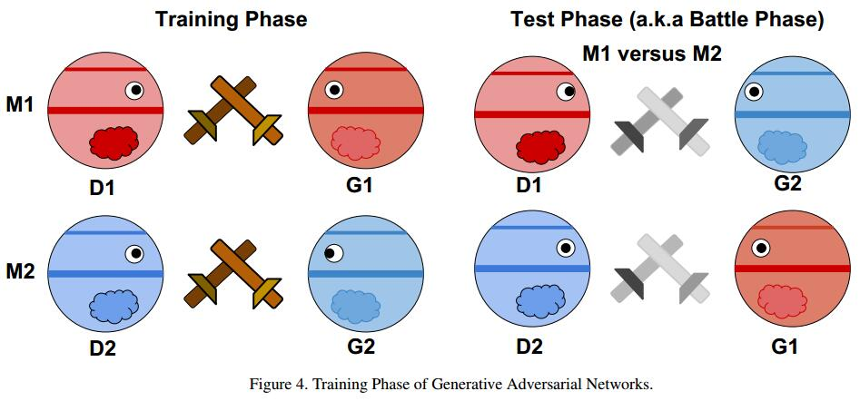

# Generating images with recurrent adversarial networks
[arXiv](https://arxiv.org/abs/1602.05110)

## Introduction
1. most common image generation models can be roughly categorized into two classes
   1. probabilistic generative models, such as the variational autoencoder
   > train an autoencoder whose latent representation satisfies certain distributional properties, which makes it easy to sample from the hidden variables, as well as from the data distribution 潜在的表达满足某种概率分布特性

   2. adversarial sampling
   > forgoes the need to encourage a particular latent distribution (and, in fact, the use of an encoder altogether), by training a simple feedforward neural network to generate “data-like” examples.“Data-likeness” is judged by a simultaneously trained, butotherwise separate, discriminator neural network 不需要潜在的分布和encoder, 而是用前向网络生成“数据相似”的样本, 数据相似度由同时训练的、独立的判别网络判断

2. separate objectives for GAN
$$
\begin{array}l
\max_{\theta_D} \mathbb E_{x\sim p_D}[\log D(X)]+\mathbb E_{z\sim p_G}[\log (1-D(G(z)))] \\
\max_{\theta_G} \mathbb E_{z\sim p_G}[\log D(G(z))]
\end{array}
$$
$$
\{\theta'_ D,\theta'_ G\}\leftarrow
\left\{
\begin{array}l
\text{Update} \theta_D \quad \text{if} \quad D(x) \text{predicts wrong} \\
\text{Update} \theta_D \quad \text{if} \quad D(G(z)) \text{predicts wrong} \\
\text{Update} \theta_G \quad \text{if} \quad D(G(z)) \text{predicts corret}
\end{array}
\right.
$$

## Model
### motivations: DRAW[5], [LAPGAN]([LAPGAN]_Deep_Generative_Image_Models_using_a_Laplacian_Pyramid_of_Adversarial_Networks.md)

> 此图应从下往上看

###  Generative Recurrent Adversarial Networks

1. decoder: $\Delta C^{t}= f([h_{c,t-1},h_{z,t-1}])$
2. encoder: $h_{c,t}=g(\Delta C^{t-1})$

### Model Evaluation: Battle between GANs (如何确定更好的模型)

$M_1=\{G_1,D_1\}, M_2=\{G_2,D_2\}$
$$
r_{test}=\frac{e(D_1(x_{test}))}{e(D_2(x_{test}))}, \quad r_{sample}=\frac{e(D_1(G_2(z)))}{e(D_2(G_1(z)))}
$$
>1. $e(\cdot)$是分类错误率, $x_{test}$是预先做好的测试集
>2. $r_{test}$ tells us which model generalizes better 训好以后$G$能fool对应的$D$，如果某个$D$更好，则对应的$G$也更好。
>3. $r_{sample}$ tells us which model can fool the other model more easily 是否能fool另一个$D$
>4. $r_{sample}$用于判断哪个模型更好，$r_{test}$用于验证模型输出的有效性

$$
winner =
\left\{
\begin{array}l
M_1 \quad \text{if}\quad r_{sample}<1 \quad \text{and} \quad r_{test}\simeq1 \\
M_2 \quad \text{if}\quad r_{sample}>1 \quad \text{and} \quad r_{test}\simeq1 \\
\text{Tie} \text{otherwise}
\end{array}
\right.
$$
> $r_{test}\simeq1$ 确保两个$D$的过拟合程度相当

## Reference
1. sequential version of the variational autoencoder
K. Gregor, I. Danihelka, A. Graves, D. J. Rezende, and D. Wierstra. Draw: A recurrent neural network for image generation. In Proceedings of the International Conference on Machine Learning (ICML), 2015.

## Learned
1. 提出了GRAN来生成图像，与大多序列方法不同，起点是decoder
2. 提出了如何判断两组GAN的优劣，提出了GAM(Generative Adversarial Metric)
