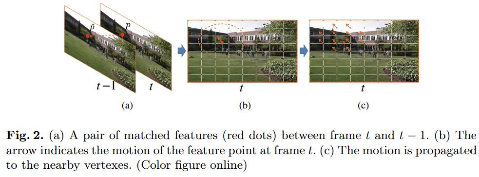
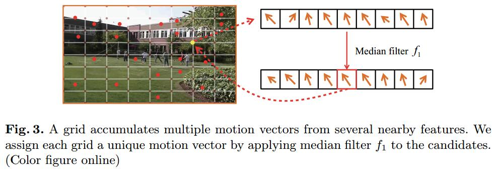

# MeshFlow: Minimum Latency Online Video Stabilization

## Introduction
1. Many existing video stabilization methods often stabilize videos off-line, i.e. as a postprocessing tool of pre-recorded videos. [1-5]
2. Some methods can stabilize videos online, but either require additional hardware sensors (e.g., gyroscope [6,7]) or adopt a single parametric motion model (e.g., affine, homography [9-11]) which is problematic to represent spatially-variant motions.
> 大多数方法不在线，在线的方法采用外部依赖或单参数的motion model
gyro-based methods: can only capture rotational motion, leaving translational motion untouched

3. This paper:
   1. Only one frame latency, works online in real time
   > 只在定点处计算运动向量，by特帧匹配
   
   2. MeshFlow: a spatially smooth sparse motion field with motion vectors defined only at the mesh vertexes.
   > 在mesh定点处的平滑稀疏的运动场

   3. Predicted Adaptive Path Smoothing

## MeshFlow
1. 特帧匹配: 运动向量就是匹配特征点相减
2. 中值滤波:
   1. 计算mesh定点处的运动向量
    
    > 这些运动向量需要在空间上平滑

   2. 去除一些错误

## Predicted Adaptive Path Smoothing (PAPS)
