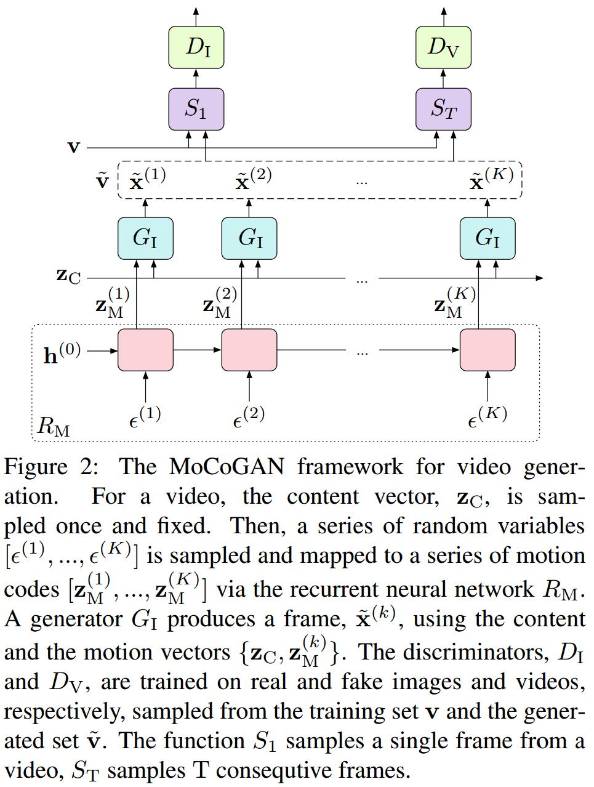

# MoCoGAN: Decomposing Motion and Content for Video Generation
[arXiv](https://arxiv.org/abs/1707.04993)

## Introduction
1. video prediction: predict future frames in a video given the observed frames in the video.
> video prediction 根据观测预测未来帧

2. video generation: the input to the generative network is only a vector drawn from a latent space

## Motion and Content Decomposed GAN
### 符号定义
1. latent space of images: $Z_I\in \mathbb R^d, Z_C\in \mathbb R^{d_C}, Z_M\in \mathbb R^{d_M}, d=d_C+d_M$
2. each image: $z\in Z_I$
3. content and motion: $Z_I=Z_C\times Z_M$
4. video of $K$ frames: $[z^{(1)},...,z^{(k)}]=[[z_C,z^{(1)}_M],...,[z_C,z^{(k)}_M]]$
5. $z_M^{(k)}=R_M(k)$ RNN的第k个输出

### Networks

1. $D_I$: image discriminator (vanilla CNN architecture)
2. $D_V$: takes a fixed length video clip, say T frames. (spatio-temporal CNN architecture)
> T可以小于视频长度K，从而将视频分为K−T+1个子片段

3. $G_I$无序列生成能力，必须依靠$R_M$
4. $D_V$ alone should be sufficient for training $G_I$ and $R_M$, but $D_I$ significantly improves the convergence of the adversarial training.

### Learning
1. 随机采样:
$S_1$ outputs a random frame from the clip.
$S_T$ returns T consecutive frames from
the clip.
2. Objecttive
$$
\begin{array}l
\max_{G_I,R_M}\min_{D_I,D_V}F_V(D_I,D_V,G_I,R_M) \\
F_V=\mathbb E_v(-\log D_I(S_1(v)))+\mathbb E_{\widetilde v}(-\log (1-D_I(S_1(\widetilde v))))+ \\
E_v(-\log D_V(S_T(v)))+\mathbb E_{\widetilde v}(-\log (1-D_V(S_V(\widetilde v))))
\end{array}
$$
3. alternating gradient update algorithm
   1. In one step, we update $D_I$ and $D_V$ while fixing $G_I$ and $R_M$.
   2. In the alternating step, we update $G_I$ and $R_M$ while fixing $D_I$ and $D_V$.

### Categorical Dynamics
1. 为适应各种类型的运动(walking, running, jumping, etc.)，引入categorical random variable $z_A$，是一个one-hot vector
2. $R_M$的输入变为$[z_A,\epsilon]$
3. objective 变为$F_V+\lambda L_I(G_I,Q)$
Q outputs the category label for a real input video clip

## Learned
1. 采用两个D分别鉴别图像和视频
2. 生成器采用RNN
