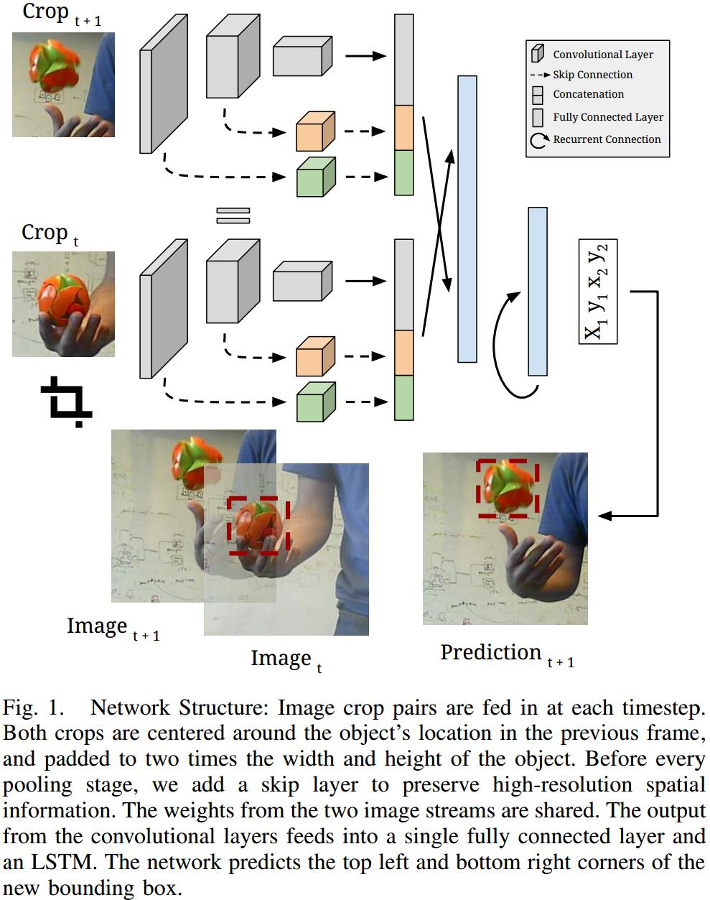

# Re3: Real-Time Recurrent Regression Networks for Visual Tracking of Generic Objects
[arXiv](https://arxiv.org/abs/1705.06368)
[TOC]

## Introduction
1. drawback of tracking-by-detection: updating the tracker often takes a significant amount of time and computational resources
2. Re3 efficiently tracks and updates itself simultaneously
3. categore：
    1. online-trained:
       * keypoint-based, part-based, correlation based, direct classification trackers
       * need trade off speed with model complexity 实时性和模型复杂度的权衡
    2. offlinetrained
       * faster
       * cannot adapt to new information
    3. hybrid trackers

## Methods
### structure

#### CNN
1. convolutional layers: embed the object appearance
2. recurrent layers: remember appearance and motion information
3. regression layer: to output the location of the object
> At test time, unlike MDNet [29], we do not update the network itself; we instead let the recurrent parameters represent the tracker state which can be updated with a single forward pass. In this way, the tracker learns to use new observations to update the appearance and motion models, but no extra computational cost is spent on online training.
测试时，不直接更新网络，而是让递归的参数表达跟踪器的状态，所以没有额外的计算量

4. Input: a pair of crops from the image sequence
5. Skip connection: The skip connections are each fed through their own
$1\times 1\times C$ convolutional layers where $C$ is chosen to be less than the number of input channels. All skip connection outputs and the final output are concatenated together and fed through a final fully-connected layer to further reduce the dimensionality of the embedding space that feeds into the recurrent pipeline
> 用1x1的卷积缩减feature map的维度。所有的skip output和最后的output concat起来送给一个全连接层，进一步减少维度
> the lowest layers of image classification networks output features like edge maps, whereas the deeper layers capture high-level concepts such as animal noses,
eyes, and ears [43]

#### RNN
1. The two layer LSTM is likely able to capture more complex object transformations and remember longer term relationships than the single layer LSTM.
$$
\begin{array}l
z^t = h(W_zx^t+R_zy^{t-1}+b_z)   \qquad\qquad \text{LSTM input} \\
i^t = \sigma(W_ix^t+R_iy^{t-1}+P_ic^{t-1}+b_i)\qquad \text{input gate} \\
f^t = \sigma(w_fx^t+R_fy^{t-1}+P_fc^{t-1}+b_f)\qquad \text{forget gate} \\
c^t = i^t\odot z^t+f^t\odot c^{t-1}\qquad\qquad\qquad\qquad \text{cell state} \\
o^t = \sigma(W_ox^t+R_oy^{t-1}+P_oc^t+b_o)\qquad \text{output gate} \\
y^t=o^t\odot tanh(c^t)\qquad\qquad\qquad\qquad \qquad \text{LSTM output} \\
\end{array}
$$
The output and cell state vectors update as the object appearance changes.
2. Output The second LSTM’s outputs are fed into a fully-connected layer with four output values representing the top left and bottom right corners of the object box in the crop coordinate frame [18]
3. L1 loss on the outputs to encourage exact matches the ground truth and
limit potential drift[18].
3. Unrolling during training: we initially train the network with only two unrolls and a mini-batch size of 64. After the loss plateaus, we double the number of unrolls and halve the mini-batch size until a maximum unroll of 32 timesteps and a mini-batch size of 4.

## Reference
### discriminative correlation filters
[6] M. Danelljan, G. H¨ager, F. S. Khan, and M. Felsberg. Discriminative scale space tracking. IEEE transactions on pattern analysis and machine intelligence, 39(8):1561–1575, 2017.

### recurrent trackers
[9] S. Ebrahimi Kahou, V. Michalski, R. Memisevic, C. Pal, and P. Vincent. Ratm: Recurrent attentive tracking model. In Proceedings of the IEEE Conference on Computer Vision and Pattern Recognition Workshops, pages 10–19, 2017.
[12] Q. Gan, Q. Guo, Z. Zhang, and K. Cho. First step toward modelfree, anonymous object tracking with recurrent neural networks. arXiv preprint arXiv:1511.06425, 2015.
>  attention-based recurrent neural networks

### regression trackers
[18] D. Held, S. Thrun, and S. Savarese. Learning to track at 100 fps with deep regression networks. In European Conference on Computer Vision, pages 749–765. Springer, 2016.

## Learned
对video detection很有帮助。两帧同时做，CNN提取多尺度特征，concat在一起，经全连接层后送入LSTM。
