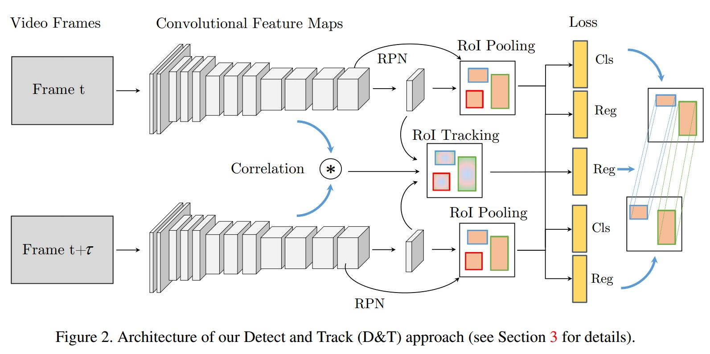

# Detect to Track and Track to Detect
[arXiv](https://arxiv.org/abs/1710.03958)

## Introduction
1. VID challenge
   1. size: the sheer number of frames that video provides (VID has around 1.3M images, compared to around 400K in DET or 100K in COCO [22])
   2. motion blur: due to rapid camera or object motion
   3. quality: internet video clips are typically of lower quality than static photos
   4. partial occlusion: due to change in objects/viewer positioning
   5. pose: unconventional object-to-camera poses are frequently seen in video.
2. use exhaustive post-processing on top of frame-level detectors.
> 现状：用了大量的后处理方法

## Method
### framework

We introduce an inter-frame bounding box regression layer that performs
position sensitive RoI pooling on the concatenation of the bounding box regression features $\{x^t_{reg},x^{t+\tau}_{reg}\}$ to predict the transformation $\Delta ^{t+\tau}=(\Delta^{t+\tau}_x,\Delta^{t+\tau}_y,\Delta^{t+\tau}_w,\Delta^{t+\tau}_h)$ of the RoIs from $t$ to $t+\tau$.

## Reference
### trackers
[1] L. Bertinetto, J. Valmadre, J. F. Henriques, A. Vedaldi, and P. H. S. Torr. Fully-convolutional siamese networks for object tracking. In ECCVVOTWorkshop, 2016.
[13] D. Held, S. Thrun, and S. Savarese. Learning to track at 100 FPS with deep regression networks. In Proc. ECCV, 2016.
>  related to this paper

[25] C. Ma, J.-B. Huang, X. Yang, and M.-H. Yang. Hierarchical convolutional features for visual tracking. In Proc. ICCV, 2015.
[26] H. Nam and B. Han. Learning multi-domain convolutional neural networks for visual tracking. In Proc. CVPR, 2016.

### video detection
[40] X. Zhu, Y. Xiong, J. Dai, L. Yuan, and Y. Wei. Deep feature flow for video recognition. In Proc. CVPR, 2017.
[29] E. Real, J. Shlens, S. Mazzocchi, X. Pan, and V. Vanhoucke. YouTube-BoundingBoxes: A Large High-Precision HumanAnnotated Data Set for Object Detection in Video. ArXive-prints, 2017

### correlation filters
[2] D. S. Bolme, J. R. Beveridge, B. A. Draper, and Y. M. Lui. Visual object tracking using adaptive correlation filters. In Proc. CVPR, 2010.
[4] M. Danelljan, A. Robinson, F. S. Khan, and M. Felsberg. Beyond correlation filters: Learning continuous convolution operators for visual tracking. In Proc. ECCV, 2016.
[14] J. F. Henriques, R. Caseiro, P. Martins, and J. Batista. Highspeed tracking with kernelized correlation filters. IEEE PAMI, 37(3):583–596, 2015

## Learned
相关滤波是最常用的跟踪方法，实际上，这篇文章是跟踪和检测单独进行，然后把结果融合
