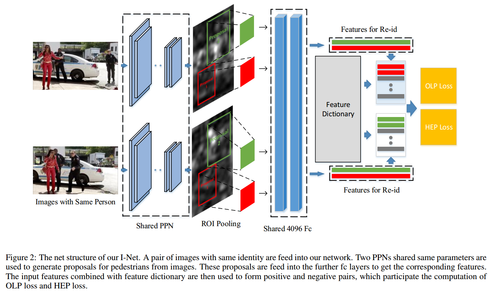

# End-to-End Detection and Re-identification Integrated Net for Person Search
[arxiv](https://arxiv.org/pdf/1804.00376.pdf)

## Introduction
1. Our ultimate goal is to search a target person from the whole image scene directly without cropping images.
2. Benefits of joint learning of the detector and re-identifier
   1. helps to handle misalignments
   > re-id 部分可以更robust

   2. detection and re-id share the same feature representation which can reduce the computation time
   > 更快

## Approach

1. Structure
    1. Input: a pair of images
    2. pedestrian proposal networks (PPN) predict the proposals
    3. feature maps pooled by ROI pooling layer are then feed into the fully-connected (fc) layers to extract 256-D L2-normalized features.
    4. features are then stored in an **on-line dynamic dictionary** where one positive pair and lots of negative pairs are generated for computation of OLP loss and HEP loss.
    > 两幅图输入VGG，(用Conv5_3作为输入)PPN预测出行人的bbox(smoothL1 loss 回归)，(从Conv5_3)ROIPooling得到各个bbox的(L2-normalized)特征向量，产生pos pair和neg pair

2. On-line Pairing Loss (OLP)
    1. proposal结果分为3类( depends on the IOU between the proposals and ground truth.)
       1. background (B)
       2. persons with identity information (p-w-id)
       3. persons without identity information (p-w/o-id)
    2. on-line feature dictionary
       最大长度为4*batch size，最早的feature会先被移除
    3. OLP
    $$ L_{OLP}=-\frac{1}{m}\log\frac{e^{d(x_A^i,x_p^i)}}{e^{d(x_A^i,x_p^i)}+\sum_{i=1}^ke^{d(x_A^i,x_n^i)}} $$
    > $x_A,x_p,x_n$为比较目标特征,pos pair特征和neg pair特征
      $i$表示一组比较，共$m$组；$d$为cosine距离
      算梯度时，只算$\frac{\partial L_{OLP}}{\partial x_A}$

3. Hard Example Priority Softmax loss (HEP)
   1. 把re-id看做分类，每个bbox将被分为$C+1$类，$C$为id数
   2. The label indexes of generated proposals from input image pair are first stored in the label pool L.
   3. For each subgroup, the label indexes of the top 20 negative pairs with the maximum distance are recorded. The chosen labels from all subgroups are then stored in the label pool L.
   4. If the size of pool L is still smaller than M (a preset value), then we randomly generate the label indexes without repetition and stored in the label pool L.
   > 选20个困难样本，他们这个类别的优先级更高，保证M个训练类别

## Reference
[Xiao et al., 2017] Tong Xiao, Shuang Li, Bochao Wang, Liang Lin, and Xiaogang Wang. **Joint detection and identification feature learning for person search**. In The IEEE Conference on Computer Vision and Pattern Recognition (CVPR), July 2017.

## Learned
虽然没有crop图像，但仍然crop了特征
