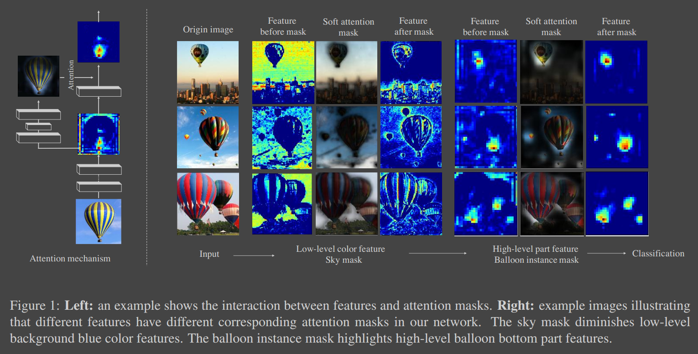
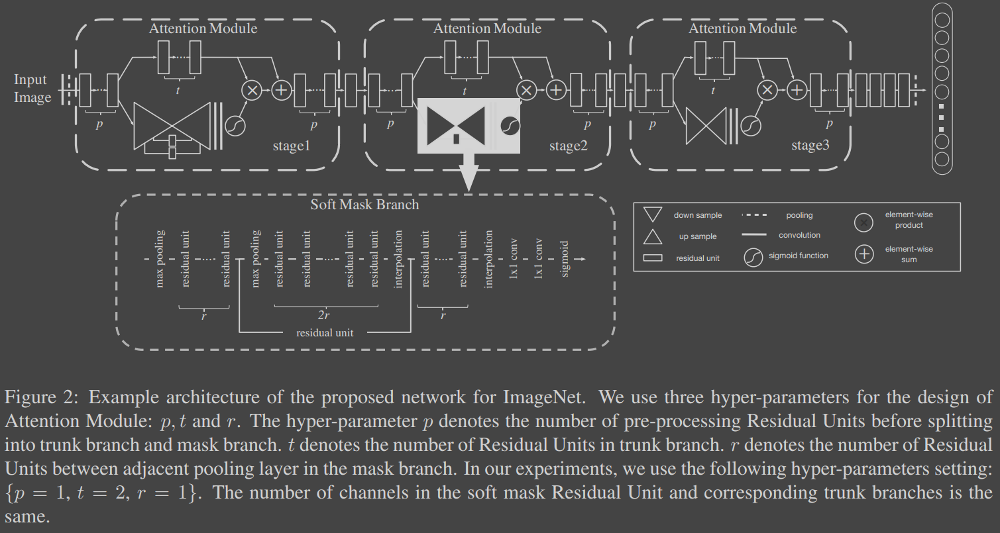

# Residual Attention Network for Image Classification
[arXiv](https://arxiv.org/abs/1704.06904)

## introduction

越high-level的part feature及其mask越会focus在object或者parts of object上。而且通过mask，可以diminish不相关的区域，如背景。

## Method

1. Attention Residual
$$
H_{i,c}(x)=(1+M_{i,c}(x))*F_{i,c}(x)
$$
>$i$ ranges over all spatial positions and $c\in (1,\cdots,C)$ is the index of the channel. 三维的attention map，与原feature map点乘

## Reference
### Attention LSTM
[18] J.-H. Kim, S.-W. Lee, D. Kwak, M.-O. Heo, J. Kim, J.-W. Ha, and B.-T. Zhang. Multimodal residual learning for visual qa. In Advances in Neural Information Processing Systems, pages 361–369, 2016.  
[21] H. Larochelle and G. E. Hinton. Learning to combine foveal glimpses with a third-order boltzmann machine. In NIPS, 2010.
[25] H. Noh, S. Hong, and B. Han. Learning deconvolution network for semantic segmentation. In ICCV, 2015.
[29] R. K. Srivastava, K. Greff, and J. Schmidhuber. Training very deep networks. In NIPS, 2015.
