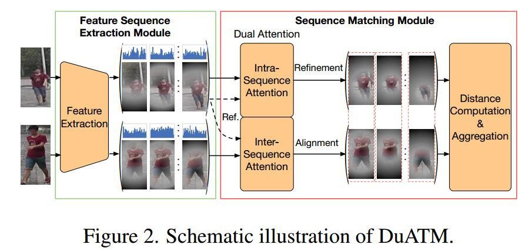
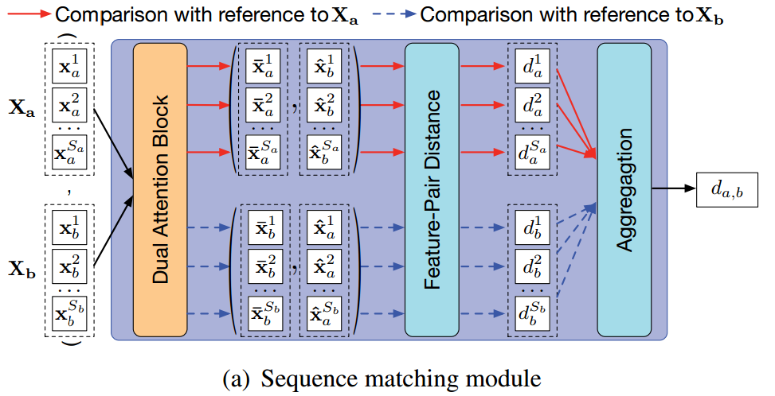
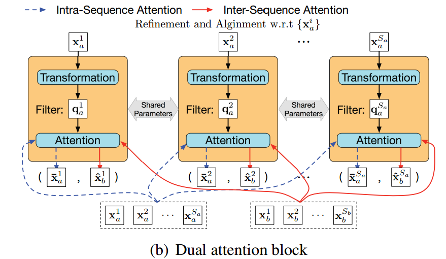
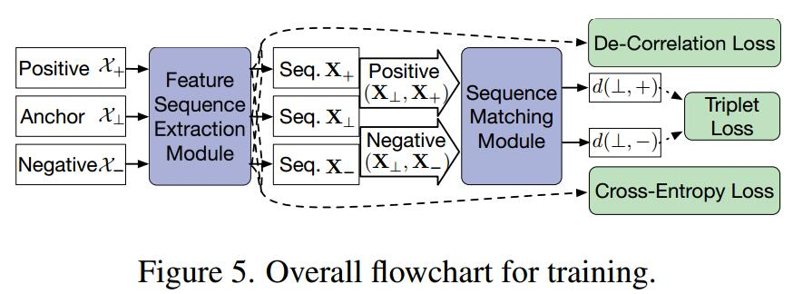

# Dual Attention Matching Network for Context-Aware Feature Sequence based Person Re-Identification
[arXiv](https://arxiv.org/abs/1803.09937)

## Introduction
1. Typical person re-identification (ReID) methods usually describe each pedestrian with a single feature vector and match them in a task-specific metric space
> 典型的Re-id方法用一个向量描述pedestrian，并在metric space中匹配，但是这种方式很少注意到细节

## Approach

1. overview
   1. feature sequence extraction module: bi-recurrent CNN
   2. sequence matching module:  dual attention mechanism
      1. intra-sequence refinement 类内的优化
      2. inter-sequence alignment 类间的联系    
2. Sequence Matching Module

   1. Dual Attention Block $(\overline x_a^i,\hat x_b^i)$
   
      1. transform layer：一层线性层
      2. attention layer: 计算內积
         1. intra-sequence refinement:
         $$
         \begin{array}{l}
         \overline e_a^{i,m}=q^i_a\cdot x_a^m \\
         \overline x_a^i=\sum_{m=1}^{S_a}\sigma(\overline e_a^{i,m})x_a^m
         \end{array}
         $$
         2. inter-sequence alignment:
         $$
         \begin{array}{l}
         \hat e_a^{i,n}=q^i_a\cdot x_b^n \\
         \hat x_b^i=\sum_{n=1}^{S_b}\sigma(\hat e_b^{i,n})x_a^n
         \end{array}
         $$
         > $x$ 为特征, $S$为序列长度, $\sigma$为softmax

    2. Distance Computation and Aggregation
       1. 双向的attention对$\{x_a^i\}$和$\{x_b^i\}$各做一次
       2. 计算距离
       $$
       \begin{array}{l}
       d^i_a=|| \overline x_a^i-\hat x_b^i|| \quad i=1...S_a \\
       d^j_b=|| \overline x_b^j-\hat x_a^j|| \quad j=1...S_b \\
       ||X_a-X_b||_\mathcal M=\frac{1}{2S_a}\sum_{i=1}^{S_a}d_a^i+\frac{1}{2S_b}\sum_{j=1}^{S_b}d_b^i
       \end{array}
       $$
       > $||X_a-X_b||_ \mathcal{M}$是两个序列的距离

3. Loss: **siamese architecture with triplet loss**

## Learned
从image sequence 的角度处理ReID，主要在特征匹配方面提出了新思路：两次计算attention，最后计算两个sequence的距离。
